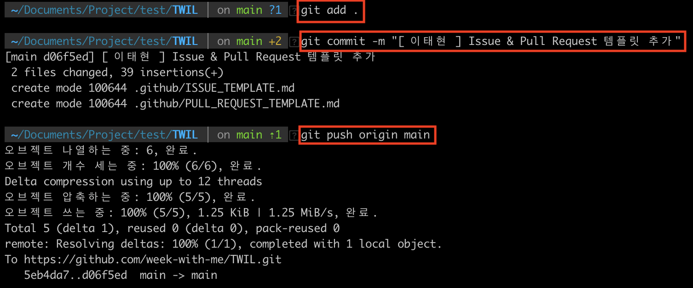

# 오리엔테이션 및 Git 사용법

## 오리엔테이션
### 목적
**TWIL(This Week I Learned)** 의 목적은 메인 [README.md](https://github.com/week-with-me/TWIL/blob/main/README.md)에서 확인하실 수 있는 것처럼 마치 소셜 네트워크 서비스를 이용하듯 각자가 공부한 내용을 쉽고 편하게 공유하는 데 있습니다. 따라서 본인이 글을 쓰기로 결정한 주제에 대해 깊이 있게 조사하고 공부하는 것은 물론 이를 TWIL 멤버를 비롯한 다른 누가 읽더라도 알기 쉽도록 적는 게 목표입니다. 물론 개인적인 생각에는 알기 쉽게 풀어내는 과정에서 자연스레 본인이 몰랐던 개념들을 포함하여 해당 주제를 깊게 공부할 수밖에 없다고 생각합니다

### 규칙
모든 커뮤니티-스터디와 마찬가지로 TWIL 또한 규칙이 있습니다. 상호 간에 아는 지식을 전달하는 목적보다도 함께 꾸준하게 공부하며 동기부여를 위한 목적이 더 크기에 다른 커뮤니티와 마찬가지로 상호 간에 **-님** 과 같은 호칭을 붙여 예의를 지켜주세요!  

공부한 내용을 공유할 때도 깔끔하고 구조적인 프로젝트 관리를 위해 몇 가지 규칙이 있습니다.
1. `0417taehyun` 과 같이 본인의 깃헙 계정으로 브랜치를 만들어 공부한 내용을 작성한다.
2. `[ 이태현 ] 오리엔테이션 및 Git 사용법` 과 같이 `[ ]` 내의 실명과 그 뒤에 학습한 내용의 제목을 적어 `commit` 한다.
3. `.DS_Store` , `.vscode` 등과 같이 불필요한 파일 및 폴더가 올라가지는 않았는지 확인하고 만약 함께 올라갔다면 삭제한다.
4. 각 주차별 본인의 이름으로 된 폴더를 만들고 내부에 글을 `md` 파일로 작성한다.

아래는 혹시 **깃(Git)** 과 **깃헙(GitHub)** 이 아직 익숙하지 않은 분들을 위한 간단한 설명입니다.

## Git 사용법
> 이미 `commit` , `branch` , `pull request` 등의 개념을 아시는 분은 넘겨도 무관한 내용들입니다

### 개요
**깃(Git)** 과 **깃헙(GitHub)** 에 관해 설명하는 건 내용이 길어질 것 같아 생략하겠습니다. 아래 내용들은 깔끔하고 구조화 된 프로젝트 진행을 위해 결정된 커밋과 브랜치 양식에 관해 어떤 개념인지 모르는 분들을 위한, **CLI 터미널 명령어** 를 통한 간단한 설명입니다. 더 자세한 내용들은 [생활코딩 깃과 깃헙 강의](https://www.youtube.com/watch?v=hFJZwOfme6w&list=PLuHgQVnccGMA8iwZwrGyNXCGy2LAAsTXk)를 추천해드립니다.

### `git clone` 명령어
우선 `TWIL` 리무트 레포지토리를 본인의 로컬 환경으로 옮겨야 합니다. 이를 조금 더 쉽게 풀어 설명하자면 **깃헙이라는 서비스** 에 소스 코드들이 정리되어 올라가 있기 때문에 해당 소스 코드와 파일-폴더들이 담겨있는 일종의 공간을 **리무트 레포지토리, 한글로는 원격 저장소** 라고 합니다. 이를 삼성 노트북, LG 노트북과 같이 **본인이 프로그래밍하는 공간** 으로 옮겨야 우리가 동일한 공간에 작업을 하여 각자의 작업 내용을 합칠 수 있게 되겠죠? 이때 본인의 작업 공간을 **로컬 레포지토리** 라고 합니다. 이때 사용하는 명령어가 `git clone` 입니다.  

우선 아래 이미지와 같이 복제하고자 하는 리무트 레포지토리로 가서 해당 주소를 복사합니다. **Code** 라 적힌 초록색 버튼을 누르면 나오는, 아래 이미지에서 빨간 박스로 표시한 **URL** 을 바로 오른쪽 **복사 버튼** 을 눌러 복사해주면 됩니다.

assets/images/1기/이태현/0주차/1.png

이제 아래 이미지처럼 본인이 이를 복제하길 원하는 폴더로 이동하여 `git clone` 명령어 뒤에 빨간 박스로 표시한 부분처럼 본인이 복제한 **URL** 을 입력하여 복제합니다. 그리고 확인해보면 처음 디렉토리 내에 들어 있는 파일들을 보여주는 명령어 `ls` 을 입력했을 때와 달리 그다음 `ls` 를 입력했을 때는 `TWIL` 이라는 폴더가 정상적으로 복제된 것을 확인할 수 있습니다.

### `git branch` 와 `git checkout` 명령어
이제 복제한 폴더로 이동해보면 `main` 브랜치라고 적혀있는 걸 확인할 수 있습니다. 이는 각자의 터미널 셋팅마다 안 보일 수도 있는데 만약 보이지 않을 경우 `main` 브랜치라고 알고 계시면 됩니다. 혹시 IDE로 비주얼 스튜디어 코드(VSC)를 사용하고 계실 경우 아래 이미지와 같이 브랜치를 알려줍니다. 물론 다른 IDE도 이러한 기능을 제공해주고 있으니 한 번 확인해보시면 좋습니다.

여기서 **브랜치(branch)** 라는 개념에 대해 짧게 짚고 넘어가겠습니다. 영어로 **가지** :herb: 를 의미하는 것처럼 브랜치 또한 뻗어나가는 개념이라고 생각하시면 편합니다.  

브랜치는 아래 이미지와 같이 `main` 또는 `master` 등으로 이름 짓는 가장 최초의 브랜치를 기준으로 `이태현` , `김태현` 과 같이 **개별적인 작업 공간** 으로 뻗어 나가는 개념입니다. 다시 말해 `이태현` 이라는 브랜치를 만들어 제가 해당 브랜치에서 작업을 하고 `김태현` 이라는 브랜치를 만들어 다른 사람은 `김태현` 브랜치에서 작업을 진행하는 것입니다.

그렇다면 브랜치라는 개념은 왜 만들어졌을까요? 어떤 소프트웨어를 만들 때 사실 단 몇 줄의 코드로 서비스 또는 제품이 만들어지는 경우는 없습니다. 당장 우리가 실생활에서 사용 중인 카카오톡만 생각하더라도 **어마어마하게 많은 소스 코드들** 로 이루어져있지 않을까요? 이때 각자가 분업을 통해 버전 관리와 유지 보수, 또 작업 자체를 효율적으로 하려고 등장했습니다.  

위 이미지를 예로 볼 경우 제가 `이태현` 이라는 브랜치를 만들어 `main` 또는 `김태현` 브랜치와 **독립적으로 작업을 진행한다면 다른 곳에서의 진행 상황에 종속적이지 않고 원활하게 작업을 진행** 할 수 있게 됩니다. 이것이 바로 브랜치의 핵심 개념입니다.

이제 터미널에 아래 이미지와 같이 `git branch` 명령어를 입력해봅시다.

그러면 아래와 같이 현재 `main` 브랜치 하나만 존재하는 걸 알 수 있습니다.

이제 아래 이미지와 같이 `git branch` 명령어 뒤에 생성하고자 하는 브랜치 이름을 적어 본인이 독립적으로 작업할 공간을 만들어줍니다. **우리의 TWIL 프로젝트에서는 본인의 깃헙 아이디가 브랜치 이름이 됩니다.** 

이제 다시 `git branch` 명령어를 입력하면 아래 이미지와 같이 기존의 `main` 브랜치 외에 본인이 방금 만든 브랜치가 추가되어 있는 걸 확인할 수 있습니다.

그렇다면 이제 **본인이 만든 브랜치로 이동** 하여, 다시 말해 기존의 `main` 브랜치에서 위 예시에서는 제가 만든 `0417taehyun` 브랜치로 이동하여 작업을 진행해야 합니다. 이때 사용하는 명령어가 바로 `git checkout` 명령어 입니다. 마치 숙박 업소에서 체크아웃을 하는 것과 같은 개념입니다. 유의할 점은 `git checkout` 명령어 뒤에 와야할 브랜치는 내가 가고자 하는 브랜치의 이름입니다. 따라서 위 예시에서는 현재 내가 있는 `main` 브랜치에서 `0417taehyun` 브랜치로의 이동을 원하는 것이기에 `git checkout 0417taehyun` 명령어를 입력합니다.  

이 과정을 거치면 아래 이미지와 같이 정상적으로 브랜치를 이동한 걸 확인할 수 있습니다.

### Pull Request
이제 본인의 브랜치에서 작업을 다 했다면 이를 우리의 리무트 레포지토리로 옮겨줘야 합니다. 그래야 내 컴퓨터에만 존재하는 소스 코드, 공부 내용 등이 타인과 공유가 가능해지기 때문입니다.  

이때 사용하는 명령어의 묶음이 바로 `git add` , `git commit` , `git push` 입니다.

아래 이미지를 통해, 그리고 편지 보내는 예시를 통해 가볍게 알아보겠습니다.  

1. `git add` 는 말 그대로 `git` 이라는 프로그램에 "나 이제 보낼거야!" 라고 공지하는 것과 같습니다. 따라서 편지를 보내기 위해 편지지를 사고 준비하는 과정입니다. 
2. `git commit` 는 이제 무엇이라 보낼지 결정해서 말해주는 걸 의미합니다. 한 마디로 편지지의 제목을 적는다고 생각하면 편한데 아래 이미지르 볼 경우 `[ 이태현 ] Issue & Pull Request 템플릿 추가` 라는 제목으로 보낸다고 생각하시면 됩니다. 여기서 `-m` 옵션은 바로 한 줄로 옆에 적을 수 있는 옵션을 의미하고 기본 `git commit` 을 사용하실 경우 `vim` 과 같은 본인이 설정한 IDE가 등장하여 조금 더 많은 줄에 내용을 적을 수 있습니다.  
3. `git push` 는 이제 주소를 적어 실제로 편지를 보내는 과정입니다. 아래 예시의 경우 `main` 으로 부터 `origin` 이라는 곳으로 최종적으로 편지를 보내게 됩니다. 이때 `origin` 은 우리의 리무트 레포지토리를 의미한다고 생각하시면 편합니다.

원래는 **스테이징** 등과 같은 여러 개념에 대한 설명이 필요하지만 단순히 일련의 과정을 거쳐 내가 로컬에서 작성한 코드를 리무트로 옮긴다고만 이해하셔도 좋습니다. 물론 무조건적으로 알아야 하는 개념이라고 생각하니 다른 곳에서 더 자세히 알아보실 것을 추천드립니다!

이렇게 `git push` 까지 완료하면 리무트 레포지토리로 본인이 작성한 글이 넘어갑니다. 위 예시에서는 `main` 브랜치에서 작성했지만 실제로 본인이 만든 브랜치에서 `git push` 를 할 경우 아래와 같이 리무트 레포지토리에서 **Pull Request** 를 생성할 수 있습니다.  

이때 병합이 되지 않는 첫 번째 Pull Request의 경우 아래 이미지에서 빨간 박스로 표시한 빈 공간에 자동으로 만들겠냐는 질문이 뜨게 됩니다. 만약 한 번 병합이 된 경우 오른쪽 상단의 **New pull request** 라 적힌 초록 버튼을 눌러줍니다.  

그러면 아래 이미지와 같이 Pull Request를 생성할 수 있습니다. 이때 빨간 박스와 같이 **본인의 브랜치를 선택** 한 뒤 바로 우측 아래 **Creat pull request** 버튼을 눌러줍니다.

아래 이미지와 같이 Pull Request가 생성됩니다. 제가 미리 만들어 둔 확인 사항을 반드시 읽어주세요. 이때 제목은 본인이 `git commit` 때 작성한 내용이 제목으로 작성됩니다.

아래 이미지와 같이 `[ ]` 로 작성된 확인 사항들을 하나씩 확인한 뒤 정상적으로 진행을 완료하였다면 `[x]` 와 같이 체크 표시를 해주고 우측 하단 **Create pull request** 라 적힌 초록 버튼을 눌러줍니다.

그러면 아래 이미지와 같이 정상적으로 Pull Request가 생성됩니다!

끝으로 슬랙에 알림이 온 걸 확인합니다. 다른 사람들이 작성한 글에도 열심히 반응해주세요

