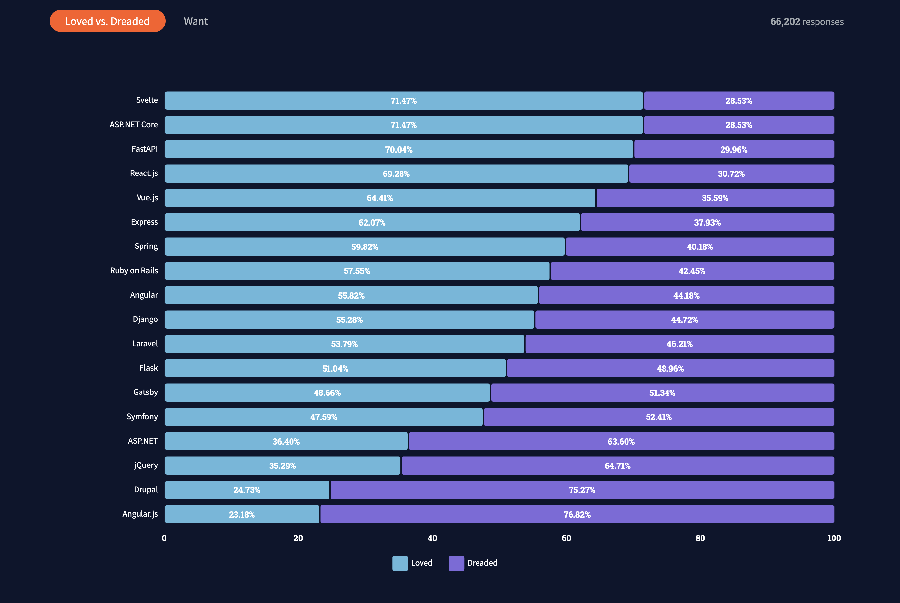

# [ 공식 문서로 배우는 FastAPI & SQLModel ] 01. FastAPI 소개

## 도입

파이썬의 **[FastAPI](https://fastapi.tiangolo.com/)**라는 웹 프레임워크가 요즘 크게 떠오르고 있습니다. 위 이미지는 스택 오버플로우(Stack Overflow)에서 개발자들을 대상으로 2021년에 진행한 설문조사로 그 중 [가장 사랑하는 기술 순위](https://insights.stackoverflow.com/survey/2021#technology-most-loved-dreaded-and-wanted)입니다. 무려 70%가 넘는 사용자들이 애정을 보이며, 같은 언어를 사용하는 웹 프레임워크인 **Django**(55%)와 **Flask**(51%)에 비해 압도적으로 높은 수치입니다.  

그리고 현재 **FastAPI**를 만든 [Sebastian](https://tiangolo.com/)이라는 개발자가 **[SQLModel](https://sqlmodel.tiangolo.com/)**이라는 파이썬에서 사용 가능한 데이터베이스 라이브러리 또한 개발 중인 상태입니다. **SQLModel**은 결국 **FastAPI**를 만든 사람이 **FastAPI**에서 SQL(관계형 데이터베이스)을 조금 더 쉽고, 직관적이고, 효율적이게 사용할 수 있게 만든 라이브러리이기 때문에 **FastAPI**와 함께 사용할 때 그 장점은 극대화 됩니다.  

그래서 앞으로 이 시리즈를 통해, 공식 문서를 바탕으로 **FastAPI**와 **SQLModel**의 동작 원리에 관해 익혀보고자 합니다. 그렇다면 왜 하필 **FastAPI**를 배워야하는 걸까요? **Django**와 **Flask**는 이미 수많은 개발자들이 사용하고 있는 웹 프레임워크이며 그 안정성 또한 매우 높은 수준으로 보장됩니다. 그에 반해 **FastAPI**는 아직 정식 1.0.0 버전도 출시되지 않은 최신 기술입니다. 그만큼 참고할 자료가 적다는 의미이며, 기술적인 구현에 있어 불안정할 수 있다는 걸 의미합니다.  

**FastAPI**를 배워야 하는 이유에 관해 이야기해보기 전에 우선 다른 두 웹 프레임워크를 간략하게 알아봅시다.  

## 파이썬 웹 프레임워크
앞서 설명했듯 사람들에게 가장 많이 알려져있고, 현재도 많이 사용 중인 파이썬 웹 프레임워크는 **[Django](https://www.djangoproject.com/)**와 **[Flask](https://flask.palletsprojects.com/en/2.0.x/)**입니다.  

이미 수많은 레퍼런스 및 강의가 존재하며 아마 이 글을 읽는 여러분께서 해당 프레임워크를 사용해 구현하고자 하는 기능들은 대부분 [Udemy](https://www.udemy.com/)와 같은 사이트에서 유료 강의는 물론 구글 및 유튜브에서도 무료로 쉽게 찾아볼 수 있을 것입니다.  

### Django
**Django**는 매우 친절한 웹 프레임워크입니다. 개발자들이 코드 상에서 데이터베이스를 쉽게 사용할 수 있게 도와주는 **ORM(Object Relational Mapping)** 중 **Django**의 ORM은 사용하기 편리하기로 유명합니다. 특히 **마이그레이션(Migration)** 기능을 자동으로 지원해주기 때문에 사용자 입장에서는 데이터베이스를 관리하는데 별다른 노력을 더하지 않아도 좋습니다. (지금 여기에서 이야기하는 내용들을 전부 몰라도 괜찮습니다. 천천히 하나씩 알아가면 됩니다. ORM, 마이그레이션과 같은 내용은 **SQLModel**을 배울 때 진행할 예정입니다.)  

그러나 그만큼 무겁습니다. 처음 프로젝트를 만들고 세팅할 때 기본적으로 제공하는 기능적인 부분들 중 대부분 사용하지 않는 것들이 꽤 있습니다. 예를 들어 `templates`와 같은 부분은 **Django**를 통해 직접 프론트엔드 부분, 다시 말해 웹 브라우저 상에서 보여지는 부분을 만들기 위해 존재하지만 사실 프론트엔드와 백엔드를 하나의 폴더 구조 내에서 모두 구현하여 관리하기에는 무리가 있기에 실제 서비스에는 어울리지 않는 구조입니다.  

더욱이 비동기 처리를 지원해주지 않아 엄청 빠른 속도의 기능들을 구현하길 원할 때 적절한 선택이 아닙니다. (물론 [djangoninja](https://django-ninja.rest-framework.com/) 라는 라이브러리의 등장으로 **Django** 또한 **FastAPI** 처럼 사용할 수 있게 됐습니다. 그러나 여전히 처음 프로젝트 세팅을 하고나면 사용하지 않는 기능들이 기본적으로 존재하게 됩니다.)  

### Flask
**Flask**는 **Django**에 비해서 굉장히 가볍습니다. 자동으로 프로젝트의 초기 세팅을 구성해주는 **Django**와 달리 본인이 직접 구조를 만들어야 하기 때문입니다. 그래서 사용하지 않는 기능들이 따로 존재하지 않기 때문에 훨씬 가볍고 빠릅니다.  

최신 **Flask**에서도 비동기 처리를 지원해주게 되었으나 이전에는 훨씬 불편한 방법으로 이를 구현해야 했습니다.  

또한 클라이언트, 다시 말해 프론트엔드 개발자와의 통신을 위해서 직접 외부 라이브러리를 통해 API 문서를 작성해야 했습니다. 이는 개발자 입장에서 신경써야 하는 부분이 늘어난 것을 의미하며, 결국 비효율적인 업무로 이어질 가능성을 내포합니다.

## Why FastAPI?
그렇다면 이제 **Django**, **Flask**와 비교되는 **FastAPI**의 특징을 알아봅시다. 이러한 특징들이 곧 **FastAPI**를 사용해야 하는 이유를 방증하기 때문입니다.  

### 특징
FastAPI의 특징은 아래와 같이 네 가지로 볼 수 있습니다. Django, Flask와 비교했을 때 눈에 띄는 특징들을 적어 놓은 것입니다.  

* 타입 힌트를 통한 안전성
* 비동기 함수를 통한 퍼포먼스
* 누구나 쉽게 이해할 수 있는 공식 문서
* OpenAPI, Swagger를 통한 자동 문서화

각 특징들이 의미하는 바에 대해서는 추후 코드를 통해 직접 구현해보며 하나씩 알아볼 예정입니다. 지금은 위 특징들이 기존의 **Django**, **Flask**에서는 없던 기능들인데 **FastAPI**에서는 제공해주는 것들이라고 알아두시면 좋습니다. 어떤 프레임워크를 선택해야 하는 순간에 다른 프레임워크와 특징을 비교해보는 건 선택에 힘을 실어주기 때문입니다.  

## 대상 독자
공식 문서를 보고 내용을 조금 더 편하게 이해하기 위해서는 기본적인 파이썬 문법을 알고 있어야 합니다!

어느 정도의 문법을 알고 있어야 할지 감이 잘 안 오는 분을 위해 세 가지 방향성을 제시해드리겠습니다.

* 두 개의 매개변수 `first_number`, `second_number`를 받아서 이를 더하여 반환하는 함수 `number_sum`을 만들고 사용할 수 있다.
* `Calculate` 클래스를 만들고 생성자를 통해 `first_number`, `second_number`를 받은 뒤, 이 두 객체변수를 매개변수로 받아 더하는 메서드 `number_sum`을 만들고 사용할 수 있다.
* `pip`를 통해 외부 라이브러리를 설치하고 `from`, `import`를 통해 이를 사용할 수 있다.

만약 위 세 가지에 대해 잘 모른다면 아래와 같은 키워드로 공부를 하신 뒤 **FastAPI**, **SQLModel**을 학습하시면 좋을 것 같습니다.

* 파이썬에서의 함수 생성 및 사용 방법
* 파이썬에서의 클래스 생성 및 사용 방법
* 파이썬에서의 외부 모듈 및 라이브러리 사용 방법

## 목표
해당 시리즈 글을 통해 도달하고자 목표는 크게 두 가지입니다.  

* **FastAPI** 공식 문서를 통해 기본적인 **FastAPI** 동작 원리를 익힌다.
* **SQLModel** 공식 문서를 통해 기본적인 데이터베이스 개념 및 **SQLModel** 동작 원리를 익힌다.

공식 문서를 통해서 두 가지 기술을 배우는 이유는, 공식 문서는 곧 해당 기술을 만든 사람이 어떤 문제에 대한 답변을 직접 적어놓은 일종의 답안지이기 때문입니다.  

수많은 사람들의 아티클 또는 영상보다도 본질적인 해답에 관해서 공식 문서를 통해 알게 되면 유연한 사고를 통해 비슷한 문제와 마주쳤을 때 쉽게 해결할 수 있습니다.  

따라서 저희는 앞으로 이 시리즈 글에서 **FastAPI**, **SQLModel** 공식 문서를 통해 각각의 동작 원리를 익힐 것입니다.  

## 준비 사항
처음 프로그래밍을 배웠을 때, 마치 수학처럼 컴퓨터 공학에도 절대적인 정답이 존재한다고 믿었습니다. 하지만 실제로 여러 프로젝트를 진행하면서 모범 사례(Best Practice)라는 용어가 있듯 사실 정답이라기 보다는 각자 상황에 맞춰 최선의 상황만이 존재한다는 걸 알게 됐습니다. 그리고 이러한, 절대적 진리가 존재하지 않는 상황에서 질문을 가지는 태도가 무척 도움 됐습니다. 사고를 유연하게 만들어주었기 때문이죠.  

제가 앞으로 올리게 될 게시글들은 정답이 아닙니다. 따라서 질문을 항상 가지면 좋을 것 같습니다. "저 부분은 왜 저렇게 작동하지?", "이렇게 구현하면 안 되는 건가?" 등 항상 의문을 가지면 좋을 것 같습니다.  

다음주 이 시간에는 본격적으로 **FastAPI**를 사용해보도록 하겠습니다.

