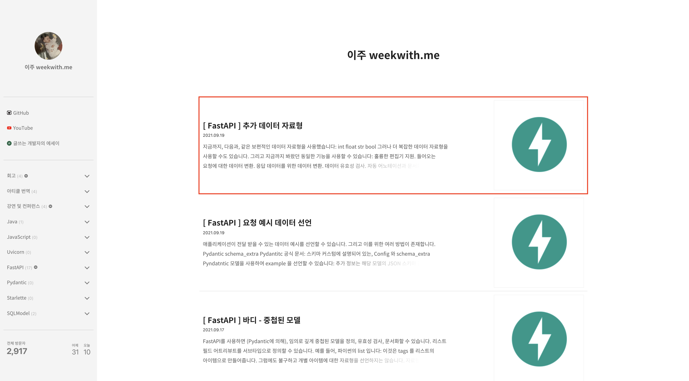
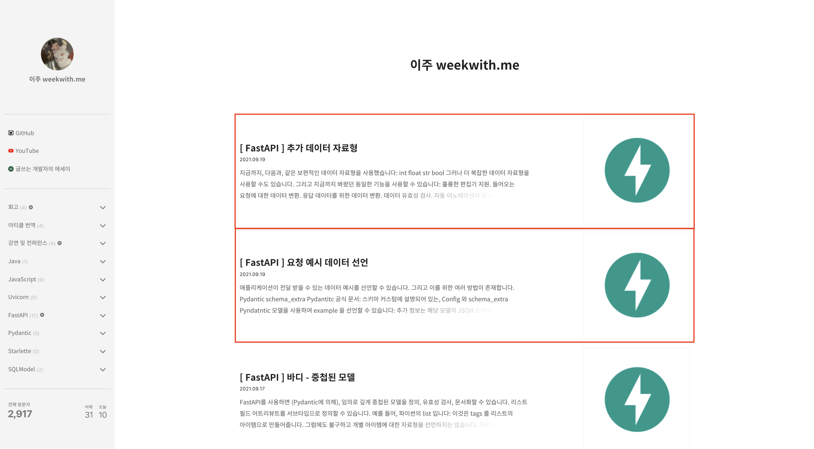
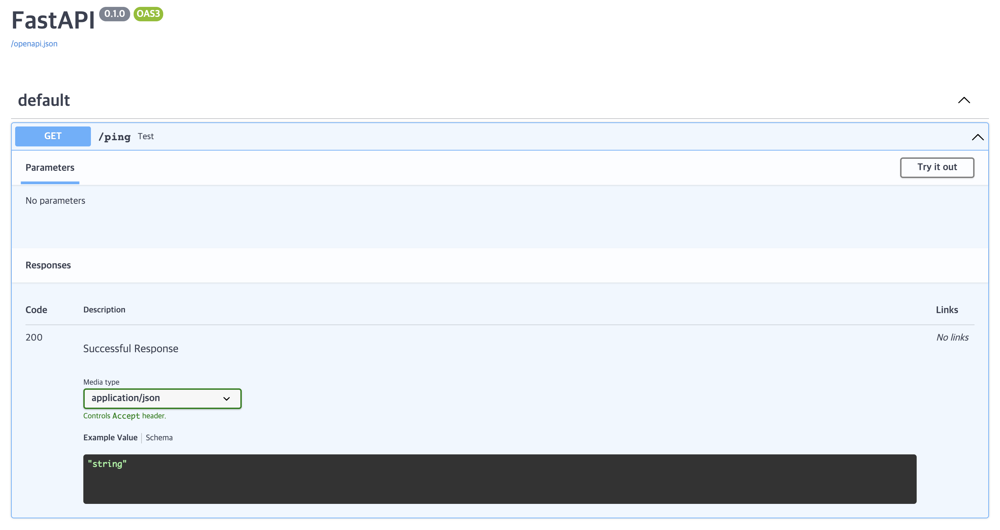
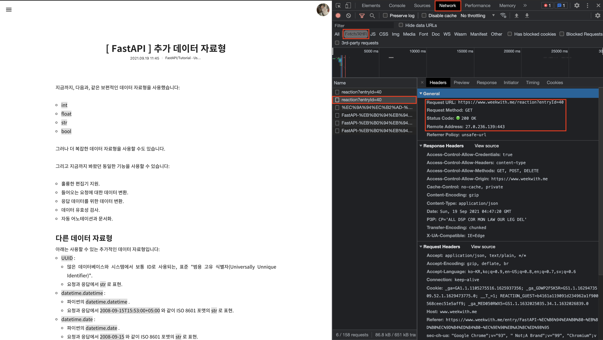

# [ 공식 문서로 배우는 FastAPI & SQLModel ] 03. 클라이언트와 서버, URL과 도메인, API와 엔드포인트, 그리고 HTTP 통신


## 도입
지난 시간 우리는 실제로 `fastapi`를 사용하여 서버를 열고 일련의 요청(Request)과 응답(Response)을 확인했습니다.  

그리고 이 과정에서 익히면 좋을 개념인 서버의 두 종류, 웹 서버(WEB Server)와 웹 애플리케이션 서버(WAS, WEB Application Server)의 개념에 관해 익히고 둘의 차이점을 살펴보았습니다.  

더 자세한 내용은 [[ 공식 문서로 배우는 FastAPI & SQLModel ] 02. FastAPI 설치와 웹 애플리케이션 서버](https://twil.weekwith.me/2%EA%B8%B0/%EC%9D%B4%ED%83%9C%ED%98%84/2021-09-14-fastapi-and-sqlmodel-2/)를 확인해주시면 감사하겠습니다.  

오늘은 이전 코드에 이어서 요청(Request)과 응답(Response) 과정을 이해하기 위해 필요한 개념들을 살펴보고자 합니다.  

바로 클라이언트(Client)와 서버(Server), 그리고 HTTP 통신입니다.  

!!! note "참고"

    혹시 이전 코드가 궁금하시다면 맨 아래 참고 부분에서 GitHub 레포지토리를 확인해주시기 바랍니다.


## 클라이언트와 서버
### 개념
클라이언트(Client)와 서버(Server)는 상대적인 개념입니다.  

쉽게, 영어 단어 'client'의 의미가 '고객'인 것처럼 클라이언트는 무엇인가 요청(Request)하는 쪽을, 서버(Server)는 이에 대응하여 응답(Response)하는 쪽이라 생각하면 편합니다.  

!!! note "참고"

    그렇다면 역으로 서버 쪽에서는 클라이언트로 요청할 수 없을지 궁금하실 수도 있습니다.

    뒤이어 HTTP 통신에 대해 배우겠지만, 기본적으로 HTTP 통신은 클라이언트의 요청과 서버의 응답으로, 일종의 단방향 통신이 이루어집니다. 다시 말해, 클라이언트에서 요청이 발생해야 서버에서 해당 요청에 해당하는 응답을 해준다는 의미입니다.

    그러나 실시간 채팅과 같이, 서로가 서로의 클라이언트이자 서버가 되어야 할 경우가 존재합니다. 이럴 때는 HTTP가 아닌 다른 통신 기법 중 하나인 소켓(Socket)을 사용합니다. 그리고 웹에서 사용하는 소켓을 웹 소켓(WEB Socket)이라 합니다.

    웹 소켓과 관련된 내용은 나중에 다룰 예정입니다.


### 소통 방식
앞서 클라이언트가 요청(Request)하는 쪽이라 배웠습니다. 아래 [블로그](https://weekwith.tistory.com)를 한 번 살펴봅시다.  

실제 사용자(User)가 웹 브라우저에서 제 블로그에 접속을 하면 아래 이미지와 같은 화면을 마주합니다.  

그리고 이때 빨간색 네모와 같은 부분을 클릭해서 해당 [글](https://weekwith.tistory.com/entry/FastAPI-%EC%B6%94%EA%B0%80-%EB%8D%B0%EC%9D%B4%ED%84%B0-%EC%9E%90%EB%A3%8C%ED%98%95)을 열람하고 싶을 수 있습니다.  




이때 사용자와 실질적으로 상호작용하는 개발자를 프론트엔드 개발자라 합니다. HTML, CSS, JavaScript를 사용해서 웹 브라우저의 UI(User Interface)를 꾸밉니다. 그리고 여기서 중요한 점은 바로 '글'이라는 데이터입니다. 프론트엔드 개발자는 '글'이라는 개발자를 서버(Server)에 요청하는 클라이언트(Client)가 됩니다.  

'글'이라는 데이터는 데이터베이스(DB, Database)에 저장되어 있습니다. 그리고 사용자가 제 블로그 주소, [https://weekwith.tistory.com](https://weekwith.tistory.com)에 접속했을 때 프론트엔드 개발자가 클라이언트가 되어 서버에 데이터를 전달해달라고 요청(Request)을 보냅니다. 그러면 서버는 해당 요청(Request)에 알맞게 [[ FastAPI ] 추가 데이터 자료형](https://weekwith.tistory.com/entry/FastAPI-%EC%B6%94%EA%B0%80-%EB%8D%B0%EC%9D%B4%ED%84%B0-%EC%9E%90%EB%A3%8C%ED%98%95)이라는 글을 데이터베이스를 통해 가져와 응답(Response)합니다. 그렇다면 이때, 클라이언트, 다시 말해 프론트엔드 개발자의 요청에 따라 데이터베이스를 통해 특정 데이터를 응답해주는 개발자를 백엔드 개발자라 합니다.  

클라이언트와 서버는 간단하게 위와 같은 과정을 거쳐 서로 소통하게 됩니다. 그리고 데이터를 주고 받아 사용자에게 알맞은 데이터를 보여주게 됩니다.  

이러한 과정을 웹에서는 HTTP 통신이라 합니다. 이제 본격적으로 HTTP 통신에 대해 알아봅시다.  

## HTTP(Hypertext Transfer Protocol)
### 프로토콜(Protocol)
우선 프로토콜이라는 용어에 관해 간단하게 짚고 넘어가겠습니다.  

아래 이미지와 같이 사람들끼리 소통하는 장면을 떠올리시기 바랍니다. 그리고 사람들이 각자 다른 언어를 사용한다고 생각해봅시다. 누군가는 영어, 누군가는 한국어, 누군가는 프랑스어를 사용하면 제대로 된 소통을 할 수 없습니다. 서로 전하고자 하는 바가 이해되지 않기 때문입니다. 그래서 보통 전세계적으로 소통을 위해 영어를 사용하거나, 아니면 통역가를 고용합니다.  


이처럼 소통을 위한 일련의 규칙이 바로 프로토콜(Protocol)입니다. 클라이언트와 서버가 서로 소통을 하는데 정해진 규칙이 없다면 올바른 데이터를 요청하고 응답할 수 없어 사용자(User)가 무척 불편할 것입니다. 그래서 웹에서도 규칙, 다시 말해 프로토콜이라는 개념을 도입하여 통신하기 시작했고 이를 HTTP(Hypertext Transfer Protocl)라 합니다.  

!!! note "참고"

    하이퍼텍스트(Hypertext)는 말 그대로 텍스트에 하이퍼 기능, 다시 말해 서로 다른 텍스트 또는 문서를 참조하여 이동할 수 있는 기능을 추가한 것을 의미합니다. 그리고 이러한 하이퍼텍스트를 통해 사용자들은 방대한 지식을 습득할 수 있게 됩니다.

    쉽게 텍스트에 [하이퍼링크](https://weekwith.me)가 달려있는 걸 떠올리시면 됩니다. (참고로 해당 하이퍼링크는 제 깃헙 블로그로 연결됩니다.)


### URL(Uniform Resource Locator)
#### 도입
웹 통신을 위한 프로토콜로 HTTP가 사용되는 걸 앞서 알게 되었습니다. 그리고 하이퍼텍스트(Hypertext)라는 이름에서 알 수 있듯, 또 앞서 살펴본 블로그 글을 조회하는 클라이언트와 서버의 일련의 소통 과정을 통해 알 수 있듯 통신에서 URL(Uniform Resource Locator)이 무척 중요합니다.  

#### URI(Uniform Resource Identifier)
URL은 사실 URI(Uniform Resource Identifier)의 종류 중 하나입니다. URI는 그 이름에서 알 수 있듯 자원(Resource)을 식별(Indentify)하는 역할을 합니다.  

다시 해당 블로그 글을 살펴보겠습니다. 아래 이미지처럼 [[ FastAPI ] 추가 데이터 자료형](https://weekwith.tistory.com/entry/FastAPI-%EC%B6%94%EA%B0%80-%EB%8D%B0%EC%9D%B4%ED%84%B0-%EC%9E%90%EB%A3%8C%ED%98%95) 글이 궁금하여 클릭해서 접근했을 때, 아래처럼 [[ FastAPI ] 요청 예시 데이터 선언](https://weekwith.tistory.com/entry/%EC%9A%94%EC%B2%AD-%EC%98%88%EC%8B%9C-%EB%8D%B0%EC%9D%B4%ED%84%B0-%EC%84%A0%EC%96%B8)과 같은 다른 게시글로 이동하면 안 됩니다. 다시 말해 정확히 요청(Request)에 알맞은 자원(Resource)으로 응답(Response)이 이루어져야 합니다.  



우리는 앞서 클라이언트가 서버에 요청을 보내면, 서버가 이에 알맞은 데이터를 가져와 응답한다고 배웠습니다. 이제 여기서 해당 요청에 '알맞은' 데이터를 가져오게 하는 방법이 바로 URI입니다.  

쉽게 집 주소를 생각하시면 편합니다. 만약 홍길동에게 택배를 보낸다면, 우리는 우체국에서 정확히 홍길동의 집 주소를 적어야 합니다. 안 그러면 전국에 수많은 홍길동 중 누구에게 택배를 보내야하는지 알 수 없기 때문입니다. 이때 홍길동의 집 주소가 곧 URI입니다.  

### URL(Uniform Resource Locator)
URL은 URI의 종류 중 하나로 그 이름에서 알 수 있듯 위치(Locator)을 통해 자원(Resource)을 나타냅니다. 앞서 예시로 든 홍길동의 집 주소처럼, 특정한 주소를 통해 해당 자원에 접근할 수 있게 됩니다.

!!! note "참고"

    URI의 종류 중 URL이 아닌 다른 것에 대해 궁금하실 수 있습니다. URI의 종류에는 URL(Uniform Resource Locator)와 URN(Uniform Resource Name)이 있습니다.

    URL은 그 이름에서 알 수 있듯 위치(Locator)를 통해 자원(Resource)을 나타냅니다. 따라서 상대적인 개념으로 만약 저장되어 있는 자원의 위치(Locator)가 변경되면 해당 자원을 기존의 URL을 통해 조회할 수 없게 됩니다.

    반대로 URN은 그 이름에서 알 수 있듯 이름(Name)을 통해 자원(Resource)을 나타냅니다. 따라서 절대적인 개념으로 저장되어 있는 자원의 위치(Locator)가 변경되더라도 이름(Name)을 통해 해당 자원을 조회하기 때문에 기존의 URN을 통해서 똑같이 조회할 수 있습니다.

    URN은 비교적 최근에 등장한 개념으로 현재 대부분의 웹은 URL로 구성되어 있습니다. 따라서 보통 URI을 말할 때 URL과 동일시하여 사용합니다.


### IP 주소와 포트, 그리고 도메인
#### 도입
그렇다면 여기서 의문이 들 수 있습니다. 이전 우리는 `fastapi`를 통해 [http://127.0.0.1:8000](http://127.0.0.1:8000) 주소에 접근 했었는데 이는 [https://www.weekwith.me](https://weekwith.me)와 같은 URL 형태와는 다르기 때문입니다. 바로 여기서 IP 주소(Internet Protocl Address)와 포트(Port), 그리고 도메인(Domain) 개념이 등장합니다.

#### IP 주소(Internet Protocl Address)와 포트(Port)
먼저 IP 주소는 우리가 이전 `fastapi`를 통해 작동한 서버의 주소, `http://127.0.0.1:8000` 에서 `127.0.0.1`과 같이 숫자의 형태로 이루어져있습니다. 그리고 포트는 IP 주소 뒤에 콜론(`:`)을 기준으로 붙는 숫자, 즉 `8000`과 같습니다. IP 주소와 포트의 관계는 쉽게 공항(Airport)을 떠올리면 됩니다.


예를 들어 인천 공항에 간다고 생각해봅시다. 수많은 비행기들 중 우리는 타야 하는 비행기로 정확히 가야 합니다. 이처럼 하나의 인천 공항 내에는 여러 비행기가 존재하는데, 프로그램도 이와 마찬가지로 하나의 서버 위에 여러 프로그램이 돌아가고 있습니다. 그리고 각 프로그램은 클라이언트가 정확히 올 수 있게 알려주는데 이를 포트(Port)라 생각하면 편합니다.  

결론적으로 IP 주소를 통해 어떤 공항으로 가야 하는지 알고 포트를 통해 정확히 타야하는 비행기에 탑승하여 원하는 목적지, 다시 말해 자원(Resource)에 도달하게 됩니다.  

!!! note "참고"

    그렇다면 겹치는 IP 주소가 존재할 가능성에 대해 의문이 들 수 있습니다.

    동일한 IP 주소 문제로 충돌이 발생하는 걸 예방하기 위해 IP 주소는 32비트로 이루어져 0부터 255 사이의 숫자를 . 으로 구분하여 표현합니다. 그리고 이를 IPv4이라 합니다.

    하지만 이후 단순히 컴퓨터 같은 기기(Device) 뿐만 아니라 휴대폰, 사물 인터넷(IoT, Internet of Things) 등의 등장으로 무수히 많은 IP 주소가 필요하게 되었고 이를 보완하기 위해 IPv6가 등장합니다.

    해당 개념, 어떻게 IP 주소를 인지하고 어떻게 IP 주소를 구성하는지 궁금하다면 직접 찾아보시길 권장해드립니다.


#### 도메인(Domain)
그러나 이때 사람 입장에서 숫자로 위치를 외우려면 불편하고 어렵습니다. 인천 공항의 주소를 `인천광역시 중구 공항로 722`와 같이 문자로 된 주소가 아닌 위도 `37.4692`, 경도 `126.451`와 같이 숫자로 외운다고 생각해보면 매번 해당 위치를 제대로 찾아가기 쉽지 않습니다.  

이를 해결하기 위해 등장한 것이 바로 도메인(Domain)과 DNS(Domain Name System)입니다. 앞서 블로그의 주소인 `www.weekwith.me`도 결국 `127.0.0.1:8000`처럼 IP 주소와 포트로 이루어져 있습니다. 다만 인천 공항의 주소인 `인천광역시 중구 공항로 722`처럼 인간이 외우고 이해하기 쉬운 문자로 해당 URL이 변환된 것입니다.  

이처럼 컴퓨터를 식별하는 이름을 도메인(Domain)이라 하고 이를 변환해주는 과정을 DNS(Domain Name System)라 합니다. DNS를 도와주는 대표적인 업체에는 [카페24](https://www.cafe24.com/), [호스팅케이알](https://www.hosting.kr/) 등이 있습니다.  

!!! note "참고"

    `127.0.0.1:8000`이라는 IP 주소와 포트는 로컬 환경, 다시 말해 각자 본인의 컴퓨터에서만 접속할 수 있는 URL입니다.

    예를 들어 집에서 `fastapi`를 통해 서버를 구동했는데, 집 앞 카페 같은 곳에서 해당 URL로 접속을 시도하면 아무 것도 뜨지 않습니다.

    이를 위해 호스팅(Hosting)이라는 개념이 존재하는데 호스팅 개념과 실제 AWS(Amazon WEB Service)을 통한 클라우드 호스팅으로 언제, 어디서나 서버에 접속할 수 있고 해당 서버의 IP 주소와 포트에 도메인을 연결하는 작업에 관해서는 추후 살펴볼 예정입니다.


### 결론
위 개념을 토대로 [[ FastAPI ] 추가 데이터 자료형](https://weekwith.tistory.com/entry/FastAPI-추가-데이터-자료형) 게시글의 URL인 [https://weekwith.tistory.com/entry/FastAPI-추가-데이터-자료형](https://weekwith.tistory.com/entry/FastAPI-추가-데이터-자료형)을 분석해보면 결국 아래와 같습니다.  


!!! note "참고"

    웹 프로토콜이 우리가 이전 살펴보았던 HTTP가 아닌 HTTPS로 되어 있습니다.

    HTTPS는 HTTP에 조금 더 강한 보안이 추가된 개념으로 관련해서는 추후에 더 자세히 살펴 볼 예정입니다.


### API와 엔드포인트
#### 도입
우리는 앞서 특정 자원(Resource)을 얻기 위해 URL에 접근을 시도한다는 걸 알게 됐습니다. 그리고 이 과정에서 원래는 IP 주소와 포트라는 숫자로 이루어진 주소가 DNS을 통해 인간이 이해하기 쉬운 문자로 바뀌었다는 것도 알게 됐습니다. 그렇다면 우리가 기존에 `fastapi`를 통해 만들었던 함수의 `@app.get("/ping")` 부분이 URL을 의미하는지 궁금하실 겁니다.  

결론부터 말씀드리면, 해당 부분은 엔드포인트(Endpoint)라 부르는 게 더 정확합니다. 이에 대해 알아보기 위해 우선 API(Application Programming Interace)에 대해 알아봅시다.  

### API(Application Programming Interface)
인터페이스(Interface)라는 용어는 다시 말해 어떤 접점을 의미합니다. API는 이 개념에서 알 수 있듯 이런 접점에서 시스템끼리, 다시 말해 애플리케이션과 프로그램끼리 서로 원활하게 상호작용할 수 있게 도와주는 매개체입니다.  

우리가 앞서 계속해서 살펴보았던 통신에서도 이러한 접점이 존재합니다. 바로 클라이언트와 서버 간의, 서버와 데이터베이스 간의 소통 접점입니다. 이를 통해 유추할 수 있는 사실은 바로 클라이언트가 서버와, 서버가 데이터베이스와 소통하기 위해 결국 API를 사용한다는 것입니다.  

그리고 여기서 접점에 정확하게 접근하기 위해 엔드포인트(Endpoint)라는 개념이 등장합니다.  

### 엔드포인트(Endpoint)
이전에 만들었던 `test()` 함수 위에 작성한, `@app.get("/ping")` 코드를 떠올리시면 편합니다. 해당 코드에서 `/ping` 부분이 바로 엔드포인트에 해당합니다.  

우리는 [http://127.0.0.1:8000/ping](http://127.0.0.1:8000/ping) 으로 접속했을 때, 해당 `test()` 함수의 반환값(`return`)으로 작성했던 `{"message": "pong"}` 이 출력된 것을 아래 이미지와 같이 확인할 수 있습니다.

우리는 이 과정을 통해 특정 엔드포인트에 클라이언트가 요청(Request)을 하면 서버가 이에 해당하는 응답(Response)을 반환한다는 것의 의미를 알 수 있습니다.

그렇다면 여기서 `get` 의 의미는 무엇인지 바로 아래 요청 메서드(Request Method)에서 알아보겠습니다.

### 결론
지금까지 배운 개념들을 통해 알게 된 사실을 다음과 같이 설명할 수 있습니다.  

브라우저로 사용자(User)가 (기존 IP 주소와 포트로 이루어진 URL이 DNS을 통해 변경된) URL로 통해 특정 자원(Resource)에 접근을 시도하면, 클라이언트(Client)는 이를 엔드포인트(Endpoint)를 통해 서버(Server)에 요청(Request)을 보내고, 서버는 구축된 API(Application Programming Interface)를 활용하여 데이터베이스(DB, Database)를 통해 알맞은 자원(Resource)으로 클라이언트에게 응답(Response)합니다.  

### 요청 메서드(Request Method)
우리는 앞서 게시글을 조회하는 경우를 가정하여 클라이언트와 서버가 소통하는 과정을 알아봤습니다.  

하지만 웹 서비스를 이용해 본 경험이 있다면 단순 조회 기능만 존재하지 않는다는 걸 알 수 있습니다. 게시글을 생성하기도 하며, 수정하기도 하고, 삭제하기도 하기 때문입니다. 우리는 이를 데이터베이스 관점에서 보통 CRUD(Create Read Update Delete)라 부릅니다. 그리고 각각의 앞글자는 생성, 조회, 수정, 삭제를 의미합니다.  

클라이언트와 서버가 소통할 때 무엇이 생성이고, 무엇이 조회인지 나타내기 위해 사용하는 게 있습니다. 바로 요청 메서드(Request Method)입니다. 메서드라는 의미에서 알 수 있듯, 특정한 동작을 상징하여 해당 동작을 통해 알맞은 요청(Request)을 서버에게 하고, 서버는 해당 메서드를 통해 알맞은 응답(Response)을 합니다.  

예를 들어, 우리는 이전에 `@app.get("/ping")`이라는 코드를 만들었습니다. 여기서 `get`을 통해 조회 요청(Requst)을 서버에 하게 되는 것입니다. 만약 `/ping`이라는 엔드포인트로 생성을 요청하고 싶으면 `@app.post("/ping")`과 같이 코드를 작성할 수 있습니다.  

대표적인 메서드의 종류와 그 의미는 아래와 같습니다.  

* `GET` : 자원의 조회를 의미합니다.
* `POST` : 자원의 생성을 의미합니다.
* `PUT` : 자원의 전체 수정을 의미합니다.
* `PATCH` : 자원의 부분 수정을 의미합니다.
* `DELETE` : 자원의 삭제를 의미합니다.

우리는 여기서 HTTP가 일종의 규칙, 다시 말해 프로토콜(Protocol)을 의미한다는 걸 알 수 있습니다. 정해진 요청 메서드가 없었다면 무분별하고 비효율적인 소통이 이루어졌을 것이기 때문입니다.  

!!! note "참고"

    해당 요청 메서드 및 앞서 살펴보았던 API(Application Programming Interface), 엔드포인트(Endpoint), 자원(Resource)과 관련하여 더 효율적인 통신을 위해 나온 개념으로 REST(Representational State Transfer)라는 소프트웨어 설계(Software Architecture)가 존재합니다. 관련해서는 추후 실제로 여러 엔드포인트를 구축해보며 다룰 예정입니다.

### 상태 코드(Status Code)
이전에 우리는 [http://127.0.0.1:8000](http://127.0.0.1:8000) 에 한 번 접속해보고 또 [http://127.0.0.1:8000/ping](http://127.0.0.1:8000/ping) 에 한 번 접속해봤습니다.  

그리고 해당 접속의 결과로 터미널 창에서 아래와 같은 로그를 확인할 수 있었습니다. 

<div class="termy">
    ``` sh
    INFO:     127.0.0.1:58175 - "GET / HTTP/1.1" 404 Not Found
    INFO:     127.0.0.1:58175 - "GET /ping HTTP/1.1" 200 OK
    ```
</div>

해당 로그에서 표시된 `404`와 `200`이라는 숫자가 상태 코드(Status Code)를 의미합니다.  

우리는 앞서 함수를 만들 때 엔드포인트를 `/ping`으로 지정했습니다. 따라서 / 엔드포인트는 존재하지 않기 때문에 해당 엔드포인트에 대한 접근은 자동으로 `404 Not Found`라는 응답(Response)을 서버가 반환하고, `/ping` 엔드포인트에 대한 접근에는 `200 OK`라는 응답을 반환합니다.  

클라이언트는 결국 서버에 요청(Request)을 하고, 서버의 요청에 따른 응답(Response)에 따라 반환 받은 결과를 사용자에게 보여줘야 합니다. 쉽게 특정 게시글을 조회할 때, 만약 로그인 한 사용자만 볼 수 있게 하려면 로그인 하지 않았을 경우 `"허용되지 않는 사용자입니다."`와 같은 문구를 띄우고 로그인을 한 사용자의 경우 정상적으로 게시글을 보여주는 경우를 생각하면 편합니다.  

이때 소통을 위해 사용하는 게 바로 상태 코드입니다. 서버로부터 응답에 반환된 숫자를 통해 클라이언트는 상황에 따라 알맞은 결과물을 사용자에게 출력하게 되는 것입니다. 그리고 이러한 맥락에서, 상태 코드로 클라이언트와 서버가 소통하게 된다는 점에서 다시 한 번 우리는 프로토콜(Protocol)이라는, 규칙을 의미하는 HTTP의 의미를 연상할 수 있습니다.  

### API 문서(API Document)
그렇다면 만약 누군가가 이미 제작 중인 서비스에 주니어 개발자로 입사하게 되면 어떤 엔드포인트로 통신해야 하는지, 어떤 상태 코드를 반환하는지 하나씩 다 물어봐야 하는 건지 의문이 들 수 있습니다. 여기서 **Django**, **Flask**와 같은 다른 파이썬 웹 프레임워크와 다른 **FastAPI**만의 특징이자 장점이 나타납니다.  

개발자도 결국 개발자끼리 협업을 통해 서비스를 구축해야 하기 때문에 소통(Communication)과 문서화(Documentation)가 중요합니다. 어떤 엔드포인트로 소통해야 하는지 단순 암기하기에는 한계가 존재하기 때문입니다. 따라서 종이, 워드(Word) 등에 각 API 및 엔드포인트에 대한 설명을 적어두고 이를 통해 서로 이야기하고 필요할 때 확인하면 무척 편할 것입니다. 이를 위해 **FastAPI**에서는 자동으로 API 문서(Document)를 만들어줍니다.  

이제 해당 문서를 확인하기 위해 터미널에서 `uvicorn main:app` 명령어를 통해 서버를 작동하고 [http://127.0.0.1:8000/docs](http://127.0.0.1:8000/docs)로 접근해보시기 바랍니다. 그러면 아래와 같은 문서를 확인할 수 있습니다. 그리고 해당 문서에서 우리가 만들었던 `/ping`을 확인할 수 있습니다.  



**FastAPI**는 이처럼 자동으로 API 문서를 생성해줍니다. 다른 웹 프레임워크와 달리 이렇게 자동으로 생성된, 그리고 사용자가 각 엔드포인트 별 우측 상단에 존재하는 `Try It Out` 버튼을 통해 직접 상호작용해 볼 수 있는 문서를 통해 작업의 능률(Performance)은 오를 수밖에 없습니다.  

!!! note "참고"

    지금은 당장 소통하기에 비효율적으로 보일 수 있습니다.

    하지만 앞으로 여러 엔드포인트를 구축하며, 각 엔드포인트에 대한 예시를 추가하는 방법을 통해 개별 상황에 대해 정교하게 구축된 문서를 만들어 볼 예정입니다.


## 기타: 개발자 도구 활용
이 모든 과정을 개발자 도구를 통해 간편하게 확인해볼 수 있습니다.  

크롬 브라우저 창을 열고 윈도우의 경우 `Ctrl + Shfit + I`, 맥의 경우 `Command + Option + I`를 눌러 개발자 도구를 열 수 있습니다.  

그리고 아래 이미지와 같이 `Network` 탭으로 들어간 뒤 [[ FastAPI ] 추가 데이터 자료형](https://weekwith.tistory.com/entry/FastAPI-추가-데이터-자료형) 글로 접속하시기 바랍니다.  



`Network` 탭을 연 상태로 해당 글에 접속하면 위 이미지와 같은 화면을 볼 수 있습니다.  

`Fetch/XHR`의 경우 웹 통신을 통해 주고 받은 데이터들을 의미합니다. 그리고 여기서 `reaction?entryId=40`이라는 것을 눌러서 보면 간단하게 이루어진 소통을 확인할 수 있습니다.  

URL의 경우 우선 `https://www.weekwith.me/reaction?entryId=40` 인 것을 확인할 수 있습니다. `https`, `reaction?entryId=40`과 같은 부분을 앞서 생략하셔도 좋습니다. 중요한 건 URL을 통해 특정 데이터를, GET 메서드를 활용하여 요청(Request)하였고, 정상적으로 응답(Response)이 되어 200 이라는 HTTP 상태 코드(Status Code)를 반환받았다는 것입니다. 또한 해당 URL의 경우, 도메인이 아닌 실제 주소는 `27.0.236.139`라는 IP 주소(Internet Protocl Address)와 `443`이라는 포트(Port)를 갖고 있다는 걸 알 수 있습니다.  

## 결론
우리는 오늘 아래와 같은 개념을 알아봤습니다.

* 클라이언트와 서버
* 프로토콜
* URL, IP 주소, 포트, 도메인
* API와 엔드포인트
* 요청 메서드
* 상태 코드
* API 문서

결론적으로 사용자(User)가 브라우저를 통해 URL을 입력 (또는 클릭) 하여 특정 자원(Resource)에 접근하면, 클라이언트(Client)는 서버(Server)에 이에 알맞은 API(Application Programming), 엔드포인트(Endpoint), 요청 메서드(Request Method)를 활용하여 요청(Request) 합니다. 그러면 서버(Server)는 데이터베이스(DB, Database)에서 데이터를 가져와 요청에 알맞은 상태 코드(Status Code)와 함께 응답(Response)합니다.  

그리고 이 과정에서 상호 간의 소통을 원활하게 하기 위해 일종의 규칙인 프로토콜(Protocol), 그 중에서도 HTTP(Hypertext Transfer Protocol)을 사용하고 개발 과정을 원활하게 하기 위해 API 문서(Document)를 활용합니다.  

이 과정에서 알 수 있는 다른 파이썬 웹 프레임워크와 달리 **FastAPI**가 가지게 되는 특징이자 장점은 자동으로 생성되는, 그리고 사용자가 상호작용할 수 있는 대화형 문서를 제공한다는 것에 있습니다.  

이외에도 네트워크가 통신하는 방법, 그리고 자원(Resource)을 요청(Request)할 때 원하는 특정 자원을 요청하기 위해 사용하는 방법 등 관련해서 여러 개념에 대한 학습이 필요합니다.  

다음 시간에는 실제로 게시글을 작성한 엔드포인트를 만들어보고 관련된 개념인 **REST(REpresentational State Transfer)**에 관해 알아보도록 하겠습니다.

---

## 참고
`fastapi` 및 `uvicorn` 설치와 간단한 첫 함수 작동에 대한 공식 문서 번역은 아래 글들을 확인해주시기 바랍니다.  

* [튜토리얼 - 사용자 안내서 - 도입부]()
* [첫 단계]()


## 코드
본문에서 사용한 코드는 아래 GitHub 저장소에서 확인하실 수 있습니다.  

모든 커밋은 해당 게시글의 이름을 따릅니다.

[https://github.com/week-with-me/fastapi-practice](https://github.com/week-with-me/fastapi-practice)
