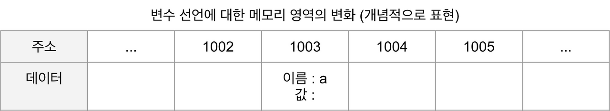
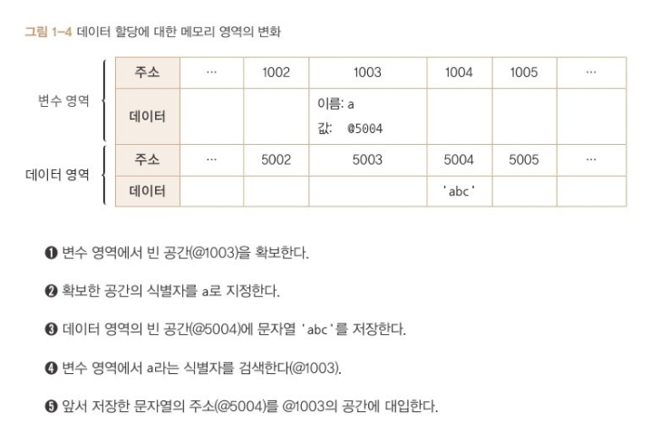

# Javascript 02 | 데이터 타입 (변수 선언 / 데이터 할당)

이번 게시글은 지난 게시글 ([데이터 타입(종류 / 배경지식)](https://twil.weekwith.me/2%EA%B8%B0/%EC%A0%95%EC%84%A0%EB%AF%B8/2021-09-05-javascript-01/))에 이어서 데이터 타입 그 중, 변수 선언과 데이터 할당에 대해 알아보도록 하겠습니다.

## 1. 변수 선언
동작 원리를 알아 볼 것입니다.  

기본적인 변수 선언식은 아래와 같습니다.  

``` js
var a;
```

말로 풀어 쓰면, **"변할 수 있는 데이터를 만든다. 이 데이터의 식별자는 a이다."**가 됩니다.  

**결국, 변수란 "변경 가능한 데이터가 담길 수 있는 공간 또는 그릇"**  
이라고 이해하는 것이 정확합니다.  

### 변수 선언에 대한 메모리 영역의 변화
아래 표는 컴퓨터가 위 변수 선언식의 명령을 받아 메모리 영역에서 어떤 작업을 수행하는지 표현한 것입니다. (실제 메모리 구조를 그리는 것은 비효율적 + 어려워서 개념적으로 표현)  



* 변수 선언 과정
    1. 예제 1-1의 명령을 받은 컴퓨터는 메모리에서 빈 공간 하나 확보 (임의로 1003번으로 정함)  
    2. 공간의 이름(식별자) 지정: a  
* 사용자가 a에 접근 시, 컴퓨터는 메모리에서 a라는 이름을 가진 주소를 검색 한 후, 해당 공간에 담긴 데이터를 반환한다.


## 2. 데이터 할당
### 2-1. 변수 선언과 할당
아래의 코드는 변수 선언과 할당에 대한 코드로, 모두 같은 동작을 수행합니다.  

```js
var a;         // 변수 a 선언
a = 'abc';     // 변수 a에 데이터 할당

var a = 'abc'; // 동시에 변수 선언 & 할당
```


### 2-2. 데이터 할당의 전체 흐름
#### 2-2-1. 할당 과정

!!! note "요약"
    별도의 메모리 공간 (데이터 저장 용도) 확보 후, 문자열 저장 → 그 주소를 변수 영역에 저장
    (해당 위치에 문자열 직접 저장 x)



#### 2-2-1. 값을 직접 대입 하지 않는다
왜 변수 영역에 값을 직접 대입하지 않고 한 단계를 더 거치는 걸까요?  
결론부터 설명하자면, **'자유로운 데이터 변환과 메모리 관리의 효율성'** 때문입니다.  

* 참고 (JS 데이터 확보 공간)
    * 숫자형 : 8 byte
    * 문자열: 규격 없음 ( 이유: 각각 필요한 메모리 용량 및 전체 글자 수가 가변적)
        * 한 글자 마다
            * 영어 : 1byte
            * 한글 : 2 byte

#### 자유로운 데이터 변환
만약 미리 확보한 공간 내에서만 데이터 변환이 가능하다면 변환한 데이터를 다시 저장하기 위해서 **'확보된 공간을 변환된 데이터 크기에 맞게 늘리는 작업'**이 선행 되어야 합니다.  
메모리 중간에 있는 데이터를 늘려야 하는 상황을 생각해본다면 이해가 쉬울 것 입니다. 해당 공간보다 뒤에 저장된 데이터들을 전부 뒤로 옮기고 이에 더해 이동시킨 주소를 각 식별자에 다시 연결해야 합니다.  

결국 효율적인 데이터 변환을 위해 변수와 데이터를 별도로 저장하는 것이 최적입니다.  

또한, **데이터의 값이 변할 경우 새로운 데이터 영역에 저장 후, 주소를 연결**합니다.  


#### 메모리 관리의 효율성
데이터 영역을 따로 두는 것은, **중복된 데이터를 처리할 때 효율적**입니다. 

예를 들어 500개의 변수를 생성한 뒤, 모든 변수에 숫자 5를 할당하는 경우를 생각해 봅시다.  
데이터 영역을 따로 두지 않을 경우에는 총 4000(500 * 8)byte을 써야 합니다.  
하지만 데이터 영역을 따로 둘 경우에 주소 공간의 크기가 2byte라고 한다면, 총 1008(500) byte를 사용하게 됩니다.  

---

'데이터 타입'에 대해서 다음 게시물에 이어서 알아보도록 하겠습니다. 긴 글 읽어주셔서 감사합니다.

* 참고 : 책 '코어 자바스크립트'_정재남