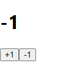

# Redux-middleware 01 | 개요 (필요한 경우 / 작업 환경 준비)


이번 게시글은 리덕스 미들웨어에 알아보기에 앞서서 필요한 배경 지식이 무엇인지 알아보고 미들웨어에 대한 개요 ( 1. 미들웨어가 필요한 경우 2. 작업 환경 준비 )에 대해 알아볼 것입니다.  


## 필요 배경 지식
본 게시글을 이해하며 읽기 위해서는 리액트와 리덕스(redux, react-redux, redux-actions)에 대한 기본적인 이해가 필요합니다.  
배경 지식을 위해서는 개인적으로 김민준 저자의 책 '리액트를 다루는 기술' 또는 [리덕스 부분의 요약 글](https://velog.io/@katej927/series/Redux)을 추천드립니다.  

## 1. 미들웨어가 필요한 경우
미들웨어는 언제 필요할까요?

리액트 웹 어플리케이션에서 API 연동 시에 이 **API 요청에 대한 상태를 잘 관리**해야 합니다.  

예를 들어, **요청이 시작할 경우에는 로딩 중을 명시**해야 하고 **요청이 성공하거나 실패한 경우에는 로딩이 끝났음을 명시**해야 합니다. 또한 성공 시에 올 응답에 대한 상태 관리, 실패 시에 에러에 대한 상태 관리가 필요합니다.  

**즉, 리액트 프로젝트에서 리덕스를 사용하며, 위와 같은 비동기 작업에 대한 관리가 필요할 경우 미들웨어로 효율적인 상태 관리가 가능합니다.**


## 2. 작업 환경 준비
보다 원활한 이해를 위해 리덕스가 적용된 간단한 리액트 프로젝트을 할 것입니다.  

1. CRA(create-react-app)을 사용하여 새 리액트 프로젝트를 생성합니다.  
    <div class="termy">
        ``` console
        $ yarn create react-app learn-redux-middleware​
        ```
    </div>
    <br />

2. 리덕스를 사용하여 카운터를 구현합니다.
    1. 필요한 라이브러리들을 새 프로젝트에 설치합니다.  
    <div class="termy">
        ``` console
        $ yarn add redux react-redux redux-actions​
        ```
    </div>
 
    2. 리덕스를 위한 코드를 준비합니다. 먼저 counter의 리덕스 모듈을 작성합니다.
        - 코드 ( modules/counter.js )
        ``` jsx
        import { createAction, handleActions } from "redux-actions";

        // 액션 타입
        const INCREASE = "counter/INCREASE";
        const DECREASE = "counter/DECREASE";

        // 액션 생성 함수
        export const increase = createAction(INCREASE);
        export const decrease = createAction(DECREASE);

        // 초기 값
        const initialState = 0; // 상태는 꼭 객체일 필요가 없습니다. 숫자도 작동

        // 리듀서
        const counter = handleActions(
        {
            [INCREASE]: (state) => state + 1,
            [DECREASE]: (state) => state - 1,
        },
        initialState
        );

        export default counter;
        ```
            ​
    3. 루트 리듀서를 생성합니다.  
        - 코드 ( modules/index.js )
        ``` jsx
        import { combineReducers } from "redux";
        import counter from "./counter";

        const rootReducer = combineReducers({
        counter,
        });

        export default rootReducer;
        ```

    4. `src/index.js`에 스토어를 생성합니다. 그리고 Provider로 리덕스를 적용합니다.
        - 코드 ( src/index.js )
        ``` jsx
        import React from "react";
        import ReactDOM from "react-dom";
        import { createStore } from "redux";
        import { Provider } from "react-redux";
        import "./index.css";
        import App from "./App";
        import reportWebVitals from "./reportWebVitals";
        import rootReducer from "./modules";

        const store = createStore(rootReducer);

        ReactDOM.render(
        <Provider store={store}>
            <App />
        </Provider>,
        document.getElementById("root")
        );

        reportWebVitals();
        ```
 
    5. counter 컴포넌트 (프레젠테이셔널)와 counter 컨테이너 컴포넌트를 만듭니다.
        - presentational 컴포넌트
            - UI 컴포넌트로 상태 관리를 하지 않습니다.
            - 위치: components 디렉터리
        - containers 컴포넌트
            - 리덕스 연동 컴포넌트
                - 리덕스로 부터 상태를 받아옵니다.
                - 리덕스 스토어에 액션을 디스패치 합니다.
            - 위치: containers 디렉터리
        - 코드( components/Counter.js )
        ``` jsx
        import React from "react";

        const Counter = ({ onIncrease, onDecrease, number }) => {
        return (
            <div>
            <h1>{number}</h1>
            <button onClick={onIncrease}>+1</button>
            <button onClick={onDecrease}>-1</button>
            </div>
        );
        };

        export default Counter;
        ```
            ​
        - 코드 ( containers/CounterContainer.js )
        ``` jsx
        import React from "react";
        import { connect } from "react-redux";
        import { increase, decrease } from "../modules/counter";
        import Counter from "../components/Counter";

        const CounterContainer = ({ number, increase, decrease }) => {
        return (
            <Counter number={number} onIncrease={increase} onDecrease={decrease} />
        );
        };

        export default connect(
        (state) => ({
            number: state.counter,
        }),
        {
            increase,
            decrease,
        }
        )(CounterContainer);
        ```  
            ​
        -> [presentational / containers 컴포넌트 참고 자료 (리덕스 사용 패턴 부분)](https://velog.io/@katej927/Redux-Redux-%EA%B8%B0%EB%B3%B8-%EA%B0%9C%EB%85%90#-%ED%94%84%EB%A0%88%EC%A0%A0%ED%85%8C%EC%9D%B4%EC%85%94%EB%84%90--%EC%BB%A8%ED%85%8C%EC%9D%B4%EB%84%88-%EC%BB%B4%ED%8F%AC%EB%84%8C%ED%8A%B8-%EB%B6%84%EB%A6%AC-%ED%95%84%EC%88%98-x)

    6. App.js 에서 CounterContainer를 렌더링합니다.
        - 코드( src/App.js )
        ``` jsx
        import React from "react";
        import CounterContainer from "./containers/CounterContainer";

        const App = () => {
        return (
            <div>
            <CounterContainer />
            </div>
        );
        };

        export default App;​
        ```

    7. 작동 확인
        <div class="termy">
            ``` console
            $ yarn start​
            ```
        </div>

화면이 아래와 같이 나온다면 준비가 끝났습니다!



* 참고 : 리액트를 다루는 기술_김민준