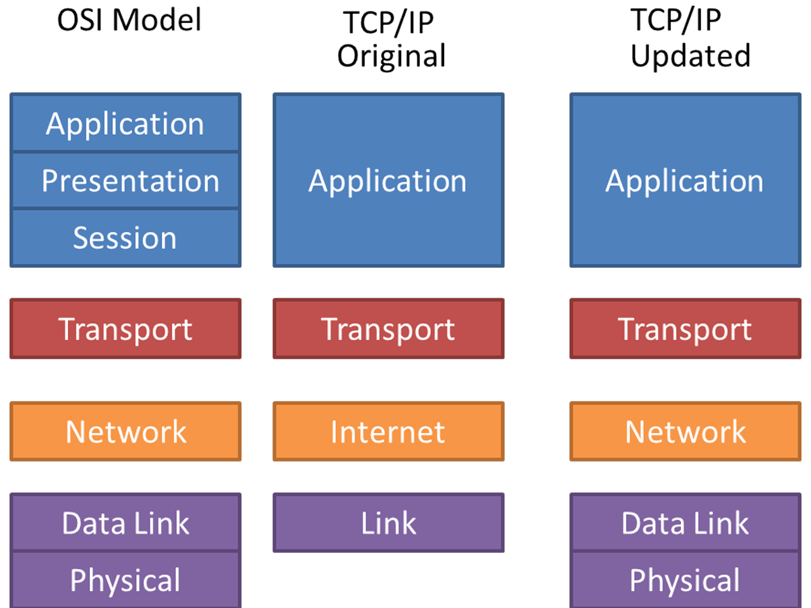
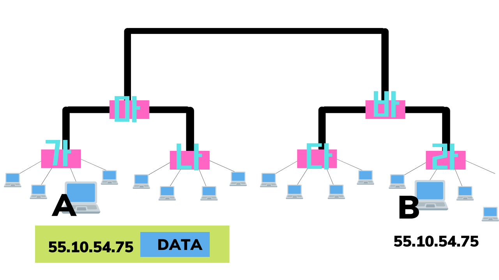
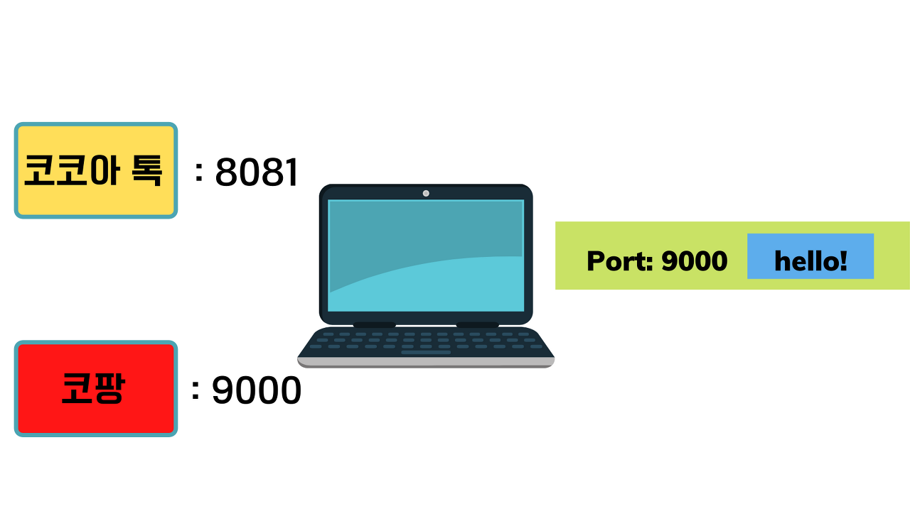
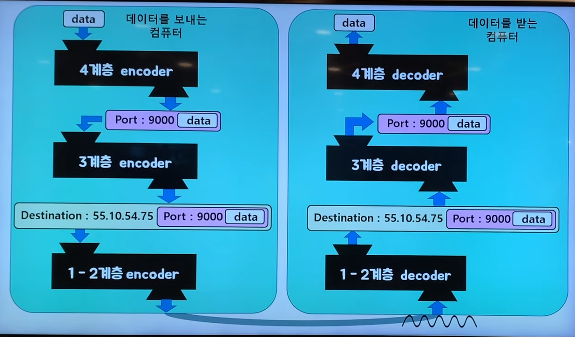

# CS | OSI 7 layers

이번에는 Computer Science의 기본 중 하나인 OSI 7 layers에 대해 알아볼 것입니다.  

소프트웨어 아키텍처 중에 Layered Architecture 라는 것이 있습니다. 이를 따르는 대표적인 예가 네트워크 시스템인데요, 이 네트워크 시스템은 하나의 거대한 소프트웨어라고 할 수 있습니다. 이 거대한 네트워크 소프트웨어의 구조를 설명하는 것이 바로 OSI 7 layers 입니다.  

먼저 OSI 7 layers의 구조를 살펴보겠습니다.  

## OSI 모델 vs TCP/IP

위 표에서 알 수 있다 싶이, 모델은 위에 있을 수록 상위이며, 아래로 올수록 하위 계층으로 나뉘게 됩니다.  
가장 하위 계층인 Physical Layer(물리 계층) 부터 알아보겠습니다.

## 1. Physical Layer(물리 계층)
### Physical Layer(물리 계층)이란
**물리적으로 연결된 두 대의 컴퓨터가 0과 1의 나열을 주고 받을 수 있게 해주는 모듈**
주고 받을 수 있는 방법은 encoding (0과 1의 나열을 아날로그 신호로 바꾸어 전선으로 흘려 보냄)과 decoding (아날로그 신호가 들어오면 0과 1의 나열로 해석)으로 가능하게 됩니다.

!!! note "참고"
    모듈: 프로그래밍 할 때 만드는 함수

### Physical Layer(물리 계층)이 구현된 곳
* PHY 칩

사실 1계층 모듈은 하드웨어 적으로 구현되어 있습니다.  

## 2. Data Link Layer (데이터 링크 계층)
그 다음 계층인 데이터 링크 계층을 이해하기 위해서는 몇 가지의 사전 지식이 필요합니다.

### 사전 지식
**여러 대의 컴퓨터가 통신하기 위해 사용** 되는 것들입니다.
( ※ 주의: 아래 개념들은 글의 주제인 OSI 7 layers과 연관된 내용을 위주로 기술하였습니다.)

1. 더미 허브 : 인터넷 선을 연결하면 해당 포트에 여러 개로 나누어서 여러 대의 PC와 서버들이 인터넷을 사용을 가능 하도록 하는 기능입니다.
2. 스위치 : 일종의 컴퓨터로, msg의 목적지를 확인한 후에 목적지에 도달할 수 있도록 합니다.
3. 네트워크 (or 인트라넷) : 하나의 스위치에 직접적으로 연결된 것들

4. 라우터
    * 스위치들을 연결해서 서로 다른 네트워크에 속한 컴퓨터끼리 통신이 가능하게 해주는 장비
    * 라우터와 라우터가 연결할 수 있음

5. 인터넷
    * 전 세계의 컴퓨터들을 (계층 구조로) 연결한 것

    

### Framing
여러 곳에서 0과 1로 오는 데이터들을 구분하기(끊어 읽기) 위해서 송신자는 **데이터 앞 뒤에 특정한 비트열을 붙입니다.** 그럼 그 특정한 비트열을 찾으면 되는데 이를 Framing이라고 합니다. 데이터 링크 계층에 속하는 작업들 중 하나입니다.  
예를 들어, A라는 곳에서 0100 0110이라는 데이터를 보낸다고 한다면 Framing을 통해 앞에는 1111 뒤에는 0000으로 감싸 어디서부터 어디까지 데이터를 보내는지 명확히 알 수 있게 됩니다.  

### Data Link Layer (데이터 링크 계층)이란
결국 **'같은 네트워크에 있는 여러 대의 컴퓨터들이 데이터를 주고 받기 위해서 필요한 모듈'** 입니다.

### Data Link Layer (데이터 링크 계층)이 구현된 곳
* 랜카드

2계층 모듈도 1계층 모듈처럼 하드웨어 적으로 구현되어 있습니다.

## 3. Network Layer(네트워크 계층)
### 사전지식
* IP 주소
    IP 주소란, '각 컴퓨터들이 갖는 고유한 주소'를 의미합니다.  
    내가 데이터를 보내고 싶은 상대방의 IP 주소를 알고 있어야 데이터 전송이 가능합니다.  

    그렇다면, 최종 목적지 컴퓨터의 IP 주소를 어떻게 아는 걸까요?  
    주소창에 [www.naver.com](https://www.naver.com) 을 입력하면 이 영어 주소는 IP 주소로 변환되어 사용됩니다. 즉, ip 주소를 이미 알고 있는 것과 같습니다.  

* 패킷

`55.10.54.75 [DATA]` 를 패킷이라고 부름 

### 흐름 (많은 컴퓨터들 사이의 통신)
* 컴퓨터 A가 직접적으로 연결된 '라우터_가'에 패킷을 보냄
    * 라우터_가
        * 패킷을 열어서 **목적지 IP주소를 확인**
        * 라우터_가 는 해당 목적지 **IP 주소와 일치하는 컴퓨터 여부를 확인**함 (→ 없음)
    * '라우터_가' 는 데이터를 다시 포장 후, 자신과 연결되어 있는 '라우터_마'에게 전달
        * 라우터_마
            * 패킷 까서 목적지 주소를 읽음
            * 패킷이 해당 목적지에 도착하려면 어느 전선으로 패킷을 보내야 하는지 알아냄. (라우팅 참고)
            * 데이터를 패킷으로 포장함
    * '라우터_바' 에게 패킷 넘김
        * '라우터_바' 는 '라우터_마' 와 같은 방식 실행
    * '라우터_라' 에게 패킷 넘김
        * 라우터_라
            목적지 IP주소가 자신과 연결된 컴퓨터들 중에 있다는 것을 확인함
    * 컴퓨터 B 에게 패킷 전달됨

### Network Layer(네트워크 계층)이란
결국 Network Layer(네트워크 계층)이란, 수많은 네트워크들의 연결로 이루어지는 inter-network 속에서 어딘가에 있는 목적지 컴퓨터로 데이터를 전송하기 위해 IP 주소를 이용해서 길을 찾고 (routing) 자신 다음의 라우터에게 데이터를 넘겨 주는 것 (forwarding)

### Network Layer(네트워크 계층)이 구현되는 곳
운영체제의 커널에 소프트웨어적으로 구현되어 있습니다.

## 4. Transport Layer(전송 계층)
### 사전 지식
* 프로세스
    실행중인 프로그램
* 포트 번호(Port Number)
    포트 번호란, '하나의 컴퓨터에서 **동시에 실행되고 있는 프로세스들이 서로 겹치지 않게 가져 가야 하는** 정수 값'입니다.

데이터를 받고자 하는 프로세스들은 포트 번호를 가져야 합니다.  
송신자는 데이터를 보낼 때 **데이터를 받을 수신자 컴퓨터에 있는 프로세스의 포트 번호**를 붙여서 보냅니다.  

그래서 데이터 전송자는 포트 번호를 미리 알고 있어야 합니다.  
하지만, 검색창에 [www.naver.com](https://www.naver.com)을 입력하는 것은 사실 뒤에 ":80"이 생략 된 것입니다. 그래서 우리는 이미 네이버의 포트 번호도 알고 있는 셈입니다.  

### Transport Layer(전송 계층) 이란
'Port 번호를 사용하여 컴퓨터의 최종 도착지인 프로세스까지 데이터가 도달하게 하는 모듈'입니다.

### Transport Layer(전송 계층)이 구현된 곳
운영체제의 커널에 소프트웨어적으로 구현되어 있습니다.

## 5. Applicaton Layer(응용 계층)
### Presentation(표현)/Session(세션) Layer 설명 생략 이유
* 현대의 인터넷은 OSI 모델이 아니라 TCP/IP 모델을 따릅니다.

### TCP/IP 모델
OSI 모델과 마찬가지로 '네트워크 시스템에 대한 모델'입니다.

특징으로는,

* OSI 7 layers의 5,6,7 계층이 축약되었습니다.  
* 오리지널 버전과 업데이트된 버전이 있습니다. (맨 위의 OSI 7 layers 구조표에서 확인 가능)
오늘 날에는 업데이트된 버전의 TCP/IP 모델이 더 많이 사용되고 있습니다.  

이 때문에 Presentation(표현)/Session(세션) Layer에 대한 설명을 생략합니다.  

### TCP/IP 소켓 프로그래밍
TCP/IP 소켓 프로그래밍이란, 'API(운영 체제의 Transport layer(전송 계층)에서 제공)를 활용해서 통신 가능한 프로그램을 만드는 것' 입니다.  
이것만으로도 클라이언트, 서버 프로그램을 따로따로 만들어서 동작 시킬 수 있고 이것을 통해서 누구나 자신만의 Application Layer 인코더와 디코더를 만들 수 있습니다. 즉, 누구든 자신만의 Application Layer 프로토콜 만들어 사용 가능하다는 뜻입니다.  

### HTTP로 인코딩/디코딩 살피기
HTTP는 대표적인 응용 계층 프로토콜입니다. 이를 통해 인코딩/디코딩을 살펴 보겠습니다.

#### 사전 지식
클라이언트 & 서버 패러다임

#### 흐름

우리의 범용 컴퓨터는 데이터 수신과 전송 둘 다 합니다. 때문에 encoder, decoder 모두 존재합니다.

* 참고 및 출처
    * 유튜브 '우아한 Tech'의 '[10분 테코톡] 🔮 히히의 OSI 7 Layer'
    * [https://mslee89.tistory.com/49](https://mslee89.tistory.com/49)
    * 나오는 여러 개념들은 글의 주제에 해당하는 것을 위주로 다루었습니다.