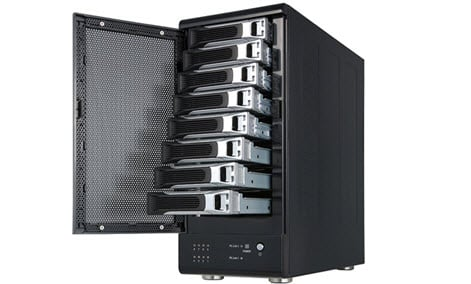
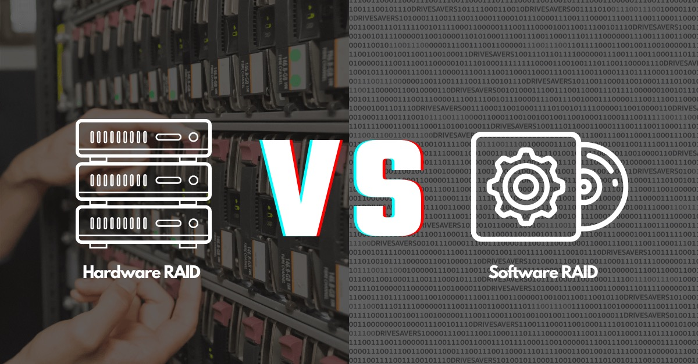
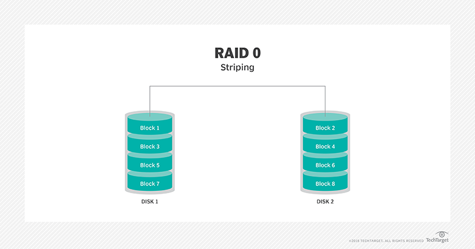
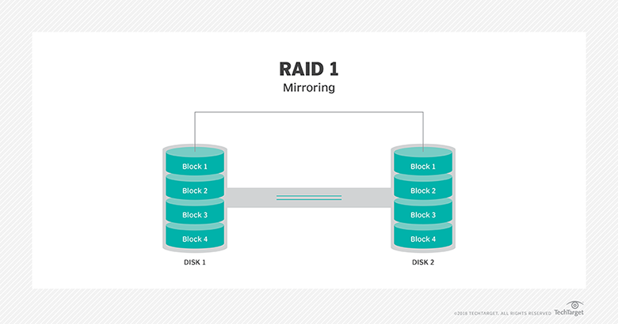
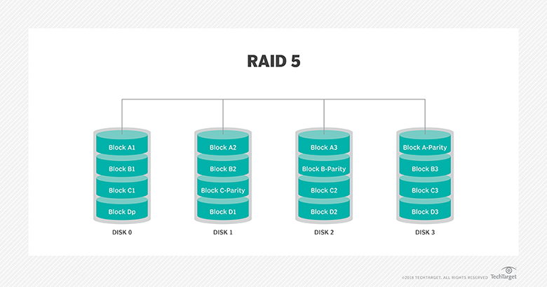
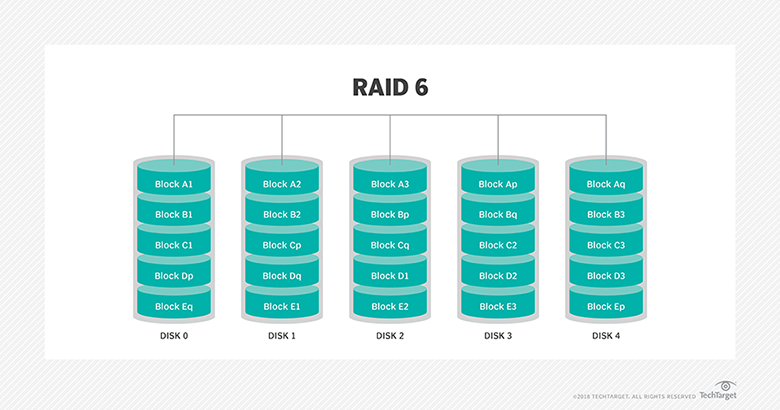
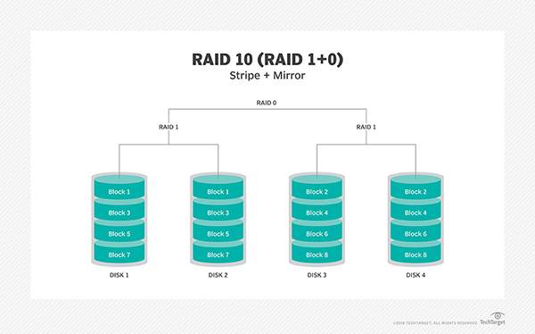

# RAID(Redundant Array of Independent Disk)

## 1. RAID란?

`RAID`는 물리적으로 독립된 여러개의 디스크를 묶어 한개의 논리적인 디스크로 만드는 기술입니다.  
그런데 독립된 디스크로 사용하는것과 `RAID`는 무엇이 다른걸까요?  
독립된 디스크는 외부의 충격이나 기기의 결함이 발생해 고장나는 경우 시스템적으로 복원할 방법이 없습니다. 그래서 이러한 위험을 방지하기 위해 백업 디스크라는 안전장치를 만들게 됩니다.  
반면 `RAID`는 구성에 따라 디스크에 장애가 생기더라도 데이터를 복원할 수 있습니다.  
추가로 성능상의 이점을 챙길수도 있죠.  

물론 `RAID`는 '여러개' 라는 표현에서 알 수 있듯이, 최소 2개의 디스크가 있어야 구성이 가능하고 그 이상 필요한 경우 비용이 많이 발생합니다.  
따라서 `RAID`의 특징을 파악하고 상황과 목적에 맞게 구성하는것이 중요합니다.  

  

## 2. RAID의 종류

`RAID`의 종류는 `하드웨어 RAID`와 `소프트웨어 RAID`가 있습니다.  
먼저 `하드웨어 RAID`는 하드웨어 제조사에서 여러개의 디스크를 연결한 장비를 뜻합니다.  
안정적이고 제조사로부터 기술지원을 받을 수 있어서 많이 선호하는 방법이지만 비용이 비싸다는 단점이 있습니다.  
`소프트웨어 RAID`는 운영체제에서 소프트웨어적으로 하나의 디스크로 인식하게끔 처리하는것입니다.  
성능 측면에서는 `하드웨어 RAID`에 비해 떨어지지만 저렴한 비용으로 `RAID`를 구현한다는 장점이 있습니다.

  

## 3. RAID 레벨
RAID는 구성하는 방법에 따라 불리는 이름을 `RAID 레벨`이라고 합니다. 
`RAID 레벨`은 기본적으로 `RAID 0`, `RAID 1`, `RAID 2`, `RAID 3`, `RAID 4`, `RAID 5`가 있습니다.
`RAID 2`, `RAID 3`, `RAID 4`는 현재 사용하지 않는 방식이며, 실무에서 주로 사용하는 것은 `RAID 0`, `RAID 1`, `RAID 5` 정도가 있습니다.  
그리고 `RAID 1`과 `RAID 0`의 장점을 합친 `RAID 1+0` 방식과 `RAID 5`를 보완한 `RAID 6`을 선택하기도 합니다.  
이 글에서는 실무에서 주로 사용하는 RAID 레벨의 구성방법과 특징을 알아보겠습니다.

  

## 4. RAID 구성 방법
RAID는 성능, 공간 효율, 데이터 안전성 중에서 어느 것에 초점을 맞추느냐에 따라 구성방법이 달라집니다.  
그럼 RAID 레벨별 구성 방법과 기능에 대해 알아보도록 하겠습니다.  

  

### 4.1 RAID 0

`RAID 0`은 여러 디스크에 동시에 데이터를 저장하는 `스트라이핑(Striping)` 기술을 사용합니다.  
최소 2개의 하드디스크가 필요하며 이론상 디스크의 개수가 늘어날수록 성능은 비례해서 좋아지는 구조입니다.  
하지만 데이터를 나누어 저장해서 생기는 단점도 존재합니다.  
만약 한 개의 디스크가 고장나면 다른 디스크의 데이터 또한 사용할 수 없게 되기 때문인데요.  
`RAID 0`은 성능은 좋아지지만 데이터의 위험성이 증가하는 구성 방법입니다.  
그래서 `빠른 성능이 중요하고 데이터가 없어져도 큰 문제가 없는 경우` 이 방법을 채택합니다.

  

### 4.2 RAID 1

`RAID 1` 또한 마찬가지로 최소 2개의 하드디스크가 필요합니다.  
`RAID 1`의 특징은 A 디스크에 저장하는 데이터를 똑같이 B 에도 저장한다는 점입니다.  
이처럼 같은 데이터를 복제해 저장하는 기술을 `미러링(Mirroring)`이라고 부릅니다.  
디스크가 고장나서 사용할 수 없는 경우에도 다른 디스크로부터 데이터를 복원할 수 있다는 장점이 있습니다.  
단점으로는 데이터의 저장 효율이 줄어든다는 점입니다.  미러링 하는 데이터만큼 공간을 사용할 수 없게됩니다.
`하드디스크가 고장나도 데이터가 없어져서는 안되는 경우` 이 방법을 채택합니다.  

  

### 4.4 RAID 5

`RAID 5`는 `RAID 0`과 마찬가지로 `스트라이핑` 기술로 데이터를 저장합니다.  
특징으로는 `패리티 비트(Parity Bit)`를 이용해 데이터 안전성을 보장한다는 점입니다.  
`패리티 비트`는 데이터의 결함을 검증하기 위한 수단입니다.  
1개의 디스크가 고장난 경우 패리티 비트로 데이터를 복원할 수 있습니다.  
하지만 2개 이상의 디스크가 고장난 경우에는 복원이 불가능해 데이터를 잃어버리게 됩니다.
`RAID 5`는 N개의 디스크로 구성하는 경우 `N - 1` 만큼의 공간을 사용 가능합니다.  
성능과 데이터 안전성을 어느정도 보장하기 때문에 많이 사용되는 구성 방법입니다.  
최소 3개의 디스크로 구성이 가능하지만 일반적으로 5개 이상의 디스크로 구성합니다.  

  

### 4.5 RAID 6

`RAID 6`는 `RAID 5`와 비슷한 방식이지만 `패리티 비트`를 2개 사용한다는 점이 다릅니다.  
`RAID 5`는 1개의 디스크 장애만 복원을 보장하는 반면 `RAID 6`는 2개의 디스크 장애까지 복원이 가능합니다.  
`RAID 6`는 N개의 디스크로 구성할 때 `N - 2` 만큼의 공간을 사용할 수 있습니다.  
`RAID 5`와 비교해 읽기 속도는 큰 차이가 없으나, `패리티 비트`를 저장하는 알고리즘이 더 복잡해서 쓰기속도는 비교적 떨어지는 편입니다.  

  

### 4.6 RAID 10 (RAID 1 + RAID 0)

`RAID 1`로 구성한 데이터를 다시 `RAID 0`으로 구성하는 방법입니다.  
데이터 안전성과 성능을 동시에 확보하는 방법으로 패리티는 사용하지 않습니다.  
최소 4개의 디스크로 구성이 가능하며 
이 외에도 RAID 1+6 같은 다양한 RAID 레벨간 조합이 있습니다.

  

## 참고
https://searchstorage.techtarget.com/definition/RAID