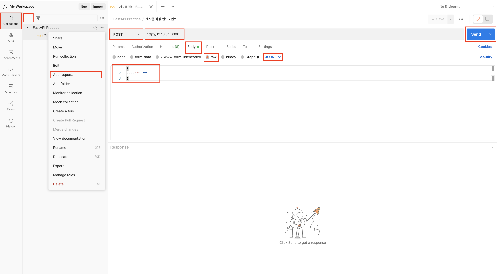
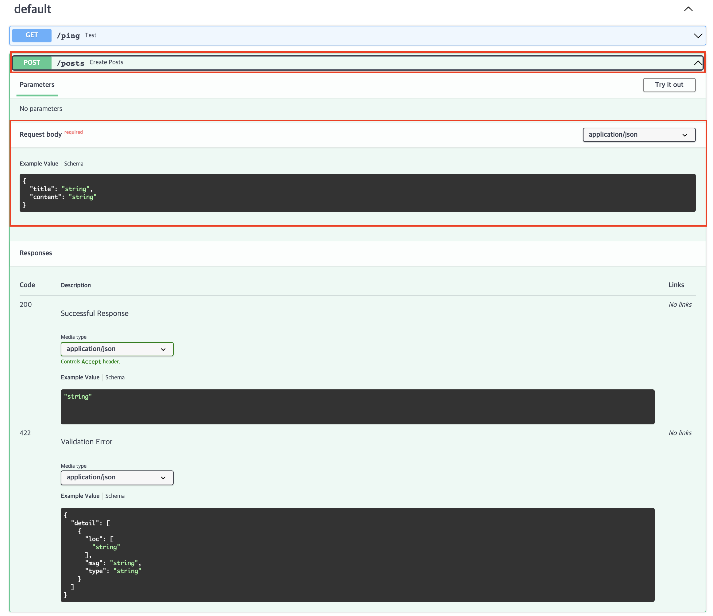

# [ 공식 문서로 배우는 FastAPI & SQLModel ] 04. REST, RESTful API, 그리고 요청 바디를 통한 게시글 작성


## 도입
지난 시간에 클라이언트와 서버, URL과 도메인, API와 엔드포인트, 그리고 HTTP 통신 개념에 관해 간략하게 훑어보았습니다. 이를 통해 대략적으로 어떻게 사용자가 웹 브라우저를 통해 특정 버튼을 클릭하는 행위가 서버에게 동작을 요청시켜 그에 알맞는 자원(Resource), 즉 데이터를 가져와서 작업하는 지 알 수 있었습니다.

더 자세한 내용은 [[ 공식 문서로 배우는 FastAPI & SQLModel ] 03. 클라이언트와 서버, URL과 도메인, API와 엔드포인트, 그리고 HTTP 통신](https://twil.weekwith.me/2%EA%B8%B0/%EC%9D%B4%ED%83%9C%ED%98%84/2021-09-19-fastapi-and-sqlmodel-3/)을 확인해주시면 감사하겠습니다.

오늘은 이제 본격적으로 게시글을 작성하는 엔드포인트를 만들어보도록 하겠습니다. 그리고 이 과정에서 엔드포인트를 만들기 위해 알아야 할 일종의 규칙인 **REST(REpresentational State Transfer)**에 관해 알아보고자 합니다.

!!! warning "주의"

    실제 데이터베이스를 연결해서 이를 실습하지는 않습니다.
    
    따라서 MySQL, PostgreSQL과 같은 관계형 데이터베이스 및 NoSQL과의 연동을 생각하신 분들은 관련해서 추후에 나올 글을 참고해주시면 감사하겠습니다.


## 준비물
### 포스트맨
원활한 테스트를 위해 [포스트맨](https://www.postman.com/)에 회원가입하고 설치해야 합니다.

아래 이미지와 같이 콜렉션을 하나 만든 뒤, *Add request* 버튼을 클릭하여 `POST` 작동의 엔드포인트를 하나 만듭니다.



사용하게 될 기능은 `Body`에 `JSON` 데이터를 담은 **요청(Request)**에 대해 **응답(Response)**하는 것입니다.`http://127.0.0.1:8000`의 경우 아직 정확한 엔드포인트를 만들지 않았지만 게시글 작성에 대한 엔드포인트를 생성할 경우 해당 위치에 작성하게 된 엔드포인트를 입력하게 됩니다. 끝으로 *Send* 버튼을 통해 실제 클라이언트가 요청을 하듯 서버에 통신이 시도됩니다.

`Body`, `JSON`에 대한 내용은 정확히 몰라도 괜찮습니다. 우선은 해당 이미지와 똑같이 준비하시면 성공입니다!

## 게시글 생성
이제 게시글을 생성할 함수를 만들어봅시다.

### `BaseModel`
우선 아래와 같이 `pydantic`에서 `BaseModel`을 임포트합니다.

```Python hl_lines="2"
{!../docs_src/3기/이태현/1주차/example.py!}
```

### 클래스 생성
이제 `BaseModel`을 상속 받는 클래스로 데이터 모델 `Posts`를 생성합니다.

```Python hl_lines="8-10"
{!../docs_src/3기/이태현/1주차/example.py!}
```

!!! note "참고"

    Pydantic에서 `BaseModel` 클래스는 데이터 모델을 쉽게 클래스로 선언할 수 있게 해줍니다. 이는 곧 파이썬 3.7부터 등장한 `dataclasses`라는 모듈과 유사합니다.
    
    또한 신뢰할 수 없는 데이터에 대한 검증(Validation)을 대신 해줍니다. 예를 들어 쌍점(`:`)을 사용하여 해당 데이터의 자료형을 명시해줄 수 있습니다.
    
    `title` 데이터의 자료형은 `title: str`로 작성되었기 때문에 `str`입니다. 만약 `str`이 아닌 `int`와 같은 다른 자료형을 전달 받게 되면 오류가 발생하고 관련해서 자동으로 오류를 반환해줍니다. 이러한 형태의 검증이 효과적인 사례는 추후에 더 자세히 살펴보겠습니다.


### 함수 생성
#### HTTP 메서드 및 엔드포인트
이제 실제로 게시글 생성 작업을 담당할 함수(`create_posts`)를 생성합니다. 이전 `GET /ping`이라는 엔드포인트를 만들었던 것과 유사하게 `app` 데코레이터를 활용하여 아래와 같이 `POST /posts` 엔드포인트를 생성합니다.

```Python hl_lines="18"
{!../docs_src/3기/이태현/1주차/example.py!}
```

* `@app.post`: HTTP의 작동 방식, 즉 메서드(Method)를 의미합니다. 이전 시간에 알아봤던 것처럼 `POST`는 **생성**을 의미합니다.
* `/posts`: 엔드포인트를 의미합니다. **게시글**을 작성하는 것이기 때문에 `/posts`라는 엔드포인트로 명명하였습니다.

반드시 `POST` 작동 방식을 사용해야는 지, 또 엔드포인트는 `/create-post`와 같이 명명하면 안 되는 것인지 궁금하실 수 있습니다. 관련해서는 아래 **REST** 개념에 대해 알아볼 때 조금 더 자세히 살펴보겠습니다.

#### 매개변수 선언
이제 아래와 같이 함수의 매개변수로 앞서 만들었던 데이터 모델 `Posts`를 전달 받습니다. 이를 통해 **FastAPI**는 정의되지 않은 양식의 데이터를 전달 받는 상황을 예방합니다. 관련된 더 자세한 부분은 아래에서 더 자세히 살펴보겠습니다.

```Python hl_lines="19"
{!../docs_src/3기/이태현/1주차/example.py!}
```

#### 반환값
아직 데이터베이스를 연결하지 않았습니다. 따라서 저장하려는 데이터가 실제로 잘 전달되는 지 확인하기 위해 아래와 같이 바디로 전달받게 되는 데이터를 그대로 반환합니다.

```Python hl_lines="20"
{!../docs_src/3기/이태현/1주차/example.py!}
```

### 테스트
이제 포스트맨에서 테스트를 한 번 진행해봅시다.

#### 성공 사례
우선 `title` 및 `content`가 기존 정의한 `Posts` 데이터 모델에 맞게 `str`로, 성공적으로 전달되는 경우를 살펴봅시다.

그러기 위해서는 아래와 같은 `JSON` 데이터를 포스트맨 바디에 입력하여 앞서 만든 엔드포인트인 `/posts`에, 다시 말해 `http://127.0.0.1:8000/posts`에 `POST` 작동 방식으로 전송(*Send*)합니다.

```JSON
{
    "title": "테스트",
    "content": "테스트입니다."
}
```

!!! info "정보"

    **JSON(JavaScript Object Notation)**은 키-값(Key-Value) 쌍으로 이루어진 데이터 객체를 전달하기 위해 사람이 읽을 수 있는 텍스트로 만들어진 포맷입니다.

    클라이언트-서버 간의 데이터 교환 형식이라고 생각하면 편합니다. 이름에서 알 수 있듯 자바스크립트(JavaScript) 객체(Object) 문법을 따르지만 굳이 자바스크립트가 아니더라도 JSON을 사용할 수 있습니다.

그러면 결괏값으로 아래와 같이 요청과 똑같은 응답을 전달받게 됩니다.

```JSON
{
    "title": "테스트",
    "content": "테스트입니다."
}
```

#### 실패 사례
이제 아래와 같이 `title` 부분을 제외하고 `content`만 한 번 전달해보도록 하겠습니다.

```JSON
{
    "content": "테스트입니다."
}
```

그러면 결괏값으로 아래와 같은 응답을 전달받게 됩니다.

```JSON hl_lines="5-6 8-9"
{
    "detail": [
        {
            "loc": [
                "body",
                "title"
            ],
            "msg": "field required",
            "type": "value_error.missing"
        }
    ]
}
```

`"loc"` 부분을 통해 알 수 있듯 바디(`body`) 부분에 요구되는(`field required`) 어떤 데이터(`title`)를 전달하지 않았음(`value_error.missing`)을 알 수 있습니다.

이처럼 Pydantic의 `BaseModel`을 활용하여 해당 데이터 모델의 검증(Validation)을 손쉽게 할 수 있습니다. 이것이 바로 **FastAPI**의 큰 장점 중 하나입니다.

### 문서
이제 [http://127.0.0.1:8000/docs](http://127.0.0.1:8000/docs)로 브라우저를 켜고 접근하면 아래와 같이 이전에는 없던 `POST /posts`라는 엔드포인트가 생성된 것을 확인할 수 있습니다.



이처럼 **FastAPI**는 생성한 API에 관한 문서를 자동으로 만들어줍니다.

문서의 중요성은 앞서 검증(Validation)을 통해 쉽게 유추해 볼 수 있습니다. 만약 클라이언트에서, 다시 말해 프론트엔드 개발자가 게시글을 생성(`POST /posts`)할 때 어떤 데이터(`title` 및 `content`)를 전달해줘야 하는 지 모른다면 매번 서버 개발자에게 이를 묻거나 아니면 실패를 반복하며 유추할 수밖에 없습니다.

그러나 만약 이런 API 문서가 잘 정리되어 있다면 개발자는 필요할 때 이를 참고하며 개발을 할 수 있어 소통에 있어서도 훨씬 효율적입니다.

## REST
앞서 왜 `POST` 경로 작동 방식을 사용해야 하는 지, `/posts` 엔드포인트를 사용해야 하는 지 짚고 넘어가지 않았습니다. 이와 관련하여 생각하기 위해서는 **REST**가 무엇인지 우선 알 필요가 있습니다.

### 정의
**REST(REpresentational State Transfer)**란 웹(Web)과 같은 분산 하이퍼 시스템을 위한 아키텍처 스타일을 의미합니다. 여기서 **아키텍처(Architecture)**란 제약조건들의 집합이라 생각하면 편합니다.

다시 말해 **REST**를 쉽게 풀어서 설명하면 웹과 같은 환경에서의 제약 조건들, 즉 규칙을 의미합니다.

### 제약조건
**REST**의 제약조건에는 다양한 것이 있지만 그중 면밀히 살펴봐야 할 부분은 바로 **통합 인터페이스(Uniform Interface)**, 다시 말해 URI(Uniform Resource Identifier)에 관한 부분입니다.

이전 시간 URI에 관해 알아보았습니다. 자원을 식별할 수 있는 방법을 의미하기 때문에 REST는 곧 자원을 식별할 수 있는 방법에 어떤 규칙을 선정하는 것이라 생각해볼 수 있습니다.

즉 서버 개발자 입장에서는 엔드포인트를 설계 하는 방식에 규칙을 적용한다는 의미입니다.

앞서 만든 게시글 작성(`POST /posts`)을 예로 들어 봅시다. 만약 게시글 작성을 `/create-post`라 명명한다면 게시글 조회는 `/get-post`라 명명할 수 있습니다. 이때 각각의 HTTP 작동 방식은 `POST`, `GET`이 될 수도 있지만 사실 HTTP의 작동 방식은 엄격한 제약 조건이 아니기 때문에 `/creat-post`의 작동 방식을 `GET` 또는 `PUT`으로 해도 무관합니다.

만약 여기서 수정을 추가한다면 또다시 `POST`와 같은 임의의 작동 방식을 사용하고 `/update-post`와 같은 엔드포인트를 만들게 됩니다. 이처럼 매번 API에 대한 요구가 늘어갈 수록 새로운 엔드포인트를 생성해야 하며 해당 엔드포인트가 작동 방식과도 매치가 되지 않아 사용하는 입장에서 큰 혼란이 올 수 있습니다.

이때 생성, 조회, 수정, 삭제와 같은 **CRUD(Create Read Update Delete)** 부분을 작동 방식에 맡기고 엔드포인트에는 어떠한 동사도 들어가 있지 않게 합니다. 즉 게시글 작성은 `POST /posts`, 게시글 조회는 `GET /posts`와 같은 형태로 만듭니다.

이렇게 규칙을 지킬 경우 게시글 수정에 대한 추가 API 요구사항이 발생했을 때 `PUT /posts`와 같은 방식으로 동일한 엔드포인트로 만들 수 있으며 사용하는 입장에서도 그 통일성 덕분에 능률적인 개발이 가능해집니다.

이러한 제약 조건을 가리켜 **URI을 통한 리소스 식별(Identification of resources by URI)**이라 합니다.


### RESTful API
결국 이러한 제약 조건을 잘 지킨 API를 **RESTful API**라 합니다. 앞으로 만들게 되는 여러 API는 이러한 규칙에 맞게 작동 방식을 통해 행위(**CRUD**)을 표현하고, 엔드포인트를 통해 자원(Resource)을 나타내도록 하겠습니다.

!!! warning "주의"

    **REST**는 Roy Fielding의 논문에서 처음 나온 개념입니다. 현대의 많은 REST API는 RESTful API라고 주장하고 있지만 사실 많은 API가 진정한 REST를 따르고 있지 않습니다.

    Roy Fielding는 그래서 REST라는 이름을 사용하지 않던가 혹은 REST를 필히 지켜줄 것을 매번 강조하는데 대부분의 API는 RESTful하지 않지만 편의상 REST API라 말하고 있습니다.

    따라서 더 많은 제약조건들과 진정한 **RESTful**에 대한 부분은 해당 개념에서 다루지 않고, 편의를 위해 앞서 말한 규칙을 지키는 경우를 REST API라 하도록 하겠습니다.


## 다음 단계
그렇다면 이제 생성 외에 조회, 수정, 삭제는 어떻게 하며, 데이터베이스에 여러 게시글을 저장했을 때 어떻게 하나의 특정 게시글만 조회, 수정, 삭제할 수 있을 지 궁금할 수 있습니다.

다음 시간 **데이터베이스** 및 **ORM(Object Relational Mapping)**에 대한 개념에 대해 간략하게 살펴보고 그 다음 실제 데이터베이스에 게시글 데이터를 저장하고 이를 조회, 수정, 삭제 해보겠습니다.

---

## 참고
`Body`에 관한 FastAPI 공식 문서 및 `BaseModel`에 관한 Pydantic 공식 문서 번역은 아래 글을 확인해주시기 바랍니다.

* **FastAPI**: [요청 바디]()
* **Pydantic**: [모델]()

## 코드
본문에 사용한 코드는 아래 GitHub 저장소에서 확인하실 수 있습니다.

모든 커밋은 해당 게시글의 이름을 따릅니다.

[https://github.com/week-with-me/fastapi-practice](https://github.com/week-with-me/fastapi-practice)