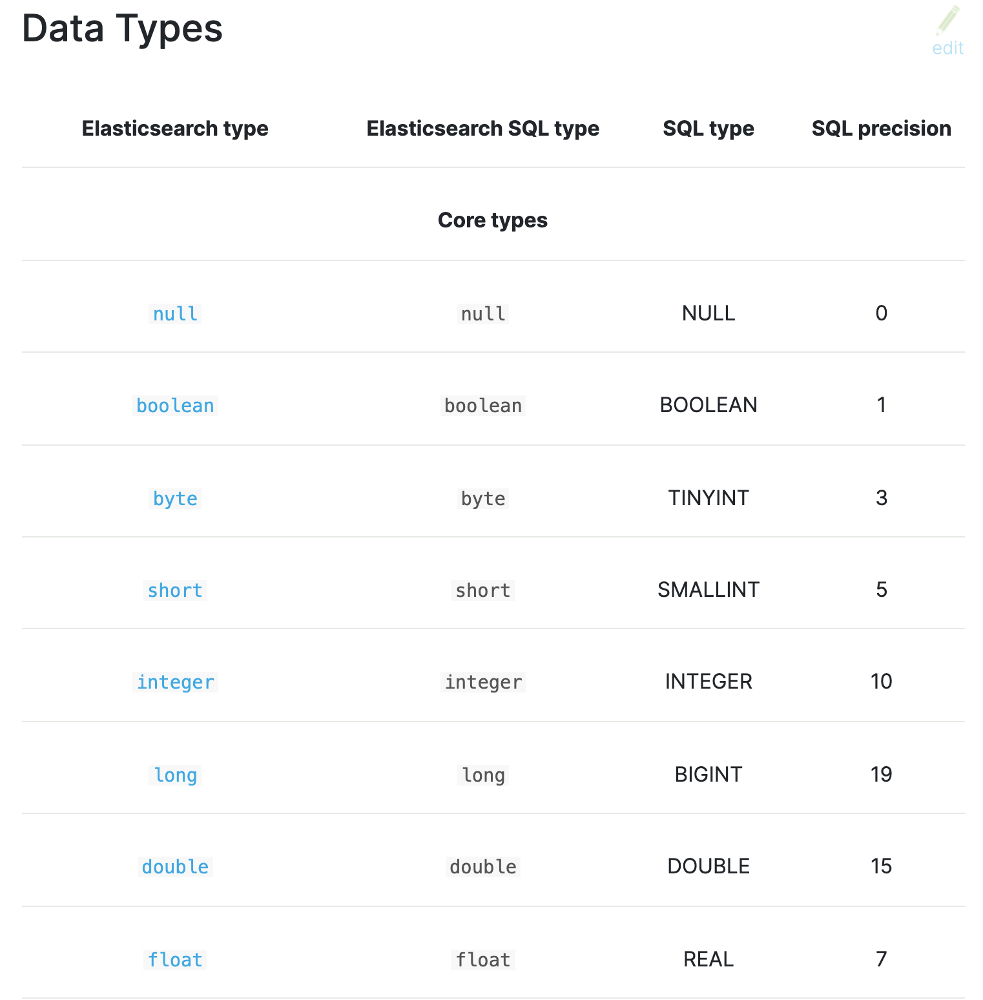

지난 글에서 소개했듯이 엘라스틱서치는 검색엔진과 데이터베이스의 역할을 수행합니다.  
그래서 용어는 다르지만 관계형 데이터베이스의 개념과 유사한 점이 있습니다.  
이번에는 관계형 데이터베이스와 비교한 엘라스틱서치7(이하 ES7)의 용어 및 개념들에 대해 알아보겠습니다.  
참고로 굳이 ES7이라고 버전까지 언급하는 이유는 옛날 버전의 ES와 비교해서 구조에 변화가 있었기 때문입니다.  
  

## 1. MySQL과 ES7의 구성요소
|MySql|ES7|
|----------|----------|
|테이블|인덱스|
|레코드|도큐먼트|
|컬럼|필드|
|스키마|매핑|  

위 표는 많이 쓰이는 관계형 데이터베이스 중 하나인 MySQL와 ES7의 유사한 개념인 구성요소들을 연결한 것입니다.  
분명 용어는 다르지만 하는 역할은 비슷한 점이 많습니다!  
그럼 지금부터 하나씩 살펴볼까요?

  

## 2. 인덱스
인덱스는 도큐먼트를 저장하는 논리적 단위입니다.  
도큐먼트는 관계형 데이터베이스의의 레코드(row)와 유사한 개념입니다.  
그리고 이것을 저장하는 인덱스는 테이블과 유사하다고 볼 수 있어요.
하나의 인덱스는 여러개의 도큐먼트를 포함할 수 있습니다.  
그리고 같은 인덱스에 있는 도큐먼트는 동일한 스키마(매핑)를 갖습니다.  
관계형 데이터베이스에서 컬럼, 제약조건 등의 테이블 스펙을 따르는것과 비슷하죠?

  

## 3. 도큐먼트
앞서 잠깐 설명한 것 처럼 관계형 데이터베이스의 레코드와 유사한 개념입니다.  
당연한 얘기지만 반드시 하나의 인덱스에 포함되어야 합니다!  
도큐먼트는 여러개의 필드(Field)와 값(Value)들로 이루어져 있어요.  
도큐먼트를 인덱스에 추가하는것을 인덱싱(indexing)이라고 합니다.  

  

## 4. 필드
필드는 관계형 데이터베이스의 컬럼과 유사한 개념이에요.  
도큐먼트에 저장하는 값들을 구분하기 위해 이름을 부여하는데 사용됩니다.  

  

## 5. 매핑

매핑은 관계형 데이터 베이스의 스키마와 유사합니다.  
특정 컬럼(필드)에는 어떤 데이터타입을 저장해야하는지 정의합니다.  
매핑을 정의하는 방법은 다이나믹 매핑, 명시적 매핑 2가지가 있습니다.  
다이나믹 매핑은 입력되는 데이터에 맞게 알아서 데이터타입을 추론하는 방법입니다.  
하지만 데이터타입으로 인해 메모리를 비효율적으로 사용하는 경우도 있습니다.
예를 들면 다이나믹 매핑은 숫자형의 경우에는 기본적으로 long타입으로 저장합니다.  
만약 나이 처럼 보통 2자리만 저장하는 데이터인데 long타입은 메모리 낭비를 초래할 수 있겠죠?
명시적 매핑은 다이나믹매핑과는 다르게 직접 필드의 데이터타입을 정의하는 방법입니다.  
직접 정의하는 번거로움이 따르지만 앞으로 입력될 데이터가 명확하다면 성능을 최적화하기 좋은 방법입니다.  
관계형 데이터베이스와 마찬가지로 스키마에 스펙에 추가하는것은 어렵지 않습니다.  
하지만 기존 스펙을 변경하는것은 비용과 리스크가 뒤따릅니다.  
때문에 매핑을 정의하는 작업은 신중하게 결정해야합니다!

  

## 마무리
이번에는 관계형 데이터베이스와 ES를 비교하며 데이터 저장과 관련된 구성요소들을 알아보았습니다.
