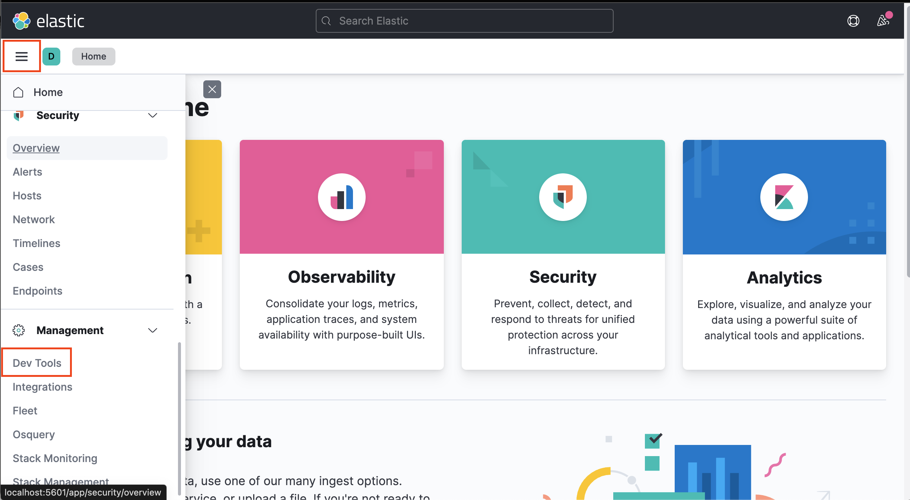
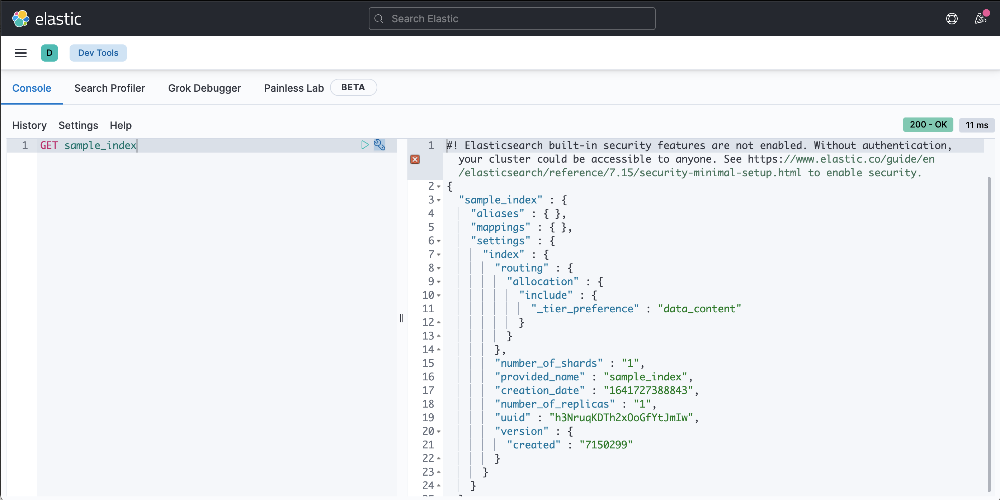
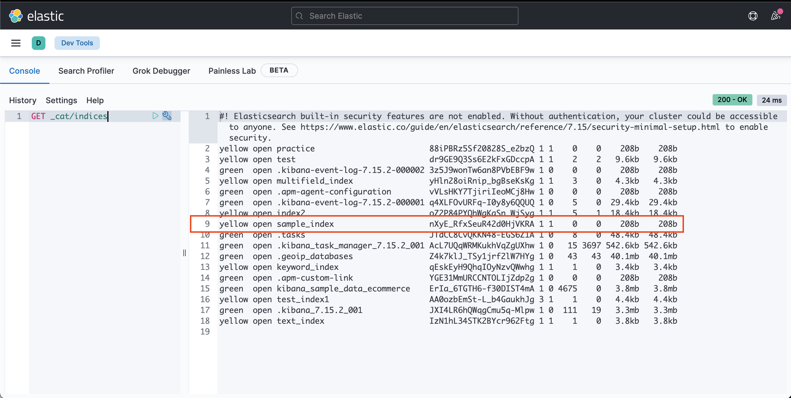
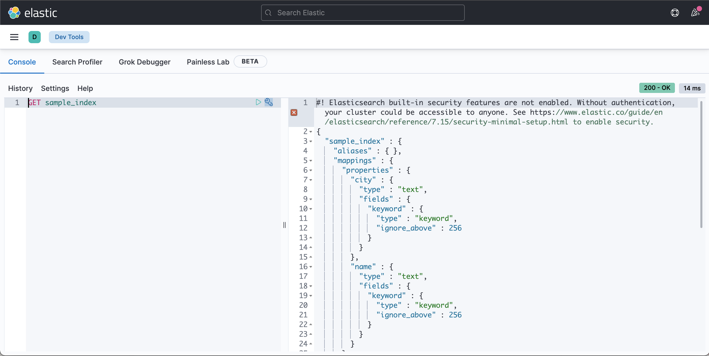
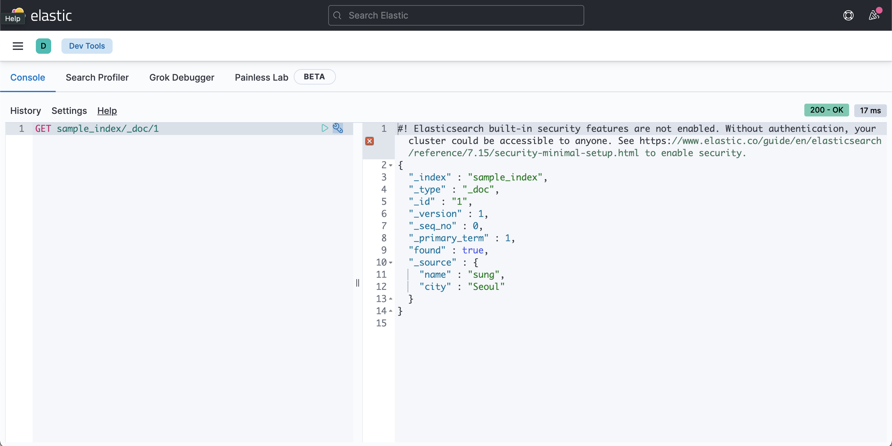
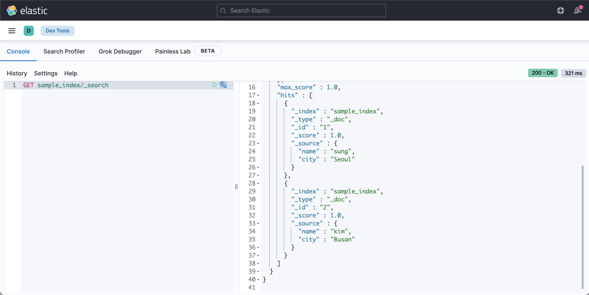
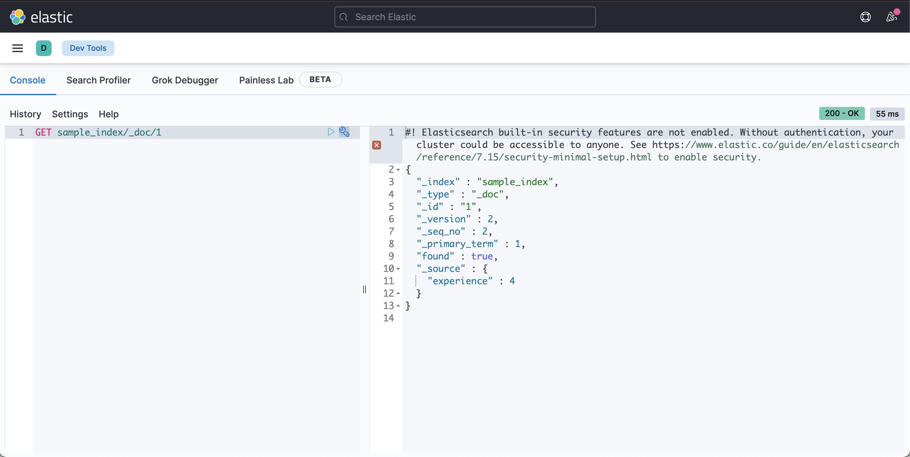
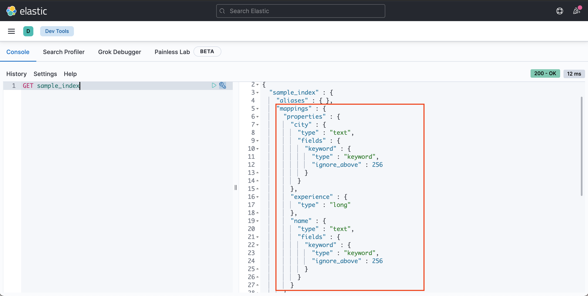
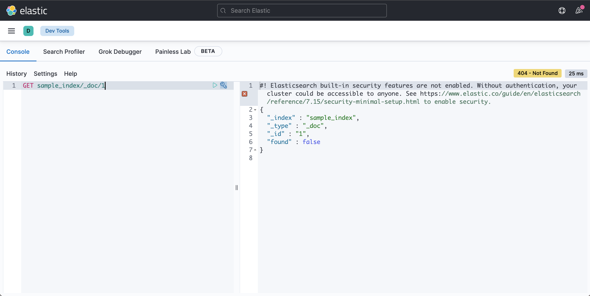

이번 글에서는 엘라스틱서치(ES7)와 키바나를 설치하고 실행하는 방법과 간단한 CRUD 기능을 사용해보겠습니다.  

<br><br>

## 1. 엘라스틱서치, 키바나 다운로드
설치 과정에서는 엘라스틱 사이트에서 설치 파일을 다운로드해서 진행하겠습니다.  
이 방법 외에도 `brew`같은 패키지 매니저를 사용해서 설치할 수도 있습니다.  

<br><br>

### 1.1 다운로드
* ES7 - https://www.elastic.co/kr/downloads/elasticsearch  
* Kibana - https://www.elastic.co/kr/downloads/kibana

위 경로에서 자신의 OS에 맞는 버전을 선택하고 다운로드합니다.  
다운로드가 끝나면 원하는 경로에 압축을 풀어줍니다.

<br><br>

### 1.2 압축 풀기
```sh
# 자신이 다운로드 받은 파일명을 입력하면 된다.
# ES7 
$ tar -xvf elasticsearch-7.15.2-darwin-x86_64.tar.gz
# Kibana
$ tar -xvf kibana-7.15.2-darwin-x86_64.tar.gz
```

<br><br>


## 2. 엘라스틱서치, 키바나 실행하기

설치가 성공적으로 마무리 되었다면 엘라스틱서치와 키바나를 실행해볼까요?  
실행방법은 간단합니다. 엘라스틱서치와 키바나의 `bin` 디렉터리에서 `elasticsearch`, `kibana`를 각각 실행하면 됩니다.  

<br><br>

### 2.1 엘라스틱서치 실행하기
```sh
$ cd elasticsearch-7.15.2
$ bin/elasticsearch
```
먼저 엘라스틱 서치를 실행한다.  
터미널을 열고 압축을 해제한 디렉터리로 이동해서 `bin/elasticsearch`를 실행한다.  
브라우저를 열고 주소창에 `localhost:9200`를 입력하면 실행되었는지 확인이 가능하다.  
엘라스틱서치의 기본 포트는 `9200`번으로 설정되어있습니다.  

<br><br>

### 2.2 키바나 실행하기
```sh
$ cd kibana-7.15.2-darwin-x86_64
$ bin/kibana
```
이번에는 터미널을 하나 더 열고 Kibana가 설치된 디렉터리로 이동합니다.  
`bin/kibana`를 입력해서 Kibana를 실행하고 브라우저의 주소창에 `localhost:5601`을 입력합니다.  
키바나의 기본 포트는 `5601`번으로 설정되어있습니다.  
Kibana는 엘라스틱서치의 시각화 도구이기 때문에 반드시 엘라스틱서치가 실행된 상태에서 실행해야 합니다.  
그렇지 않으면 오류가 발생합니다.  

<br><br>


## 3. 엘라스틱서치의 CRUD
엘라스틱서치는 REST API형태로 동작합니다.  
즉, 다음과 같은 HTTP 메서드에 따라서 CRUD 동작을 하게됩니다.  

* POST: 생성
* GET: 조회
* PUT: 수정
* DELETE: 삭제

그럼 REST API에 맞게 동작하는지 엘라스틱서치에 요청하고 응답을 받아보겠습니다.  
`Kibana Dev Tools`의 `Console`을 사용해서 HTTP 요청을 보내보겠습니다.  
물론 브라우저, Postman, curl 등등 HTTP요청이 가능한 도구들을 사용해서 보내도 상관없습니다.  
그럼 실습을 위해 Kibana Devtools를 실행해 보겠습니다!   
아래 화면과 같이 메뉴버튼을 클릭한 다음 `Management > Dev Tools`로 이동해서 `Console`을 선택하면 요청을 작성하는 텍스트 에디터가 나옵니다.  



<br><br>

### 3.1 인덱스 생성하기
이전 글에서 `인덱스`는 관계형 데이터베이스의 `테이블`와 같고 `도큐먼트`는 `레코드`와 같다는 설명이 기억이 나시나요?  
우리가 관계형 데이터베이스에서 CRUD를 실습하기 위해서는 먼저 `테이블`을 만들어야 `레코드`를 입력할 수 있는것 처럼, 엘라스틱서치에서도 `인덱스`를 만들어야 `도큐먼트`를 CRUD할 수 있습니다.  
그럼 인덱스를 만들어보겠습니다.

<br><br>

* 인덱스 생성
    ```sh
    PUT sample_index
    ```
    키바나 콘솔에서 위와 같이 입력하면 `sample_index`라는 이름의 인덱스를 생성합니다.  
    인덱스가 제대로 생성되었는지 확인해보죠.

<br><br>

* 인덱스 조회
    ```sh
    # GET index이름
    GET sample_index
    ```
    
    GET메서드로 인덱스를 조회하면 정상적으로 생성된 것을 확인할 수 있습니다.  

<br><br>

* 인덱스 삭제
    ```sh
    # DELETE index이름
    DELETE sample_index
    ```

    인덱스를 삭제하고 싶은 경우 DELETE 메서드로 요청합니다.  
    인덱스를 삭제하면 인덱싱된 도큐먼트가 모두 삭제되니 신중하게 결정해야합니다!  

<br><br>

* 인덱스 목록 조회
    
    ```sh
    GET _cat/indices
    ```
    
    만약 모든 인덱스를 조회하고 싶다면 `cat` API를 사용하면 됩니다.  
    `cat`은 `compact and aligned text`의 약자로 엘라스틱서치의 상태를 확인할 목적으로 만들어진 API입니다.  
    위 요청을 실행하면 그림처럼 인덱스가 생성된 것을 확인할 수 있습니다.  
    인덱스 조회 외에도 다양한 기능들이 있는데 차차 알아가보도록 하겠습니다.  
    `GET _cat`으로 요청을 보내면 아래와 같이 `cat`이 제공하는 기능들을 확인할 수 있습니다.  

    ```sh
    #! Elasticsearch built-in security features are not enabled. Without authentication, your cluster could be accessible to anyone. See https://www.elastic.co/guide/en/elasticsearch/reference/7.15/security-minimal-setup.html to enable security.
    =^.^=
    /_cat/allocation
    /_cat/shards
    /_cat/shards/{index}
    /_cat/master
    /_cat/nodes
    /_cat/tasks
    /_cat/indices
    /_cat/indices/{index}
    /_cat/segments
    /_cat/segments/{index}
    /_cat/count
    /_cat/count/{index}
    # ... 이하 생략...
    ```

<br><br>

### 3.2 Create
자! 드디어 인덱스를 생성했으니 CRUD를 실행할 수 있게 되었습니다.  
그럼 생성한 인덱스에 도큐먼트를 생성해보겠습니다.  
아래와 같이 POST메서드로 요청을 보내면 도큐먼트가 생성됩니다.  


```sh
# POST index이름/_doc/{id}
POST sample_index/_doc/1 
{ "name": "sung", "city": "Seoul" }
```


이처럼 도큐먼트를 생성하는 작업을 `인덱싱` 이라고 지난 글에서 설명 드렸습니다.
잠시만요! 저희는 인덱스만 생성하고 스키마에 해당하는 매핑은 설정한 적이 없습니다.
매핑 정보를 입력한 적이 없는데 어떻게 인덱싱이 가능한걸까요?  
바로 지난 글에서 언급했던 `다이나믹 매핑` 덕분입니다.  
아래와 같이 요청하면 인덱스의 매핑 정보를 조회할 수 있습니다.  
```sh
# GET index이름
GET sample_index
```



매핑에 관한 자세한 내용은 차차 알아보도록 하고 인덱싱한 도큐먼트를 조회해봅시다.    

<br><br>

### 3.3 Read

앞서 입력한 도큐먼트를 조회해보겠습니다.  
엘라스틱서치에서 데이터를 조회하는 방법은 `도큐먼트 ID`를 활용한 방법과 `DSL`이라는 엘라스틱서치 전용 쿼리로 검색하는 방법이 있습니다.  
먼저 도큐먼트 ID를 활용한 조회입니다.  
ID로 조회하는 만큼 단건의 조회에 적합한 방법입니다.  
아래와 같이 GET메서드로 요청을 보내면 ID가 일치하는 도큐먼트를 조회합니다.  
```sh
# GET index이름/_doc/{id}
GET sample_index/_doc/1
```


<br><br>

하지만 빅데이터 세계에서는 단건으로 조회하는 일은 많지 않습니다.  
여러 데이터를 한번에 조회하기 위해 `_search`라는 `DSL쿼리`를 사용해 보겠습니다.
사용하기 앞서 차이를 느껴보기 위해 추가로 인덱싱을 진행합니다.  

```sh
POST sample_index/_doc/2 
{ "name": "kim", "city": "Busan" }
```

자 그럼 DSL쿼리로 조회를 해볼까요?

```sh
# GET index이름/_search
GET sample_index/_search
```

그림에서 인덱스의 모든 도큐먼트가 조회된 것을 확인할 수 있습니다.  

<br><br>

### 3.4 Update

이번에는 수정입니다.  
PUT메서드로 요청하면 도큐먼트를 수정할 수 있습니다.  
맨 처음 만들었던 1번 id의 도큐먼트를 아래와 같이 수정해보겠습니다.  
```sh
# PUT index이름/_doc/{id}
PUT sample_index/_doc/1
{ "experience": 4 }
```

다시 조회해보면 내용이 변경된 것을 확인할 수 있습니다.  
기존에 있던 필드인 `name`, `city`가 없어지고 새로운 필드인 `experience`가 생겼습니다.    
관계형 데이터베이스였다면 스키마에 맞지 않는 요청이라 오류가 발생했을겁니다.  
인덱스의 매핑을 다시 조회해보면 이에 맞게 인덱스의 매핑이 변경된 것을 확인할 수 있습니다.  



마지막으로 수정 작업을 할 때 주의해야할 점은 엘라스틱서치에서 수정은 비용이 많이 드는 작업이라는 점입니다.  
만일 수정해야할 일이 많을것으로 예상된다면 다른 데이터베이스를 사용하는것이 좋습니다.

<br><br>

### 3.5 Delete
삭제입니다.
DELETE 메서드로 요청하면 도큐먼트가 삭제됩니다.
```sh
# DELETE index이름/_doc/{id}
DELETE sample_index/_doc/1
```

수정과 마찬가지로 삭제 또한 비용이 많이 드는 작업이므로 사용에 주의가 필요합니다.

<br><br>

## 마치며

이번에는 엘라스틱서치, 키바나의 설치방법과 간단한 예제를 통해 CRUD를 하는 방법에 대해 알아보았습니다.  
간단한 CRUD 기능만을 살펴보았지만 실제로는 검색성능을 위해 매핑 정보에 따라서 조회, 저장하는 방법이 변하게 됩니다.  
다음 시간에는 매핑과 타입에 대해 알아보고 엘라스틱서치가 어떻게 빨리 검색할 수 있는지 알아보도록 하겠습니다.

