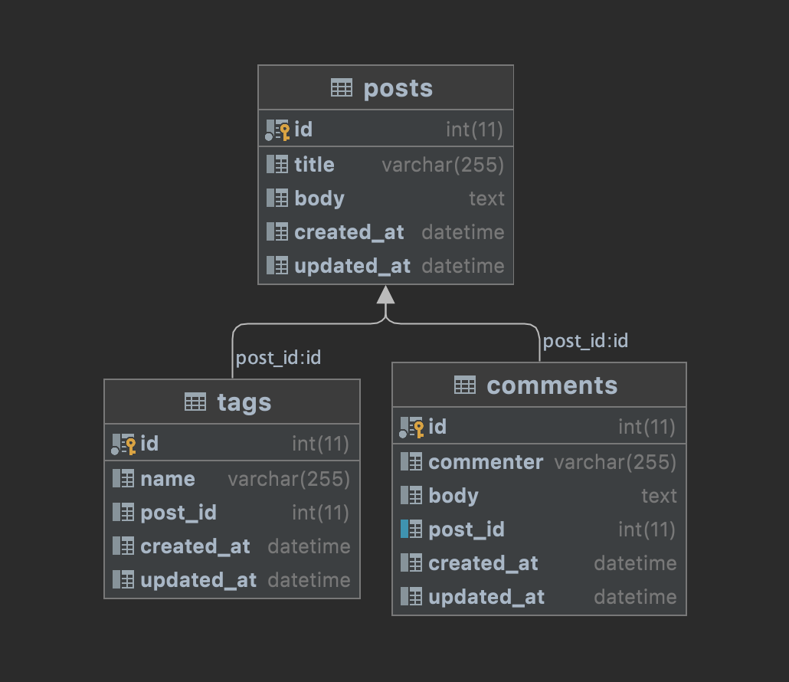

# Rails로 알아보는 N+1 쿼리 문제와 해결 방법

`N+1 쿼리 문제`는 지난 글에서 알아본 것 처럼 쿼리가 N+1번 실행되어 성능이 저하되는 문제입니다.  
이번에는 실제로 N+1 쿼리가 실행되는 조건을 만들어보고 해결하는 방법에 대해서 알아보겠습니다.  

<br><br>

## 1. N+1 쿼리 문제가 발생하는 환경 만들기

먼저 N+1 쿼리가 발생하는 환경을 만들어 보겠습니다.
N+1 쿼리는 로드되지 않은 관계엔티티를 실행하는 상황에서 발생합니다.  
테이블 관계가 위 그림과 같을 때 아래와 같이 `Post` 엔티티에서 `Comment`엔티티를 필요로 하는 상황을 만들면 N+1쿼리를 실행합니다.  
`index` 메서드는 요청을 받으면 json형태로 데이터를 만들어 응답합니다.  
기본적으로 조회 방식은 지연 로딩(Lazy loading)으로 설정되어있기 때문에 예상대로 N+1 쿼리가 발생합니다.  

<br>

```ruby
# /posts/index
def index
    # N+1 쿼리 발생
    result = []
    @posts = Post.all

    @posts.each do |post|
        result << {
        id: post.id,
        comments: post.comments
        }
    end

    render json: result
end
```
```sql
  Post Load (0.2ms)  SELECT `posts`.* FROM `posts`
  Comment Load (0.2ms)  SELECT `comments`.* FROM `comments`  WHERE `comments`.`post_id` = 1
  Comment Load (0.2ms)  SELECT `comments`.* FROM `comments`  WHERE `comments`.`post_id` = 2
  Comment Load (0.2ms)  SELECT `comments`.* FROM `comments`  WHERE `comments`.`post_id` = 3
```

자 그럼 이제 준비가 되었으니 N+1 쿼리를 어떻게 해결하는지 알아보겠습니다!

<br><br>

## 2. Rails에서 N+1 쿼리를 피하는 방법
Rails에서 N+1 쿼리를 피하는 방법은 2가지가 있습니다.  
첫번째는 `IN절`을 활용해 관계테이블을 조회하는 방법입니다.  
먼저 베이스 테이블을 조회합니다. 그리고 결과 레코드들의 id를 관계테이블의 `WHERE절`에 `IN절`로 넣은 쿼리를 한번 더 실행해서 필요한 데이터를 조회합니다.  
이 경우 베이스 테이블 1번, 관계 테이블 1번을 실행해야합니다.  
따라서 쿼리를 최소 2번 실행하게 됩니다.  
관계 테이블의 개수가 많아지면 더 많이 실행하겠죠?  
<br>
두번째 방법은 `LEFT OUTER JOIN`을 통해 한번에 가져오는 방법입니다.  
단일 쿼리로 작성했기 때문에 쿼리를 1번만 실행하게 됩니다.  
<br>
관계 테이블을 조회할 때 사용하는 메서드에는 `preload`, `includes`, `eager_load`가 있습니다.  
각 메서드는 관계 테이블을 조회하는 방법에 조금씩 차이가 있습니다.  
그럼 각 메서드의 조회 방법과 특징에 대해 알아보겠습니다.  

<br><br>

### 2.1 preload
preload는 쿼리를 나누어 실행합니다.  
앞서 설명한 IN절을 사용해 관계테이블을 조회하는 방식으로 동작합니다.  
코드와 실행 결과는 아래와 같습니다.  
```ruby
def index_preload
    result = []
    @posts = Post.all.preload(:comments)

    @posts.each do |post|
        result << {
        id: post.id,
        comments: post.comments
        }
    end

    render json: result
end
```
```sql
Post Load (0.2ms)  SELECT `posts`.* FROM `posts`
Comment Load (0.1ms)  SELECT `comments`.* FROM `comments`  WHERE `comments`.`post_id` IN (1, 2, 3)
```

<br>

2번에 나누어 실행한 것을 확인할 수 있습니다.  
참고로 관계 테이블이 많아지면 아래 처럼 쿼리를 더 실행하게 됩니다.

```ruby
@posts = Post.all.preload(:comments, :tags)
```
```sql
Post Load (0.2ms)  SELECT `posts`.* FROM `posts`
Comment Load (0.2ms)  SELECT `comments`.* FROM `comments`  WHERE `comments`.`post_id` IN (1, 2, 3)
Tag Load (0.2ms)  SELECT `tags`.* FROM `tags`  WHERE `tags`.`post_id` IN (1, 2, 3)
```

<br>

자, 그런데 요구사항이 변경돼서 관계 테이블의 컬럼을 조건으로 사용해야 합니다.  
`WHERE절`에 관계 테이블의 컬럼을 넣으면 어떻게 될까요?
```ruby
def index_preload
    result = []
    # @posts = Post.all.preload(:comments)
    @posts = Post.all.preload(:comments).where(comments: {body: 'Body 1'})

    @posts.each do |post|
        result << {
        id: post.id,
        comments: post.comments
        }
    end

    render json: result
end
```
```sql
  Post Load (0.5ms)  SELECT `posts`.* FROM `posts`  WHERE (comments.body='Body 1')
Mysql2::Error: Unknown column 'comments.body' in 'where clause': SELECT `posts`.* FROM `posts`  WHERE (comments.body='Body 1')
Completed 500 Internal Server Error in 5ms (ActiveRecord: 0.5ms)

ActiveRecord::StatementInvalid (Mysql2::Error: Unknown column 'comments.body' in 'where clause': SELECT `posts`.* FROM `posts`  WHERE (comments.body='Body 1')):
  app/controllers/posts_controller.rb:51:in `index_preload'
```

<br>

오류가 발생하고 말았네요.  
실행결과에서 알 수 있듯 `preload`는 조건 절에서 관계 테이블의 컬럼을 사용할 수 없다는 특징이 있습니다.

참고로 베이스 테이블의 컬럼은 조건절로 사용 가능합니다.
```ruby
def index_preload
result = []
# @posts = Post.all.preload(:comments)
# @posts = Post.all.preload(:comments).where(comments: {body: 'Body 1'})
@posts = Post.all.preload(:comments).where(posts: {body: 'Body 1'})

@posts.each do |post|
    result << {
    id: post.id,
    comments: post.comments
    }
end

render json: result
end
```
```sql
Post Load (0.3ms)  SELECT `posts`.* FROM `posts`  WHERE (posts.body='Body 1')
Comment Load (0.2ms)  SELECT `comments`.* FROM `comments`  WHERE `comments`.`post_id` IN (1)
```

<br><br>

### 2.2 includes
```ruby
def index_includes
    result = []
    @posts = Post.all.includes(:comments)

    @posts.each do |post|
        result << {
        id: post.id,
        comments: post.comments
        }
    end

    render json: result
end
```
```sql
Post Load (0.2ms)  SELECT `posts`.* FROM `posts`
Comment Load (0.2ms)  SELECT `comments`.* FROM `comments`  WHERE `comments`.`post_id` IN (1, 2, 3)
```
다음으로는 `includes` 입니다.
코드와 결과는 위와 같습니다. 동작하는 방식은 결과에서 알 수 있듯 `preload`와 동일합니다.  
하지만 `preload`보다는 좀 더 똑똑하게 동작합니다!
무슨 얘긴지 잘 모르시겠죠?  
`preload`와 동일하게 조건절에 관계 테이블의 컬럼을 추가해 보겠습니다.  

<br>

```ruby
def index_includes
    result = []
    # @posts = Post.all.includes(:comments)
    @posts = Post.all.includes(:comments).where(comments: {body: 'Body 1'})

    @posts.each do |post|
        result << {
        id: post.id,
        comments: post.comments
    }
    end

    render json: result
end
```
```sql
SQL (0.4ms)  SELECT `posts`.`id` AS t0_r0, `posts`.`title` AS t0_r1, `posts`.`body` AS t0_r2, `posts`.`created_at` AS t0_r3, `posts`.`updated_at` AS t0_r4, `comments`.`id` AS t1_r0, `comments`.`commenter` AS t1_r1, `comments`.`body` AS t1_r2, `comments`.`post_id` AS t1_r3, `comments`.`created_at` AS t1_r4, `comments`.`updated_at` AS t1_r5 FROM `posts` LEFT OUTER JOIN `comments` ON `comments`.`post_id` = `posts`.`id` WHERE `comments`.`body` = 'Body 1'
```

<br>

오류가 발생했던 `preload`와는 다르게 쿼리를 `LEFT OUTER JOIN`으로 변경해서 실행했습니다.  
이처럼 필요한 경우 알아서 쿼리를 변경해주는 편리함 때문에 실제로도 `includes`를 더 선호하는 개발자가 많습니다.  

<br><br>

### 2.3 eager_load
마지막으로 `eager_load` 입니다.  
`LEFT OUTER JOIN`방식으로 단일 쿼리를 실행해 데이터를 가져옵니다.  
```ruby
def index_eager_load
    result = []
    @posts = Post.all.eager_load(:comments)

    @posts.each do |post|
        result << {
        id: post.id,
        comments: post.comments
        }
    end

    render json: result
end
```
```sql
SQL (0.3ms)  SELECT `posts`.`id` AS t0_r0, `posts`.`title` AS t0_r1, `posts`.`body` AS t0_r2, `posts`.`created_at` AS t0_r3, `posts`.`updated_at` AS t0_r4, `comments`.`id` AS t1_r0, `comments`.`commenter` AS t1_r1, `comments`.`body` AS t1_r2, `comments`.`post_id` AS t1_r3, `comments`.`created_at` AS t1_r4, `comments`.`updated_at` AS t1_r5 FROM `posts` LEFT OUTER JOIN `comments` ON `comments`.`post_id` = `posts`.`id`
```

<br>

똑같이 조건절에 관계 테이블 컬럼을 추가해보겠습니다. 역시나 잘 동작합니다.

<br>

```ruby
def index_eager_load
    result = []
    # @posts = Post.all.eager_load(:comments)
    @posts = Post.all.eager_load(:comments).where(comments: {body: 'Body 1'})

    @posts.each do |post|
        result << {
        id: post.id,
        comments: post.comments
        }
    end

    render json: result
end
```
```sql
SQL (0.3ms)  SELECT `posts`.`id` AS t0_r0, `posts`.`title` AS t0_r1, `posts`.`body` AS t0_r2, `posts`.`created_at` AS t0_r3, `posts`.`updated_at` AS t0_r4, `comments`.`id` AS t1_r0, `comments`.`commenter` AS t1_r1, `comments`.`body` AS t1_r2, `comments`.`post_id` AS t1_r3, `comments`.`created_at` AS t1_r4, `comments`.`updated_at` AS t1_r5 FROM `posts` LEFT OUTER JOIN `comments` ON `comments`.`post_id` = `posts`.`id` WHERE `comments`.`body` = 'Body 1'
```

하지만 `eager_load`를 쓰는것이 무조건 좋은건 아닙니다.  
테이블간의 관계, 레코드의 수 등의 조건에 따라 나누어 실행하는것이 더 빠를수도 있기 때문입니다.
때문에 `eager_load`를 사용해서 성능이 느리다면 `includes`나 `preload`를 사용해 쿼리를 분리해보는 시도를 해볼 필요가 있습니다.  

<br><br>

## 마무리
이번 글에서는 N+1을 발생시키는 코드와 해결하는 방법에 대해서 알아봤습니다.

<br><br>

## 참고
* https://guides.rubyonrails.org/v4.1/active_record_querying.html
* https://www.bigbinary.com/blog/preload-vs-eager-load-vs-joins-vs-includes
