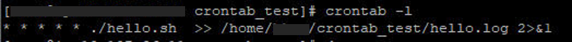

# Crontab으로하는 작업 예약

살다 보면 주기적으로 같은 시간대에 해야하는 작업들이 생깁니다. 매주 있는 주간 회의라던지, 매일 정해진 시간에 접속해야만 받을 수 있는 게임 보상이라던지(?)...그렇다면 같은 시간대에 주기적으로 실행시켜야 하는 파일(혹은 코드)도 있을 법 합니다. 이런 경우 항상 같은 시간에 직접 해당 파일을 실행하는 것도 하나의 방법이지만, 우리는 개발자입니다. 이런 귀찮은 작업은 자동화시키면 되죠! 그러니 서버에서 자동으로 때가 되면 파일을 실행해줄 수 있는 `crontab`에 대해서 알아봅시다. 


## Cron과 Crontab

### Cron

`crontab`을 본격 알아보기 앞서, 명령어의 핵심을 차지하고 있는 `cron` 부터 알아도록 합시다. 

Cron을 구글에 검색해보면

> 소프트웨어 유틸리티 cron은 유닉스 계열 컴퓨터 운영 체제의 시간 기반 잡 스케줄러이다.

라고 뜹니다만, 사전적 의미보다 `cron`이라는 단어가 더욱 기억에 남게 해드리겠습니다. `cron`이 어쩌다 스케줄러라는 의미를 가진 명령어가 되었을까요? 유닉스의 창시자인 [Ken Thompson에 의하면](https://www.quora.com/What-is-the-etymology-of-cron) 그리스어로 `시간`을 의미하는 `chronos`를 **잘못 쓴 것**이라고 합니다. 전세계적으로 널리 알려진 오타라니, 놀랍군요! 하지만 **정해진 "시간"에 무언가를 한다**는 의도는 확실히 전해진 것 같습니다. 

그렇다면 이 시간은 어떻게 지정할까요? 

```bash
* * * * *
```

`cron`에는 5가지 항목이 있습니다. `분(minute)` , `시(hour)`, `일(day)`, `월(month)`, `요일(day)`. 년-월-일-시-분으로 가는 한국어와 반대로 서구식 표현답게 거꾸로 가네요. 시간은 24시간 기준, 요일은 월~일까지 1~7의 숫자로 표현됩니다.

```bash
# 예시
5 14 19 12 7
```

얼핏보면 당황스럽지만, 거꾸로 읽어보면 쉽습니다. 일요일 12월 19일 14시 05분. 즉, 12월 19일이 일요일인 날 오후 2시 5분에 작업을 실행하라는 의미입니다. 매년 12월 19일이라면 (일요일이 아니어도 된다면) 다음과 같습니다.

```bash
# 매년 12월 19일 14시 5분
5 14 19 12 *
```

이렇게 정해진 시간에 특정 작업을 수행하는 것이 바로 `cron`입니다.

### Crontab

`crontab`은 `cron`이 작업을 할 명령들의 리스트를 모은 `table`입니다. 따라서 `crontab`을 만든다는 것은 `cron`이 언제, 무엇을 할 지 알려주는 작업 파일을 만드는 것과 동일합니다.


그렇다면, cron에게 어떤 작업을 하면 될지 알려줍시다.

## Crontab 생성하기

1분에 한번씩 친절하게 인사를 해주는 크론탭을 만들어보겠습니다. 먼저 간단한 `hello.sh`파일을 만들었습니다. 

```bash
# hello.sh
echo "Hello Jamie!"
```

### 기존에 있는 crontab 확인하기

```bash
crontab -l
```

음, 확인해보니 아무것도 뜨지 않습니다. 많약 존재한다면, 어느 주기에 무엇을 실행하는지 간략하게 적혀있는 리스트가 뜹니다.

### crontab 생성하기

```bash
crontab -e
```

`edit`의 `e`겠죠? 크론탭을 만들어봅시다.

```bash
* * * * * ./hello.sh
```

시간과 실행할 파일을 적어줍니다. 방금 만든 `hello.sh`는 같은 폴더 내에 있으니 상대 경로로 알려줍니다. 저장 후 종료!하면 끝일 것 같지만 돌아가고 있는지 보기 위해 `log`파일을 만들어서 보겠습니다.

```bash
* * * * * ./hello.sh >> /home/user/crontab_test/hello.log 2>&1
```

`>>`를 통해 어느 파일에 수행한 기록을 할 것인지 알려줍니다. 경로는 원하시는 곳으로 설정하시면 됩니다. 이제 확인해볼까요?



`crontab -l`을 통해 확인하니 잘 생성되었네요. 그렇다면 정말 실행됐는지 로그파일을 확인해봅시다.


로그파일도 생성이 되었고, 해당 파일을 열어보니 계속해서 인사를 해주는 것을 확인할 수 있습니다. 성공적으로 크론탭을 만들었습니다.