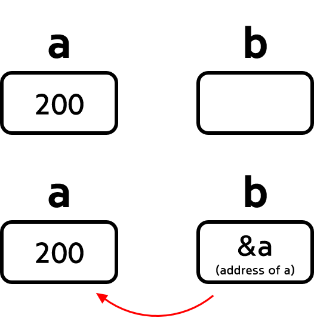
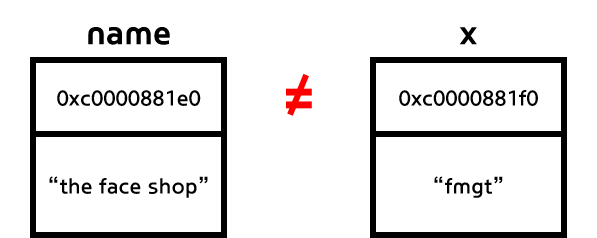
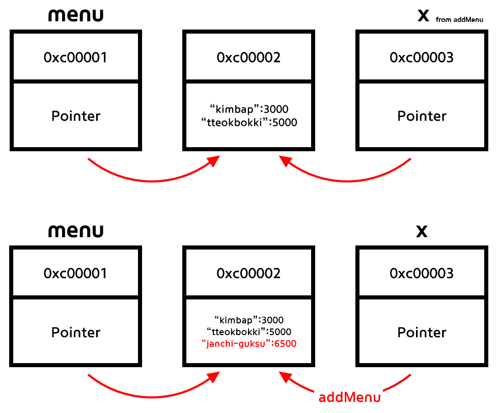

# Go의 포인터

Go는 C언어의 영향을 많이 받은 언어입니다. 그래서인지 문법도 굉장히 C와 유사하고, C언어에서 빠질 수 없는 **포인터**의 개념 또한 존재합니다. 포인터(Pointer)는 이름에서 알 수 있다시피 특정 주소를 가리키는(point)하는 값입니다. 



예시 속 `a`와 `b`를 살펴봅시다. `a`는 200이라는 정수가 할당된 변수입니다. `b`는 `a`가 메모리 내 어디에 저장되어 있는지, 해당 주소값을 가지고 있는 변수입니다. 이렇게 `b`는 포인터로,  **다른 변수의 주소**를 값으로 가지는 타입입니다.


## Pass-by-value

Go는 `pass-by-value` 방식을 지원하는 언어입니다. 말 그대로 "값에 의한 전달"이라는 데이터 전달 방식인 pass-by-value는 다른 변수 등에 특정 값을 전달할 때, 해당 값을 복사해서 전달함으로써 원본 데이터에는 영향을 주지 않도록 하는 방식입니다.

```go
func updateName(x string) {
	x = "fmgt"
}
```

예시를 살펴봅시다. 함수 `updateName`은 매개변수 `x`를 "fmgt"라는 문자열로 바꾸는 함수입니다. 

```go
func main() {

	name := "the face shop"

	updateName(name)

	fmt.Println(name)
}
// 결과: "the face shop" => 변수 name의 값이 달라지지 않음
```

이제 메인 함수에 `name`이라는 변수에 "the face shop"이라는 문자열을 할당했습니다. 이 변수에 대해 `updateName`함수를 불러봅시다. 보통 pass-by-reference 형식에선, `updateName` 에 전달된 문자열들은 모두 fmgt라는 결과로 바뀌어야 합니다. 하지만 결과는 fmgt로 바뀌지 않은, 처음 `name`에 할당된 값이 그대로 남아있는 것을 확인할 수 있습니다.



실제로 `name`과 `x`는 각자 다른 주소를 가지고 있습니다. pass-by-value 방식에 따라 `name`에 있는 값을 전달할 때 "the face shop"이라는 문자열을 복사한 후 원본과는 다른 주소를 가진 문자열을 `updateName`에 넘겼기 때문에 원본이 바뀌지 않고 복사본이 "fmgt"라는 값으로 바뀐 것입니다.

그렇다면 포인터는 어떻게 사용되는 걸까요?


## Pass-by-pointer

Go에는 포인터의 개념을 pass-by-pointer를 통해 사용하고 있습니다. pass-by-pointer는 변수에 값과 해당 값이 있는 메모리 주소를 모두 전달하는 방식입니다. Go에서는 slice, map, function 타입을 통해 pass-by-pointer를 구현할 수 있습니다. 

Map을 통한 예제를 살펴봅시다.

```go
func addMenu(x map[string]int) {
	x["janchi-guksu"] = 6500
}

func main() {
	menu := map[string]int{
		"kimbap":     3000,
		"tteokbokki": 5000,
	}
	fmt.Println(menu)
	addMenu(menu)
	fmt.Println(menu)
}
/* 결과
map[kimbap:3000 tteokbokki:5000]
map[janchi-guksu:6500 kimbap:3000 tteokbokki:5000] <= menu의 값이 수정되었음!
*/
```

 `menu`라는 변수에 map타입의 값을 할당했습니다. `addMenu`는 map타입 매개변수 `x`에 "janchi-guksu"는 6500이라는 값을 넣어주는 함수입니다. pass-by-value와는 달리 `addMenu` 함수를 실행한 후 변수 `menu`의 값이 바뀐 것을 알 수 있습니다.



Go의 map 타입은 주소와 값을 모두 가지는 자료형입니다. 따라서 `menu`와 `x` 모두 원본 값에 대한 주소를 가지고 있었기 때문에 `x`를 통해 변경이 일어났을 때, 해당 주소를 그대로 가지고 있는 `menu`가 변경된 값을 그대로 보여준 것입니다.


이렇게 Go에서의 포인터에 대해 간략하게 알아봤습니다. 참고로 Go에서의 포인터는 다른 언어에서의 포인터(특히 C)와 다르다고(혹은 더 [낫다고](https://dave.cheney.net/2014/03/17/pointers-in-go)) 하네요!