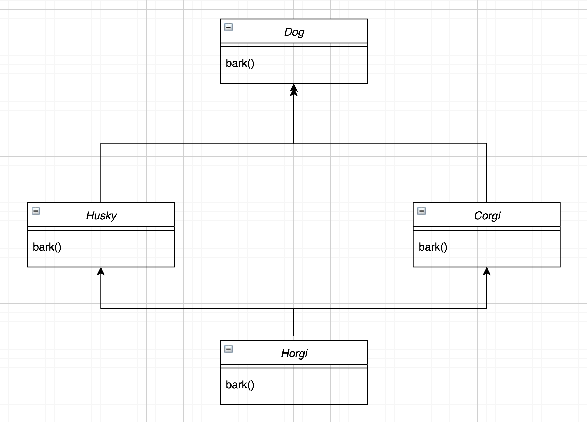

# 파이썬의 MRO(Method Resolution Order)

## 도입

**MRO(Method Resolution Order)**는 단어 의미 그대로 메서드의 결정 순서를 의미하며 이는 곧 **상속**과 연관되는 개념입니다.

파이썬은 기본적으로 다중 상속을 지원합니다. 예를 들어 아래와 같은 클래스와 메서드가 존재한다고 가정해봅시다.



`Husky` 및 `Corgi` 클래스는 `Dog` 클래스를 상속 받고 `Horgi` 클래스는 `Husky` 및 `Corgi` 클래스를 다중 상속 받습니다. 그렇다면 이때 `Horgi` 클래스의 메서드 `bark()`는 `Husky` 클래스의 메서드를 호출할까요 아니면 `Corgi` 클래스의 메서드를 호출할까요?

이처럼 동일한 이름의 메서드를 가진 부모 클래스를 다중 상속 받을 때 어떤 메서드를 호출해야할 지 모르기 때문에 발생하는 문제를 **죽음의 다이아몬드(Deadly Diamon of Death)** 또는 **다이아몬드 문제(Diamon Problem)**이라 합니다.

파이썬에서 이 문제를 해결하기 위해 알고리즘이 존재하며 이를 적용하여 메서드의 순서를 확인하는 걸 MRO라 합니다. `mro()` 메서드 또는 `__mro__`를 통해 결정된 순서를 확인할 수 있습니다.

!!! info "정보"

    파이썬은 인스턴스의 메서드를 실행할 때 `__getattribute__()`를 통해 바운드된 메서드를 가져온 이후에 실행하게 됩니다. 따라서 그 순서가 중요합니다. 순서를 결정 지을 때 바로 `__mro__`를 따르게 되는데 `__mro__`는 $C_3$ 알고리즘에 의해 순서를 결정합니다.

    $C_3$ 알고리즘이라 불리는 메서드 결정 순서 방법에 대한 부분은 파이썬 공식 문서 [파이썬 2.3 이후의 메서드 결정 순서](https://www.python.org/download/releases/2.3/mro/)에서 확인할 수 있습니다.

## 예시

우선은 아래와 같이 `bark()` 메서드를 갖고 있는 `Dog`, `Husky`, `Corgi` 클래스를 만들어 봅시다. 이때 `Husky`, `Corgi` 클래스는 `Dog` 클래스를 상속 받습니다.

```Python
{!../docs_src/4기/이태현/2주차/1-example.py[ln:1-14]!}
```

`Horgi`라는 클래스는 아래와 같이 `Husky` 및 `Corgi` 클래스 순서대로 다중 상속 받습니다.

```Python
{!../docs_src/4기/이태현/2주차/1-example.py[ln:18-20]!}
```

이제 아래와 같이 `mro()` 메서드 및 상속 받은 `bark()` 메서드를 출력해보면 다음과 같습니다.

!!! warning "주의"

    실제 출력은 `<class ___>`와 같은 형태입니다. 작성 문법 오류로 인해 `<>` 부분을 다르게 인식하여 해당 부분을 지웠습니다.

<div class="termy">
    ```sh
    $ python 1-example.py

    MRO:  [class '__main__.Horgi', class '__main__.Husky', class '__main__.Corgi', class '__main__.Dog', class 'object']
    I'm a Husky.
    ```

</div>

먼저 `mro()` 메서드의 출력값으로는 본인(`Horgi`)이 제일 먼저 나오고 그 다음으로 상속 받은 순더대로 `Husky`, `Corgi`, `Dog` 그리고 마지막으로 최상위 `object` 클래스가 출력되는 걸 확인할 수 있습니다.

또한 `bark()` 메서드의 출력값으로 MRO에 맞게 `Husky` 클래스를 상속 받아 `I'm a Husky`라는 값을 출력하였습니다.

이제 반대로 아래와 같이 `Corgi` 및 `Husky` 클래스 순서대로 다중 상속 받아봅시다.

```Python
{!../docs_src/4기/이태현/2주차/1-example.py[ln:28-30]!}
```

이를 출력해보면 그 결과가 위와 달리 `mro()` 메서드의 출력값으로 `Corgi` 클래스가 `Husky` 클래스보다 먼저 나오고 따라서 `bark()` 메서드의 출력값으로도 `Corgi` 클래스의 메서드를 상속 받아 `I'm a Corgi`가 출력된 것을 확인할 수 있습니다.

<div class="termy">
    ```sh
    $ python 1-example.py

    MRO:  [class '__main__.Horgi', class '__main__.Corgi', class '__main__.Husky', class '__main__.Dog', class 'object']
    I'm a Corgi.
    ```

</div>

그렇다면 만약 상속 받으려는 클래스의 메서드가 부모 클래스의 메서드를 상속 받을 경우 어떻게 될까요?

아래와 같이 `Husky` 클래스의 메서드 `bark()`가 부모 클래스인 `Dog` 클래스의 `bark()`를 `super()`를 통해 상속 받을 수 있습니다. 그리고 해당 `Husky` 클래스를 `Horgi` 클래스가 상속 받게 됩니다.

```Python
{!../docs_src/4기/이태현/2주차/1-example.py[ln:38-44]!}
```

해당 `Horgi` 클래스의 `mro()` 메서드와 `bark()` 메서드를 출력해보면 결과는 아래와 같습니다. `Husky` 클래스가 먼저 `Corgi` 클래스보다 먼저 위치해있지만 `Dog` 클래스는 `Corgi` 클래스보다 늦게 위치해있습니다.

따라서 `bark()` 메서드의 경우 `Dog` 클래스의 `bark()` 메서드를 사용하기 때문에 MRO에서는 비록 `Husky` 클래스를 우선 상속 받더라도 `Dog` 클래스보다 우선 순위가 높은 `Corgi` 클래스의 `bark()` 메서드를 사용하게 되는 것입니다.

<div class="termy">
    ```sh
    $ python 1-example.py

    MRO: [class '__main__.Horgi', class '__main__.Husky', class '__main__.Corgi', class '__main__.Dog', class 'object']
    I'm a Corgi.
    ```

</div>

그러면 만약 `Horgi` 클래스가 아래와 같이 `Dog`, `Husky`, `Corgi` 클래스를 모두 상속 받을 경우 어떻게 될까요?

```Python
{!../docs_src/4기/이태현/2주차/1-example.py[ln:52-54]!}
```

`TypeError`가 발생합니다. `Dog` 클래스를 가장 먼저 상속 받아야하는데 뒤이어 오는 `Husky` 및 `Corgi` 클래스 또한 `Dog` 클래스를 상속 받기 때문에 그 순서가 꼬여 오류가 발생하는 것입니다.

<div class="termy">
    ```sh
    $ python 1-example.py

    TypeError: Cannot create a consistent method resolution
    order (MRO) for bases Dog, Husky, Corgi
    ```

</div>

그렇다면 아래와 같이 코드를 작성한다면 어떻게 될까요?

```Python
{!../docs_src/4기/이태현/2주차/1-example.py[ln:56-58]!}
```

아래와 같이 정상적으로 출력됩니다. `Dog` 클래스가 맨 마지막에 위치하였기 때문에 순서가 꼬이지 않았기 때문입니다.

<div class="termy">
    ```sh
    $ python 1-example.py

    MRO:  [class '__main__.Horgi', class '__main__.Husky', class '__main__.Corgi', class '__main__.Dog', class 'object']
    I'm a Corgi.
    ```

</div>

이를 통해 MRO의 조건을 아래와 같이 유추해 볼 수 있습니다.

1. 자식 클래스를 부모 클래스보다 먼저 확인한다.
2. 만약 부모 클래스가 둘 이상이라면 나열된 순서대로 확인한다.
3. 유효한 후보가 둘 이상 있을 경우 첫 번째 부모 클래스부터 선택한다.
4. 부모 클래스는 중복될 수 있지만 서로 교차될 경우 `TypeError`를 일으킨다.
