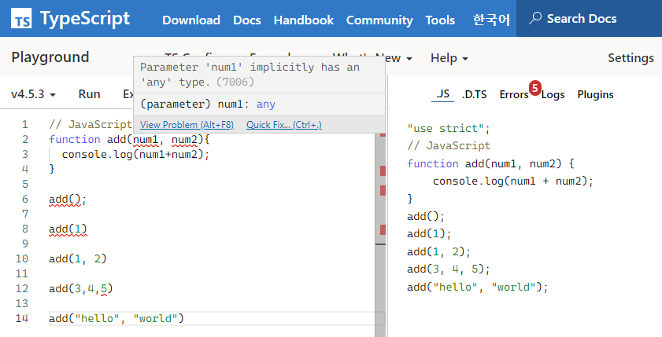
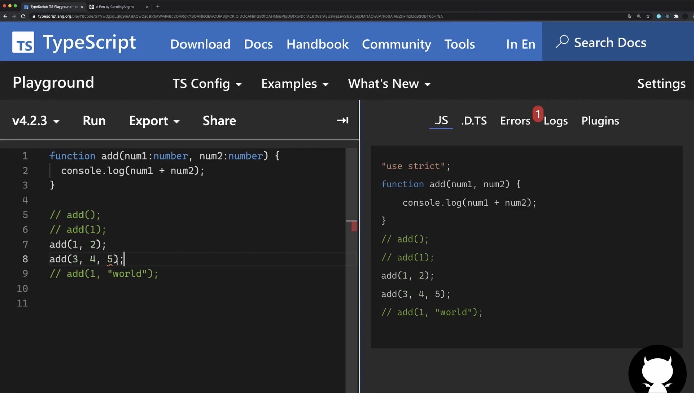

## 1. 타입스크립트란?

타입스크립트는 자바스크립트에 타입을 부여한 언어입니다. 자바스크립트의 확장된 언어라고 볼 수 있습니다.

그런데 우리가 사용하는 브라우저들 (크롬, 엣지, firefox, safari, 오페라 등)은 TypeScript 를 이해하지 못합니다. 결국 Javascript로 변환해서 로드해야 실행 가능합니다.

그런데 굳이 타입스크립트를 사용하는 이유는 무엇일까요?

## 2. JavaScript의 문제점

> JavaScript는 실수가 분명한 코드임에도 아무런 경고나 문제 없이 실행됩니다.

### 2.1. 예시 | 숫자 2개를 받아 더하기

예를 들어 보겠습니다.

```jsx
// JavaScript
function add(num1, num2) {
  console.log(num1 + num2);
}
```

위와 같은 JavaScript 코드가 있습니다. num1, num2라는 숫자 인수를 받아 둘을 더한 값을 콘솔로 보여줌을 알 수 있습니다.

이 add함수를 다양하게 사용해보겠습니다.

```jsx
add();
/*
- 결과: NaN 
- 동작 원리:
    1. 아무 인수도 전달x
    2. num1, num2는 undefined가 됨
    3. undefined + undefined = NaN
*/
add(1);
/*
- 결과: NaN 
- 동작 원리:
    1. 1 + undefined = NaN
*/
add(1, 2);
/*
- 결과: 3 (올바른 답)
*/
add(3, 4, 5);
/*
- 결과: 7
- 동작 원리: 세번째 인수(5) 무시됨
- 문제점: 12를 예상했던 개발자는 어디서 버그 발생했는지 찾아봐야 함.

*/
add("hello", "world");
/*
- 결과: 'helloworld'
- 문제점: 문자열을 전달했는데도 더해짐.
*/
```

`add(1, 2)` 만이 원하던 사용 방식으로 올바른 값이 나왔습니다.

나머지 사용 방식들은 결과를 보면 알 수 있듯이, 원하던 결과가 나오지 않았으나 JavaScript는 아무런 힌트를 주지 않고 에러 없이 진행이 되었음을 알 수 있습니다.

## 3. JS / TS 비교

`JavaScript`에 어떤 문제점이 있는지 알아보았습니다. 그러면 `JavaScript`와 `TypeScript`는 어떤 점이 다를까요?

간단히 표로 알아보겠습니다.

|                            | JavaScript                           | TypeScript                       |
| -------------------------- | ------------------------------------ | -------------------------------- |
| (타입) 언어                | 동적                                 | 정적                             |
| 타입 결정 / 오류 발견 시기 | 런타임 (실행되는 시점)               | 컴파일 타임                      |
| 단점                       | 개발자 실수 시, 사용자가 볼 수 있음. | 코드 작성 시간 ↑                 |
| 장점 (단점에 대한)         |                                      | 안정적이고 빠르게 작업 진행 가능 |

## 4. TS 기능

그러면 좀 더 구체적으로 `TypeScript`가 어떤 기능을 구현하는지 위에 나왔던, `[예시] 숫자 2개를 받아 더하기`와 함께 알아보겠습니다.

<참고> [TypeScript Playground](https://www.typescriptlang.org/play?#code/Q) 에서 타입스크립트를 빠르게 동작 시켜볼 수 있습니다.

### 4.1. 예시 Refactoring

```tsx
function add(num1: number, num2: number) {
  console.log(num1 + num2);
}

// 함수를 만들 때 의도 했던 방식(add(1, 2))외에는 모두 에러 뜸.

add(); // Expected 2 arguments, but got 0.(2554)

add(1); // Expected 2 arguments, but got 1.(2554)

add(1, 2);

add(3, 4, 5); // Expected 2 arguments, but got 3.(2554)

add("hello", "world");
/* 
앞("hello")에만 에러가 뜸.
-> 타입에 맞게 앞을 숫자로 바꾸면 뒤("world")에도 에러가 뜸.
-> 둘다 수정 해야 함.
*/

// 함수 사용 시, 몇 개의 인수 & 어떤 타입으로 전달해야 되는지 파악 가능
add(); // add(num1: number, num2: number): void
```

- **마우스 올리면, 타입 및 에러를 알려줍니다.**
  

- **의도 했던 방식 외에는 모두 에러**
  → 위 예시 코드에서 살펴 볼 수 있듯이, `add(1, 2)` 외에는 모두 에러가 뜨는 것을 확인 할 수 있습니다.
- **같은 에러 발생 시, 앞을 정정하면 뒤에 에러가 뜸.**
  `예시 코드`의 `add("hello", "world")`에서 "hello"나 "world" 모두 타입 에러임에도 불구하고 "hello"만 빨간 밑줄이 쳐져 있습니다. 하지만 앞의 인수인 "hello"의 에러를 정정하면, 뒤의 인수("world")가 에러 처리(빨간 밑줄) 됩니다.

- **(함수 사용 시) 어떤 인수 및 타입으로 전달해야 되는지 파악 가능**
  `예시 코드`의 맨 마지막 코드를 보면 알 수 있듯이 함수를 사용할 때 어떤 인수 및 타입이 필요한지 뜨기 때문에 빠른 파악이 가능합니다.
- **브라우저에서 JS 변환 전, 에러 코드 미리 확인 가능**
  서론에서 적었듯이, 브라우저에서는 JS로 변환된 코드를 읽어서 실행됩니다.
  이때, 에러가 있는 코드를 적더라도 그대로 보여주게 되는데 타입스크립트는 변환되기 전에 에러 코드를 미리 확인 가능하도록 합니다. (사진 참고)
  

---

참고

- [타입스크립트 핸드북](https://joshua1988.github.io/ts/why-ts.html#%ED%83%80%EC%9E%85%EC%8A%A4%ED%81%AC%EB%A6%BD%ED%8A%B8%EB%9E%80)
- 코딩앙마\_타입스크립트
