이번에는 자바스크립트의 중요한 개념인 클로저에 대해 알아보겠습니다.

## 📌 사전 지식

- [변수와 호이스팅](https://velog.io/@katej927/JavaScript-변수-호이스팅-Temporal-Dead-Zone)
- [함수 선언문 특징](https://velog.io/@katej927/JavaScript-함수-표현식-화살표-함수arrow-function)

위 2가지에 대한 선행 학습이 필요합니다.

(해당 개념들에 대한 요약본은 링크를 참고하시면 됩니다.)


## 📌 어휘적 환경 (Lexical Environment)

자바스크립트는 어휘적 환경을 갖습니다.

이에 대해 앞으로 3가지의 예시와 함께 클로저에 대한 개념과 원리를 이해해 보도록 하겠습니다.

### 🔹 원리 (예시 1)

#### ◾ 목표

이번 예시를 통해 코드가 위에서 아래까지 어떻게 동작하는지 파악하는 것이 목표입니다.

##### 1. 코드 실행

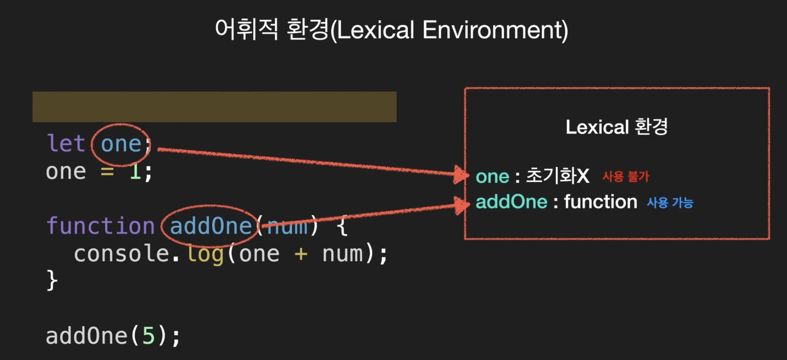

우선 코드가 실행되었을 경우를 살펴 보겠습니다.

코드가 실행되면 스크립트 내에서 선언한 변수들이 `어휘적 환경 (Lexical Environment)` 에 올라갑니다.

위 예시에서 살펴 보자면,

- `let` 으로 선언된 변수

  호이스팅 되었습니다. 하지만 초기화가 되지 않아 사용은 불가 합니다.

- `addOne` 함수 선언문

  바로 초기화 되어 사용 가능합니다.

##### 2. 코드 1번째 줄

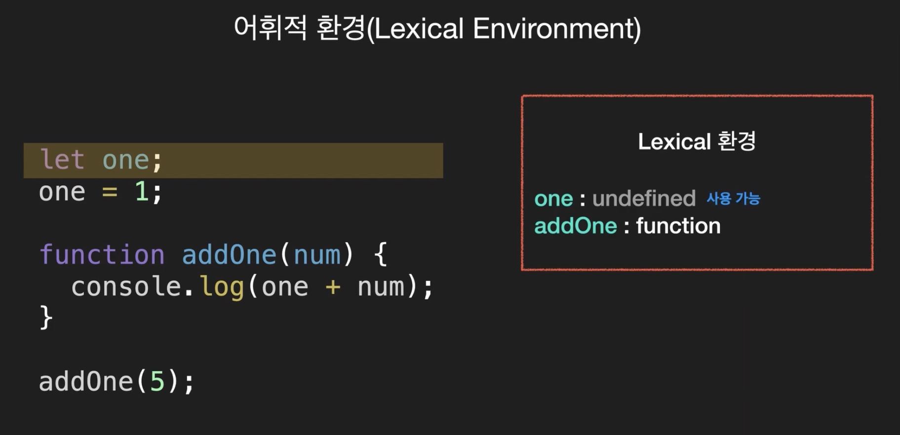

`let one` 을 만났습니다.

여기서는 `one` 이 아직 할당이 되지 않아서 초기값을 `undefined` 로 가지지만 사용은 가능합니다.

##### 3. 코드 2번째 줄

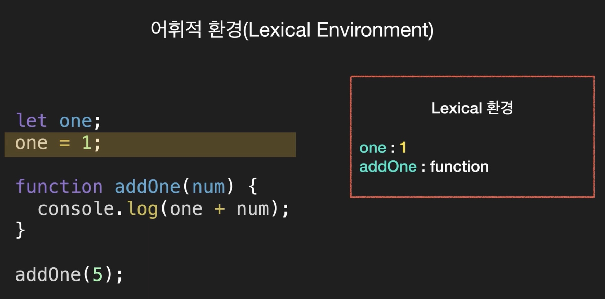


이번 줄에서는 `one` 에 1이 할당되었습니다.

함수 선언은 초기에 이미 완료 되었죠? 그래서 이제 마지막 라인으로 가서 함수가 실행 됩니다.

##### 4. 마지막 줄

1. 함수가 실행되는 순간, 새로운 `어휘적 환경 (Lexical Environment)` 이 생성됩니다.

   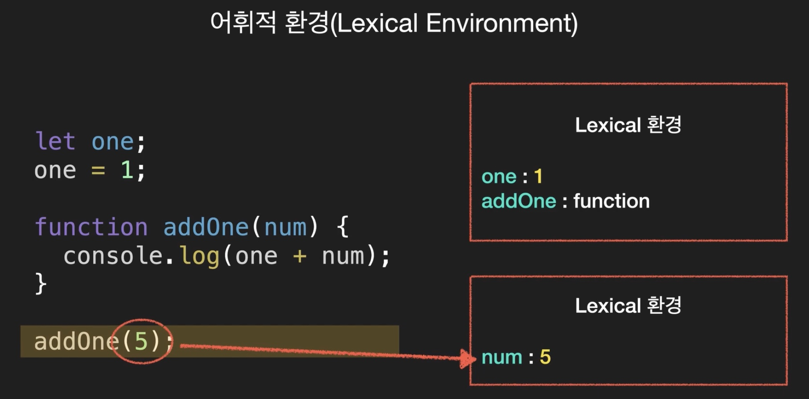

   이 곳에 저장되는 것은 함수가 넘겨 받은 매개변수와 지역 변수들입니다.

2. 함수가 호출되는 동안, 2개의 `Lexical 환경` 을 가집니다.

   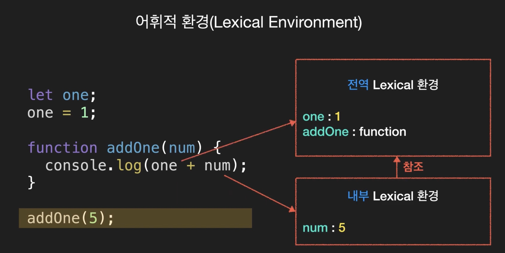

   2개의 `Lexical 환경` 은 함수에서 만들어진 `내부 Lexical 환경` 과 외부에서 받은 `전역 Lexical 환경` 입니다.

   `내부 Lexical 환경` 은 `외부 Lexical 환경` 에 대한 참조를 가집니다.

   현재, 이 함수의 `외부 Lexical 환경` 은 `전역 Lexical 환경` 입니다.

------
!!! tip "코드에서 변수를 찾을 때, 범위를 넓히는 순서"

    > 내부부터 찾음. 없으면 → 외부. 없으면 → 전역 `Lexical 환경`
    
    현재 코드에서는, 이 순서대로 우선 `내부 Lexical 환경` 에서 찾습니다. 찾아야 할 것은 `one` 과 `num` 이겠죠? 그 중 `num` 은 찾았지만, `one` 은 없습니다.

    그래서 외부로 넓혀서 `one` 이 있는지 찾습니다. `전역 Lexical 환경` 에서 찾게 되었으니 `one` 과 `num` 을 더해줍니다.


### 🔹 원리 (예시 2)

아래와 같은 코드가 있습니다.

```tsx
{!../docs_src/4기/정선미/2주차/ex1.tsx!}
```

`makeAdder` 는 `add` 함수를 만들어주는 함수입니다.

##### 1. 최초 실행

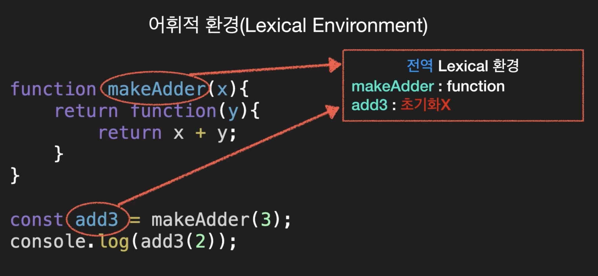

> `makeAdder` 함수 & 변수 `add3` 는 `전역 Lexical 환경`에 들어갑니다.

`add3` 은 초기화가 되지 않은 상태로 사용은 불가 합니다.

##### 2. 변수 add3 라인 실행

1. `makeAdder` 가 실행되고 `makeAdder Lexical 환경` 이 만들어 집니다.

   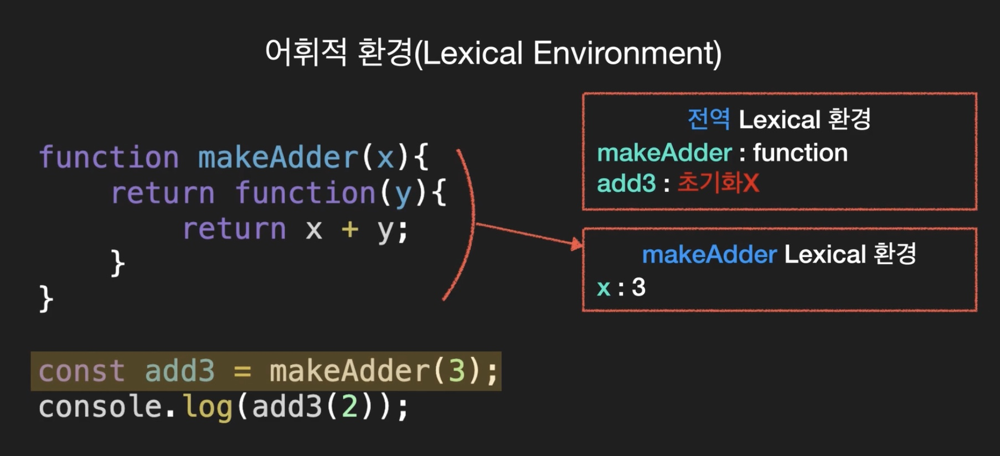

   - 전달 받은 x의 값이 들어갑니다.
   - 함수의 `Lexical 환경` 에 저장되는 것은 넘겨받은 매개변수와 지역변수들입니다.

2. `전역 Lexical 환경` 에 있던 `add3`

   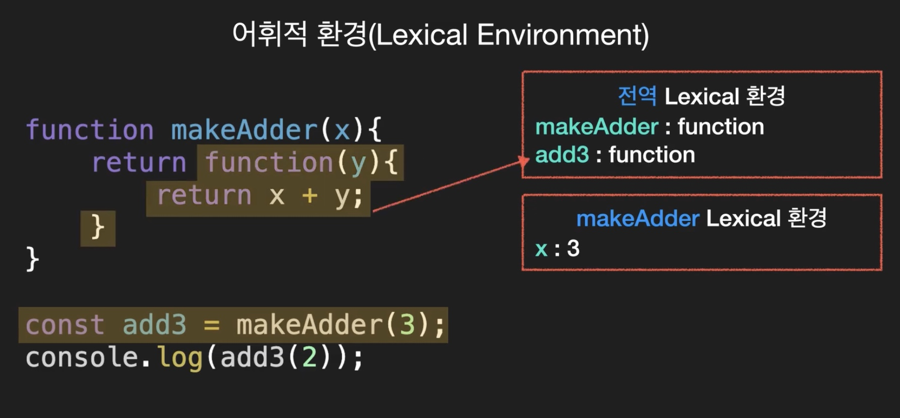

   이 함수가 실행되었으니, `return` 하는 함수가 됩니다.

##### 3. 마지막 줄 실행

1. `익명함수 Lexical 환경` 의 생성

   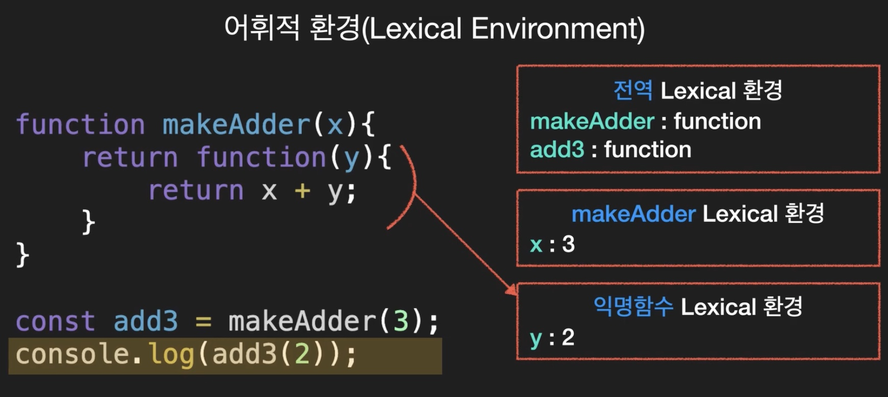

   `add3` 을 실행하면 익명함수가 실행되는데 이 때 또 새로운 `Lexical 환경` 인, `익명함수 Lexical 환경` 이 만들어집니다.

   이번에는 y가 2로 들어가게 됩니다.

2. `x+y` 하기

   

   1. 처음에는 `익명함수 Lexical 환경` 에서 x와 y를 찾습니다.

      y는 있지만, x는 없습니다.

   2. 참조하는 `외부 Lexical 환경` 으로 갑니다.

      x를 찾습니다.

##### 4. 정리

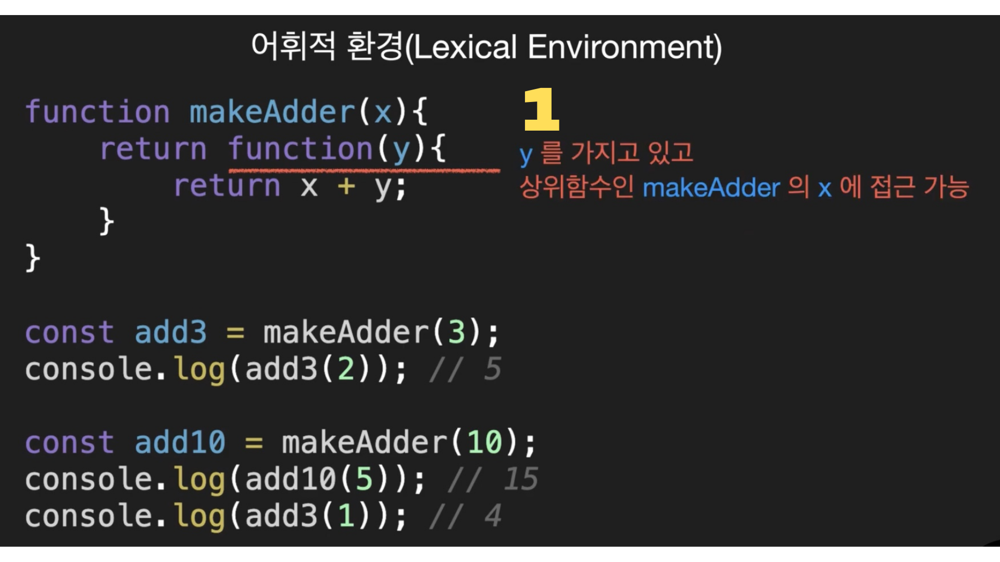

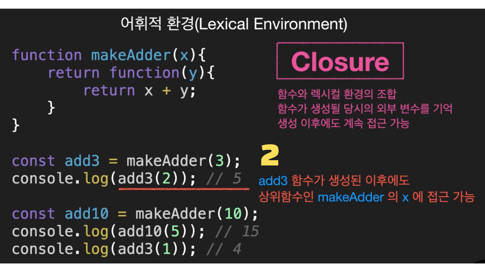

###### ◽ Closure

위 사진 두 개에서 1번과 2번에 적힌 것과 같은 것을 Closure라고 합니다.

다시 정의 해보자면,

> Closure는 함수와 그 함수의 렉시컬 환경의 조합입니다.

사진에 적힌 것 처럼, Closure는 함수가 생성될 당시의 외부 변수를 기억하고 생성된 이후에도 그 변수에 계속해서 접근이 가능한 기능인 것입니다.

외부 함수의 실행이 끝나서 외부 함수가 소멸된 이후에도 내부 함수가 외부 함수의 변수에 접근이 가능합니다.


빨간 색으로 밑줄 쳐진 코드를 봐볼까요?

`makeAdder(10)`이 호출되었지만, `add3(1)`이 4가 된 것처럼 `add3` 에는 변화가 없습니다.

즉, `add3`과 `add10` 은 서로 다른 환경을 가지고 있는 것입니다.

### 🔹 예시 3

```jsx
{!../docs_src/4기/정선미/2주차/ex2.jsx!}

```

##### ◾ 흐름

위 코드의 흐름을 살펴보겠습니다.

1. `counter` 에 익명함수(`makeCounter`가 리턴하는 함수)를 넣었습니다.

   익명함수는 숫자(외부 함수의 변수)를 반환합니다.

2. 실행 시

   초기값 0이 나오고 한 번 더하면 1이 증가한 1, 2가 나옵니다.

   즉, 내부 함수에서 외부 함수의 변수 (`num`)에 접근한 것입니다.

   

##### ◾ 결론

여기서 알 수 있는 것은 생성(`const counter = makeCounter();`)된 이후에 계속 기억하고 있다는 점입니다.

##### ◾ 숫자 수정 가능 여부 & 은닉화

더불어 숫자를 수정할 수 있는지에 대한 여부와 은닉화에 대해 알아보겠습니다.

우선,  0, 1, 2와 같은 숫자들에 대한 수정은 불가능 합니다.

다음, 은닉화는 성공했습니다. 오직 `counter` 를 증가시키고 반환받기 때문입니다. 갑자기 99로 바꾸거나 100씩 증가시키는 것은 불가능 합니다.


클로저에 대해 알아보았습니다. 도움이 되었길 바라며, 긴 글 읽어주셔서 감사드립니다. ([요약본](https://velog.io/@katej927/JavaScript-클로저-Closure))

------

참고

- 코딩앙마_자바스크립트 중급