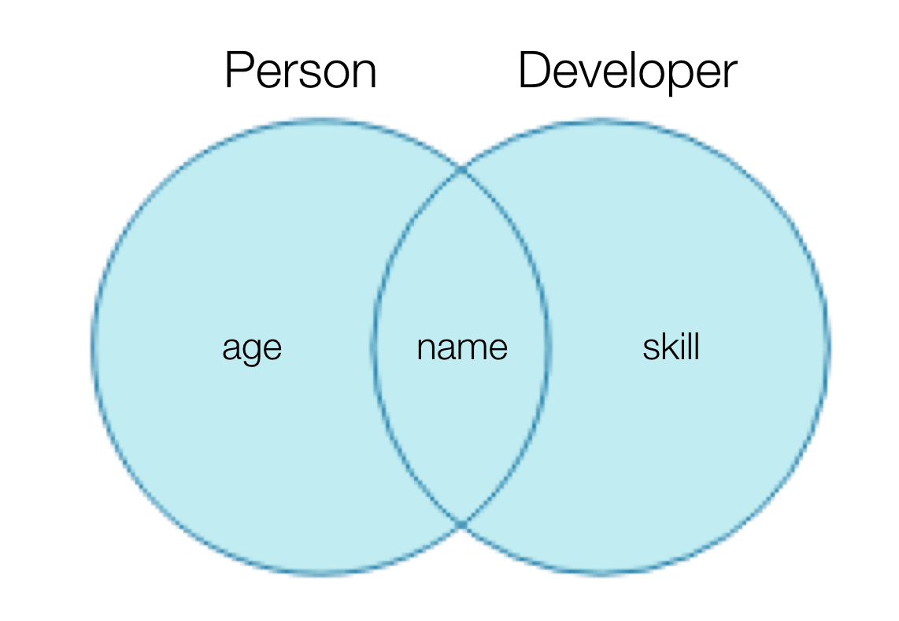

이번에는 연산자를 이용하여 타입을 정의하는 것에 대해 알아보겠습니다.

## 1. 유니온 타입(Union Type)
### 1.1 타입의 의미
‘A이거나 B이다’입니다. 자바스크립트의 OR 연산자(`||`)와 같습니다.
### 1.2 정의 방식
연산자(`|`)를 이용하여 여러 개의 타입을 연결하는 방식입니다.
### 1.3 코드 형태 (예시)
```tsx
function logText(text: string | number) {
  // ...
}
```

위 코드에서 `logText` 함수의 파라미터인 `text` 에는 `string` (문자)

또는 `number` (숫자) 타입이 가능하다는 것을 알 수 있습니다.

### 1.4 장점
`any`를 쓸 수도 있는데 굳이 유니온 타입을 쓰는 이유가 무엇일까요? 어떤 장점이 있을까요?

코드와 함께 살펴보겠습니다.

```tsx
// 1. any를 사용하는 경우
function getAge(age: any) {
  age.toFixed(); // 에러 발생. 숫자 관련 API를 작성 시, 코드 자동 완성 안됨.
  return age;
}

// 2. 유니온 타입을 사용하는 경우
function getAge(age: number | string) {
  if (typeof age === 'number') {
    age.toFixed(); // 정상 동작. 숫자 관련 API를 쉽게 자동완성 가능.
    return age;
  }
  if (typeof age === 'string') {
    return age;
  }
  return new TypeError('age must be number or string');
}
```

1. ‘any를 사용하는 경우’에서 에러가 발생하고 코드 자동 완성이 안되는 이유는 무엇일까요? 
    
    `age` 의 타입이 `any` 로 추론되고 있는데 `toFixed()` 라는 숫자 관련 API를 작성하였습니다. 그렇기 때문에 숫자가 아닌 다른 타입이 들어오게 되면 에러가 발생하게 됩니다.
    
    또한 어떤 타입이 들어올지 모르니 숫자 관련 API가 자동 완성 되지 않겠죠?
    
2. ‘유니온 타입을 사용하는 경우’가 정상 동작 되고 자동 완성이 가능한 이유는 무엇일까요?
    
    1번의 답과 비슷한 맥락입니다.
    
    조건문으로 타입을 분리하니 `number` 가 타입인 경우에는 숫자 관련 API가 편리하게 자동완성 되는 것입니다.
    

이처럼, `any` 를 사용 할 경우에는 자바스크립트로 작성하는 것처럼 동작합니다. 하지만 유니온 타입을 사용할 경우에는 타입스크립트의 이점을 살리면서 코딩을 할 수 있죠.

### 1.5 사용 시, 주의할 점
인터페이스와 같은 타입을 다룰 때는 ‘유니온 타입은 OR이고 인터섹션은 AND이다’와 같은 논리적 사고를 주의해야 합니다.

즉, 결론부터 말하자면 별도의 타입 가드(Type Guard)를 이용하여 타입의 범위를 좁히지 않는 이상은 ‘타입들에 공통적으로 들어있는 속성에만 접근이 가능’하다는 것을 주의해야 합니다.

이러한 이유가 무엇일까요? 타입스크립트의 관점에서는 어느 타입이 올지 알 수 없습니다. 그렇기 때문에 ‘어느 타입이 들어오든 간에 오류가 나지 않는 방향으로 타입을 추론’하게 됩니다.

코드와 함께 살펴보겠습니다.

```tsx
interface Person {
  name: string;
  age: number;
}
interface Developer {
  name: string;
  skill: string;
}
function introduce(someone: Person | Developer) {
  someone.name; // O 정상 동작
  someone.age; // X 타입 오류
  someone.skill; // X 타입 오류
}
```

예시 코드에서 위와 같은 결론이 나온 코드의 흐름을 살펴보겠습니다.

`introduce()` 함수의 파라미터 타입을 두 인터페이스들(`Person`, `Developer`)의 유니온 타입으로 정의했네요. 여기서 우리는 유니온 타입이 `Person` 도, `Developer` 도 될 수 있는 타입이라고 생각 할 수 있습니다. 이에 더해서 인터페이스들이 제공하는 속성들인 `age` 나 `skill` 을 사용 가능할 것이라고도 생각할 수 있습니다. 이렇게 생각하고 아래의 코드를 살펴보겠습니다.

```tsx
const capt: Person = { name: 'capt', age: 100 };
introduce(capt); // 만약 `introduce` 함수 안에서 `someone.skill` 속성을 접근하고 있으면 함수에서 오류 발생

const tony: Developer = { name: 'tony', skill: 'iron making' };
introduce(tony); // 만약 `introduce` 함수 안에서 `someone.age` 속성을 접근하고 있으면 함수에서 오류 발생
```

위 코드로 살펴본 것처럼, 타입스크립트 관점에서는 `introduce()` 함수를 호출하는 시점에 둘 중 어느 타입이 올지 알 수 없습니다. 그렇기 때문에 어느 타입이 들어오든 간에 오류가 나지 않는 방향으로 타입을 추론하게 됩니다.

이러한 원리에 의해서 정상 동작을 하는 것은 공통된 속성인 `someone.name` 뿐이게 된 것입니다.

## 2. 인터섹션 타입(Intersection Type)
### 2.1 타입의 의미

‘여러 타입을 모두 만족하는 하나의 타입’입니다.
### 2.2 정의 방식
연산자(`&`)를 이용하여 여러 타입의 정의를 하나로 합치는 방식입니다.
### 2.3 예시
```tsx
interface Person {
  name: string;
  age: number;
}
interface Developer {
  name: string;
  skill: number;
}
type Capt = Person & Developer;
```

위 코드는 `Person` 인터페이스의 타입 정의와 `Developer` 인터페이스의 타입 정의를 연산자(`&`)를 이용하여 합친 후 `Capt` 타입에 할당한 것입니다.

그럼 `Capt` 타입은 아래와 같습니다.

```tsx
{
  name: string;
  age: number;
  skill: string;
}
```




지금까지 연산자를 이용하여 타입을 정의하는 법에 대해 알아보았습니다. 도움이 되었기를 바라며, 긴 글 읽어주셔서 감사합니다.

---

참고

- 캡틴 판교-[타입스크립트 핸드북](https://joshua1988.github.io/ts/guide/operator.html#union-type%EC%9D%84-%EC%93%B8-%EB%95%8C-%EC%A3%BC%EC%9D%98%ED%95%A0-%EC%A0%90)

요약본

- [TypeScript | 연산자를 이용한 타입 정의](https://velog.io/@katej927/TypeScript-%EC%97%B0%EC%82%B0%EC%9E%90%EB%A5%BC-%EC%9D%B4%EC%9A%A9%ED%95%9C-%ED%83%80%EC%9E%85-%EC%A0%95%EC%9D%98#-%EC%98%88%EC%8B%9C-%EC%BD%94%EB%93%9C)