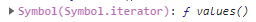

이번 글에서는 JavaScript의 Generator에 대해 알아보겠습니다.

## 1. Generator란?
Generator란, 함수의 실행을 중간에 멈췄다가 재개할 수 있는 기능입니다.

즉, 다른 작업을 하다가 다시 돌아와서 `next()` 라는 메소드를 실행해주면 진행이 멈췄던 부분부터 이어서 실행합니다.

`Redux-saga`에서 활발히 사용되고 있습니다.

## 2. 기본 문법
- `function*`

    흔히 `function` 를 사용하지만, `Generator` 를 만들 때는 `*` 을 붙입니다.
    
- `yield`
    
    이 키워드는 `function*` 내부에서 사용하며, `yield` 에서 함수의 실행을 멈출 수 있습니다.
    
- 예시 코드
    
```js
    function* fn(){
      yield 1
      yield 2
      yield 3
      return "finish"
    }
    
    let a = fn() // Generator 함수 실행
```
    
위 코드에서 `fn()` 과 같이 `Generator` 함수를 실행하면, 코드가 실행되지 않고 `Generator` 객체가 반환됩니다.
    
그럼 `Generator` 객체란 무엇일까요?

## 3. Generator 객체
`Generator`객체란, 실행을 처리하는 특별 객체입니다.

이 객체는 `next()`, `return()`, `throw()` 와 같은 메소드를 가지고 있습니다.

각 메소드들에 대해 알아볼까요?

### 3.1 next()
> 가장 가까운 `yield` 문을 만날 때까지 실행하고 데이터 객체를 반환하는 메소드
> 

여기서 반환되는 데이터 객체는 무엇일까요?

#### 3.1.1 반환된 데이터 객체
이 객체는 `value` 와 `done` 프로퍼티를 가집니다.

`value` 는 `yield` 오른쪽에 있는 값입니다. 값이 생략되어 있으면 `undefined` 를 반환합니다.

`done` 은 함수 코드가 끝났는지 나타냅니다. 함수의 실행이 끝났다면 `true` 를, 끝나지 않았다면 `false` 를 반환합니다.

예시 코드와 함께 살펴볼까요?

#### 3.1.2 예시 코드
```js
function* fn(){
  console.log(1)
  yield 1
  console.log(2)
  yield 2
  console.log(3)
  console.log(4)
  yield 3
  return "finish"
}

let a = fn()

console.log(a) // Generator 함수 실행
// Generator 객체만 반환. 함수 본문 코드는 실행되지 않음.

console.log(a.next()) // 첫 번째 yield 까지 실행
// 1
// {value: 1, done: false}

console.log(a.next()) // 두 번째 yield 까지 실행
// 2
// {value: 2, done: false}

console.log(a.next()) // 세 번째 yield 까지 실행
// 3
// 4
// {value: 3, done: false}

console.log(a.next()) // return까지 실행
// {value: "finish", done: true}

console.log(a.next())
// {value: undefined, done: true}
// value는 표현 할 것이 없기 때문에 undefined 반환. done은 계속 true (끝났기 때문에)
```

#### 3.1.3 인수 전달 가능
`next()` 에 인수를 전달하는 것이 가능합니다. 즉, 외부로부터 값을 입력 받을 수 있습니다.

```js
function* fn() {
  let num1 = yield "첫 번째 숫자를 입력해주세요."
  console.log(num1)

  let num2 = yield "두 번째 숫자를 입력해주세요."
  console.log(num2)

  return num1 + num2
}

const a = fn()

console.log(a.next())
/* 
- 흐름 :
첫 번째 yield에서 멈춤.
value는 yield 오른쪽에 있는 값.

- 결과 : 
{value: "첫 번째 숫자를 입력해주세요.", done: false} */

console.log(a.next(2)) 
/* 
- 흐름 :
인수 넣음. 인수로 넣은 값은 num1에 저장됨.
그 다음 콘솔로 보여짐.
두 번째 yield에서 멈춤.

- 결과 :
2 
{value: "두 번째 숫자를 입력해주세요.", done: false}*/

console.log(a.next(4))
/* 
- 흐름 :
num2에 인수 값 4가 들어감.
console.log로 보여짐.
더이상 yield 없음 -> done이 true가 됨.
value는 두 숫자를 더한 값이 됨.

- 결과 : 
4 
{value: 6, done: true}*/
```

### 3.2 return()
> 호출하는 즉시, `done` 속성 값은 `true` 를 반환하며 전달하는 인수가 있으면 그 인수가 `value` 값이 되는 메소드
> 

- 이후 `next` 실행 시

    `value` 는 얻지 못하고 `done` 은 그대로 `true` 입니다.
    
- 예시 코드
    
```js
    function* fn(){
      console.log(1)
      yield 1
      console.log(2)
      yield 2
      console.log(3)
      console.log(4)
      yield 3
      return "finish"
    }
    
    let a = fn()
    
    console.log(a.next())
    // 1
    // {value: 1, done: false}
    
    console.log(a.next())
    // 2
    // {value: 2, done: false}
    
    console.log(a.return('END'))
    // {value: "END", done: true}
    
    console.log(a.next())
    // {value: undefined, done: true}
```
### 3.3 throw()


> 호출하는 즉시, `done` 속성 값은 `true` 를 반환하며 `catch`문 내부를 실행하는 메소드
> 

- 이후 `next` 실행 시

    `value` 는 얻지 못하고 `done` 은 그대로 `true` 입니다.
    
- 예시 코드
    
```js
    function* fn(){
      // 예외 처리를 위해서 try cath 문으로 코드를 감쌈.
      try {
        console.log(1)
        yield 1
        console.log(2)
        yield 2
        console.log(3)
        console.log(4)
        yield 3
        return "finish"
      } catch(e) {
        console.log(e)
      }
    }
    
    let a = fn()
    
    console.log(a.next())
    // 1
    // {value: 1, done: false}
    
    console.log(a.next())
    // 2
    // {value: 2, done: false}
    
    console.log(a.throw(new Error('err')))
    // Error: err (에러 로그 찍힘)
    // {value: undefined, done: true}
    
    console.log(a.next())
    // {value: undefined, done: true}
    // value: undefined ->  아무 값도 받을 수 없음
    // done: true -> 이미 끝남
```

## 4. iterable

> `Generator` 는 `iterator` 이면서 `iterable` 입니다.
> 

이게 무슨 말일까요? `iterator` 는 뭐고 `iterable` 는 무엇일까요? 차근히 알아보겠습니다.

---

`iterable` 의 의미는 ‘반복이 가능하다’입니다.

`iterable` 은 조건이 있습니다. `Symbol.iterator` 메서드가 구현되어 있어야 합니다. 그리고 이 `Symbol.iterator` 는 `iterator` 를 반환해야 합니다.

여기서 `iterator` 는 무엇일까요? 목차에서 `iterable`  아래에 있는 `iterator` 에 대해 읽어보고 오세요.

### 4.1 iterable (반복 가능한) 객체인 것
`iterable` (반복 가능한) 객체가 있습니다. 어떤 것들이 있는지 볼까요?

#### 4.1.1 배열
배열은 반복이 가능하다는 사실을 많은 분들이 알고 계실 것 같습니다.

배열이 정말 `iterable` (반복 가능한) 객체인지 확인해볼까요?

- 확인 하는 방법

    배열의 `prototype` 을 확인하여, `iterable` 의 조건인 `Symbol.iterator` 메서드가 있는지 확인합니다.
    
- 결과
    
    
    
    

배열의 `prototype` 을 열어보니 `Symbol.iterator` 메서드가 있는 것이 확인 되었습니다.

그러면 `Symbol.iterator` 메서드를 호출해서 그 결과인 `iterator` 의 `next` 메서드를 사용하여 객체의 속성 값이 어떻게 변하는지 예시 코드와 함께 살펴보겠습니다.

```js
const arr =[1,2,3,4,5]

let it = arr[Symbol.iterator](); // it 변수 안에 array가 가진 Symbol.iterator 메소드를 실행한 값을 넣음.

console.log(it.next()) // {value: 1, done: false}
console.log(it.next()) // {value: 2, done: false}
console.log(it.next()) // {value: 3, done: false}
console.log(it.next()) // {value: 4, done: false}
console.log(it.next()) // {value: 5, done: false}
console.log(it.next()) // {value: undefined, done: true}
```

#### 4.1.2 Generator
`Generator` 도 `iterable` (반복 가능한) 객체인데, 그 이유는 무엇일까요?

바로 `Generator`에 `Symbol.iterator`메소드를 실행한 값이 자기 자신이기 때문입니다.

```js
function* fn(){
  yield 4
  yield 5
  yield 6
}

const a = fn()

console.log(a[Symbol.iterator]()===a) // true
// 의미: Generator에 Symbol.iterator메소드를 실행한 값이 자기 자신이다.
```
#### 4.1.3 문자열
문자열 또한 `Symbol.iterator` 가 있습니다.

```js
const str = 'hello';

// Symbol.iterator 유무 확인
console.log(str[Symbol.iterator]) // 존재: ƒ [Symbol.iterator]() {} 

// next() 실행
const xx = str[Symbol.iterator]();
console.log(xx.next()) // {value: "h", done: false}
console.log(xx.next()) // {value: "e", done: false}
console.log(xx.next()) // {value: "l", done: false}
console.log(xx.next()) // {value: "l", done: false}
console.log(xx.next()) // {value: "o", done: false}
console.log(xx.next()) // {value: undefined, done: true}
```

### 4.2 순회 가능(for of 이용)


`iterable` 은 `for of` 를 이용하여 순회가 가능합니다. 

그 동작 원리와 앞서 살펴본 `iterable` (반복 가능한) 객체인 배열, Generator, 문자열이 어떻게 순회하는지 예시 코드를 통해 알아보겠습니다.

#### 4.2.1 동작 원리
1. `for .. of`가 시작이 되면 `Symbol.iterator` 를 호출합니다. 만약 없으면 에러가 발생합니다.

2. 반환된 `iterator` 에 `next` 메소드를 호출하면서 `done`이 `true`가 될 때까지 반복합니다.

#### 4.2.2 예시 코드
- 배열
    
```js
    const arr =[1,2,3,4,5]
    
    for(let num of arr){
      console.log(num)
    }
    /*
    1
    2
    3
    4
    5
    */
```
    
- Generator
    
```js
    function* fn(){
      yield 4
      yield 5
      yield 6
    }
    
    const a = fn()
    
    for(let num of a){
      console.log(num)
    }
    /*
    4
    5
    6
    */
```
    
- 문자열
    
```js
    const str = 'hello';
    
    const xx = str[Symbol.iterator]();
    
    // for..of 확인
    for(let s of xx){
      console.log(s)
    }
    /*
    h 
    e 
    l
    l 
    o 
    */
```
## 5. iterator
`iterator` 는 `Symbol.iterator` 를 호출한 결과입니다.

`iterator` 는 `next` 메서드가 있어야 하는데, 이 메서드가 반환하는 것은 `value`와 `done` 속성을 가진 객체입니다. 이 객체의 `done` 프로퍼티는 작업이 끝나면  `true` 가 됩니다.

## 6. [특징] 값을 미리 제작하지 않는다
`Generator` 의 특징은 값을 미리 제작 하지 않고 필요한 값만 그 때 그 때 생성한다는 것입니다.

그렇기 때문에 메모리 관리 측면에서 효율적입니다.

또한 이러한 특징 덕분에 `while (true)`문과 같은 무한 반복자를 브라우저에서 사용 가능합니다. 

브라우저를 뻗게 하지 않으면서 사용할 수 있는 이유는 `next` 를 호출할 때마다 값을 주기 때문입니다.

아래 예시 코드와 함께 살펴보겠습니다.

```js
function* fn(){
  let index = 0;
  while(true){
    yield index++
  }
}

const a = fn()
console.log(a.next()) // {value: 0, done: false}
console.log(a.next()) // {value: 1, done: false}
console.log(a.next()) // {value: 2, done: false}
console.log(a.next()) // {value: 3, done: false}
```

`Generator` 함수를 사용하지 않았다면 `break` 없는 `while true`문은 사용하면 안됩니다.

이처럼 일반적인 함수와 비교해보았을 때의 장점이 있습니다. 일반적인 함수는 값을 구할 때, 쓸지 안 쓸지 정해지지 않은 상황에서도 모든 값을 미리 계산해놓고 유지 해야합니다.

반면에 `Generator` 는 필요한 순간까지 계산을 미룰 수 있습니다.

## 7. yield*로 다른 Generator 부르기
`yield*` 는 다른 `generator` 또는 이터러블(`iterable`) 객체에 `yield`를 위임할 때 사용합니다. 

즉, 반복 가능한 모든 객체가 올 수 있습니다.

코드와 함께 볼까요?

```js
function* gen1() {
  yield "w"
  yield "o"
  yield "r"
  yield "l"
  yield "d"
}

function* gen2() {
  yield "Hello"
  yield* gen1()
  yield "!"
}

console.log(...gen2());
// [결과] Hello w o r l d ! 
```

위 코드는 `yield*` 로 다른 `Generator` (`gen1()`)를 호출했습니다.

그리고 코드에서 `...` 는 `done`이 `true`가 될 때까지 값을 펼쳐주는 역할을 합니다. 그래서 `Hello w o r l d !` 와 같은 결과를 확인할 수 있었습니다.

지금까지 `Generator` 에 대해 알아보았습니다. 도움이 되었기를 바라며, 긴 글 읽어주셔서 감사드립니다.

---

참고

- 코딩앙마_자바스크립트 중급
- [모던 JavaScript 튜토리얼_제너레이터](https://ko.javascript.info/generators)

요약본

- [JavaScript | Generator](https://velog.io/@katej927/JavaScript-Generator)